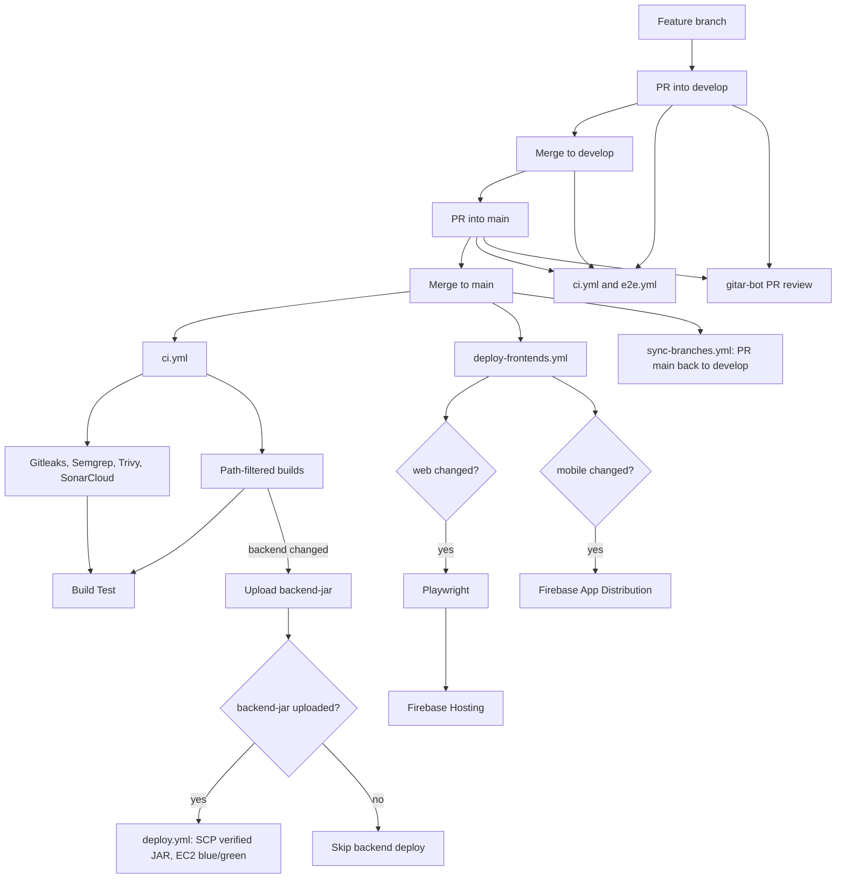

# CI/CD Pipeline Architecture (DevSecOps)

## 1. Overview

CanMakan uses **GitHub Actions** for a monorepo: Spring Boot (`server/backend`), React/Vite (`client/web`), and Kotlin Android (`client/mobile`).

**CI** (verify and scan) is one workflow. **CD** stays in separate workflows so deploy secrets are not on every PR runner.

| Stack | CI | Production CD (`main` only) |
|-------|----|-----------------------------|
| Backend | `mvn verify` vs job-local MySQL 8; upload `backend-jar` | After successful CI: download that JAR, SCP to EC2, Nginx blue/green |
| Web | Vitest + Vite build | `push` to `main`: Playwright, then Firebase Hosting |
| Mobile | `assembleDebug testDebugUnitTest` | `push` to `main`: signed APK → Firebase App Distribution (does not wait on Playwright) |

Engineers open pull requests into **`develop`**, then promote **`develop` → `main`**. Direct pushes to `main` are not used. **`develop` is integration only** (CI + Playwright; no staging host). **`main` is production**.

Security jobs in CI: **Gitleaks** (secrets), **Semgrep** (SAST), **Trivy fs** (SCA vulns), **Trivy config** (Actions YAML). **SonarCloud** is the maintainability / coverage quality gate on each stack build. **Gitar** (`gitar-bot`) reviews pull requests on GitHub. There is no CodeQL, Snyk, or DAST (e.g. ZAP) workflow. There is no separate `secret-scan.yml`.

## 2. DevSecOps tooling

Each category has **one primary tool**. Overlaps (Trivy can scan secrets; Dependabot and Trivy both talk about dependencies) are split on purpose so a red job has a single meaning.

| Category | Tool | Where it runs | Config | Why this tool |
|----------|------|---------------|--------|----------------|
| Secret scanning | Gitleaks **8.21.2** | `ci.yml` job `gitleaks` | [`.gitleaks.toml`](.gitleaks.toml) (`[allowlist]`, `useDefault = true`); [`.gitleaksignore`](.gitleaksignore); `gitleaks detect --source . --verbose --config .gitleaks.toml`; checkout `fetch-depth: 0` | Built for git history and one allowlist. Trivy `fs` can also flag secrets; we turn that off (`scanners: vuln`) so Trivy red means CVEs, not the same test JWT Gitleaks already allowlists |
| SAST | Semgrep **1.173.0** | `ci.yml` job `sast-scan` | Docker `semgrep/semgrep:1.173.0 semgrep --config=.semgrep.yml` (needs network). Policy: [`.semgrep.yml`](.semgrep.yml) (`include: p/default`, excludes for `node_modules` / `target` / `build`) | Fast security-pattern scan on every PR. Rule set is in git (`p/default`), not `--config=auto`. CodeQL would be a second, slower SAST. SonarCloud is the quality gate, not this SAST job |
| SCA (CVE scan) | Trivy filesystem | `ci.yml` job `sca-scan` | `aquasecurity/trivy-action@v0.36.0`, `scan-type: fs`, `scanners: vuln`, `severity: CRITICAL,HIGH`, table then SARIF; CycloneDX artefact `trivy-sbom` (14 days, `exit-code: 0`) | Answers “does the tree **right now** contain a known CRITICAL/HIGH CVE?” and fails **Build Test**. SBOM is an artefact, not the gate |
| SCA (upgrade PRs) | Dependabot | GitHub (not Actions YAML jobs) | [`.github/dependabot.yml`](.github/dependabot.yml): weekly Monday, npm / Maven / Gradle / GitHub Actions, PR limit 5, labels | Answers “move us off old versions **before** they become a gate failure.” Trivy does not bump `pom.xml` / lockfiles. Dependabot does not fail the PR that introduced the vuln today |
| IaC / workflow config | Trivy config | `ci.yml` job `config-scan` | `scan-type: config`, `scan-ref: .github`, CRITICAL/HIGH, SARIF, `exit-code: 1` | Same Trivy family, different scan type: misconfigured Actions/Dependabot YAML, not library CVEs |
| Quality gate (maintainability, coverage, duplication) | SonarCloud | Inside `build-backend`, `build-web`, `build-mobile` | Org **`canmakan-team`**. Keys `canmakan-backend`, `canmakan-web`, `canmakan-mobile`. `sonar.qualitygate.wait=true`. Secret **`SONAR_TOKEN`**. JaCoCo / Vitest lcov / Android unit-test XML | Semgrep does not rate complexity, duplication, or coverage on new code. That gate belongs here, after tests |
| DAST | — | Not implemented | No ZAP, Burp, or authenticated scan of a running host | Needs a live URL (staging). Playwright is not a substitute |
| E2E | Playwright | `e2e.yml`; `deploy-frontends.yml` on `main` web | `npx playwright test` in `client/web`; report 30 days | Checks user journeys (invite, navigation). Does not send security payloads at the API |
| AI PR review | Gitar (`gitar-bot`) | GitHub App (no workflow file) | Org/repo install. `@gitar-bot` / `@gitar`. Label `gitar-skip`. Not a required check | Extra review comments and optional fixes on the PR. Does not replace Semgrep, Trivy, or **Build Test** |

### Why Gitleaks instead of Trivy secrets

Trivy’s default filesystem scan includes a **secret** scanner as well as **vuln**. Using both would:

- Flag the same CI test JWT and `google-services.json` client key twice, with **two** allowlist formats to keep in sync.
- Mix “dependency CVE” and “secret in git” in one job, so logs and SARIF are harder to explain.
- Miss Gitleaks’ **full-history** scan (`fetch-depth: 0`). Trivy `fs` is the current tree.

So Gitleaks owns secrets (one `[allowlist]` in `.gitleaks.toml`). Trivy `sca-scan` sets `scanners: vuln` only.

Gitleaks allowlists the CI test JWT `dGVzdC1vbmx5LXNpZ25pbmcta2V5LTMyLWJ5dGVzISE=` and path `google-services.json`. Restrict the Firebase Android client key in GCP.

### Why Dependabot as well as Trivy SCA

| | Trivy `vuln` | Dependabot |
|--|--------------|------------|
| When | Every CI run on the current lockfiles | Weekly PRs (Monday) |
| Output | Fail the job if CRITICAL/HIGH CVEs are present | Open a PR that bumps the version |
| Human action | Fix or suppress before merge | Review and merge the bump |

Trivy is the **gate**. Dependabot is the **maintenance path** so the gate stays green without someone discovering CVEs only when a feature PR is blocked. They share the same ecosystems (npm, Maven, Gradle, Actions) but they are not the same control.

## 3. Workflows

| Workflow | Trigger | Role |
|----------|---------|------|
| [`ci.yml`](.github/workflows/ci.yml) | PR / push to `develop` and `main`, `workflow_dispatch` | Gitleaks, Semgrep, Trivy fs, Trivy config, path-filtered builds + SonarCloud, **Build Test**, `backend-jar` upload |
| [`e2e.yml`](.github/workflows/e2e.yml) | PR to `develop`/`main`, push to `develop`, `workflow_dispatch` | Playwright when `client/web/**` changes |
| [`deploy.yml`](.github/workflows/deploy.yml) | `workflow_run`: successful **CI** on `main`, and artefact `backend-jar` exists | EC2 blue/green of the verified JAR |
| [`deploy-frontends.yml`](.github/workflows/deploy-frontends.yml) | `push` to `main` and web/mobile (or this workflow file) | Web: Playwright then Hosting. Mobile: App Distribution |
| [`sync-branches.yml`](.github/workflows/sync-branches.yml) | `push` to `main` | Opens (or no-ops) a PR `main` → `develop` so hotfixes flow back |

Branch protection on **`develop` and `main`** (configured on GitHub): require a pull request; require **Build Test**; require review from Code Owners ([`.github/CODEOWNERS`](.github/CODEOWNERS) lists two owners); restrict deletions; block force pushes. Do not require Gitleaks/Semgrep/Trivy as separate checks: they already fail **Build Test**. Drop any leftover required check named **Secret Scan**. Unused stack builds `skip` and do not fail the aggregator.

GitHub Actions in these workflows use version tags (for example `actions/checkout@v7.0.1`). Dependabot opens weekly PRs for `github-actions`.

## 4. GitHub repo settings (current)

These are not in YAML; they are required for CD to match this design.

| Setting | Value |
|---------|--------|
| Environment | **`production`**, limited to branch **`main`**, optional reviewers |
| Repository Actions variable | **`DEPLOY_ENVIRONMENT=production`** (`vars.`, not an Environment secret) |
| Deploy jobs | `environment: ${{ vars.DEPLOY_ENVIRONMENT }}` (a literal `environment: production` fails the Actions language service until the Environment exists) |
| Branch protection | On **`develop` and `main`**: require a PR (no direct pushes); require **Build Test**; require review from Code Owners (two owners in [`.github/CODEOWNERS`](.github/CODEOWNERS)); restrict who can push; restrict deletions; block force pushes |
| Visibility | **Public** repository |
| SARIF upload | Trivy jobs always upload SARIF. On a **public** repo, GitHub Code Scanning can show those results in the Security tab without GitHub Advanced Security. Failure is still the **table** scan (`exit-code: 1`) |
| SonarCloud | Org **`canmakan-team`**. Projects **`canmakan-backend`**, **`canmakan-web`**, **`canmakan-mobile`**. Repo secret **`SONAR_TOKEN`**. Analysis is in `ci.yml` (not a separate `build.yml`). Scans skip until the token is set |
| Gitar | GitHub App **Gitar** (`gitar-bot`) enabled on this repository. PR review only; no Actions secret required for the default App install |

## 5. Continuous integration (`ci.yml`)

Concurrency: `ci-${{ github.ref }}` (cancel superseded runs). Permissions: `contents: read`, `pull-requests: read`.

| Job | When | What |
|-----|------|------|
| `detect-changes` | always | `dorny/paths-filter` on `server/backend/**`, `client/web/**`, `client/mobile/**` |
| `gitleaks` | always | `fetch-depth: 0`, Gitleaks **8.21.2**, `gitleaks detect --config .gitleaks.toml` |
| `sast-scan` | always | Docker `semgrep/semgrep:1.173.0 --config=.semgrep.yml` (`p/default`) |
| `sca-scan` | always | Trivy `fs`, `scanners: vuln` only, CRITICAL/HIGH, table + SARIF; CycloneDX SBOM artefact `trivy-sbom` |
| `config-scan` | always | Trivy `config` on `.github`, CRITICAL/HIGH, SARIF, `exit-code: 1` |
| `build-backend` | backend paths | JDK 21, MySQL **8.0** service, `mvn -B clean verify` (not RDS) + JaCoCo; SonarCloud `canmakan-backend` (`qualitygate.wait`); stages one fat JAR, uploads **`backend-jar`** (14 days) |
| `build-web` | web paths | Node 24, `npm ci`, Vitest with lcov, SonarCloud `canmakan-web`, `npm run build` |
| `build-mobile` | mobile paths | `assembleDebug testDebugUnitTest createDebugUnitTestCoverageReport`, JaCoCo XML for Sonar, then Gradle `sonar` (`canmakan-mobile`) |
| **Build Test** | `if: always()` | Fails if any needed job is `failure` or `cancelled`; `skipped` stack builds are allowed |

Gitleaks details are in [section 2](#2-devsecops-tooling). Fingerprints live in [`.gitleaksignore`](.gitleaksignore).

Dependabot and SonarCloud config are also in that table. `sonar.qualitygate.wait=true` fails the stack job (and **Build Test**) when the gate is red. Steps skip until `SONAR_TOKEN` is set.

There is no repo-root `.github/workflows/build.yml` or root `sonar-project.properties`. SonarCloud’s sample assumes a single project on `master`. This monorepo already scans web from `ci.yml` (`projectBaseDir: client/web`, scanner **v8.1.0**) after Vitest coverage. A root properties file would label backend and mobile as `canmakan-web`.

## 6. End-to-end (`e2e.yml`)

Concurrency: `e2e-${{ github.ref }}`. Path job `detect-frontend-changes`; Playwright job runs only if `client/web/**` changed. Report artefact `playwright-report`, 30 days.

Pushes to **`main` do not** run this workflow. Web production deploy runs Playwright in `deploy-frontends.yml` instead.

## 7. Continuous deployment

### Backend (`deploy.yml`)

`on.workflow_run` of workflow name **`CI`**, `types: completed`, `branches: [main]`. Permissions: `contents: read`, `actions: read`. Concurrency: `deploy-backend` (cancel in progress).

`workflow_run` cannot use `on.push.paths`. Path filtering stays in **CI** `detect-changes`. Deploy infers “backend changed” from whether CI uploaded **`backend-jar`**.

| Job | When | What |
|-----|------|------|
| `resolve-artifact` | CI conclusion is `success` | `gh api` lists artefacts for that CI `run-id`; sets `has_jar` |
| `deploy-backend` | `has_jar == true` | Environment from `vars.DEPLOY_ENVIRONMENT`. Download artefact into `server/backend/target` (no checkout, no Maven). SCP, blue/green **8080/8081**, `/actuator/health`, Nginx upstream swap, `SIGTERM` of the old process, logrotate if missing |

Docs-only (or non-backend) CI on `main` succeeds with no JAR → `has_jar=false` → skip deploy. Failed CI does not start `resolve-artifact`. Runtime **RDS** `MYSQL_*` and other app secrets are forwarded to EC2 at JAR start; CI never uses those for tests.

### Frontends (`deploy-frontends.yml`)

`push` to `main` with `client/web/**`, `client/mobile/**`, or this workflow file. Job `detect-frontend-changes` filters web vs mobile on the **push SHA** (not `workflow_run`). Frontend CD is **not** coupled to `e2e.yml`, so a mobile-only change is not blocked by Playwright.

- **Web** (`deploy-web`): needs Playwright job `e2e`, then Vite build (`VITE_USE_MOCK_API: 'false'`) and Firebase Hosting `channelId: live`. Concurrency `deploy-web-${{ github.ref }}`.
- **Mobile** (`deploy-mobile`): `needs` path detection only. Signed `assembleRelease`, shred keystore, App Distribution group `qa-team`. Concurrency `deploy-mobile-${{ github.ref }}`.

Both deploy jobs use `environment: ${{ vars.DEPLOY_ENVIRONMENT }}`.

## 8. Pipeline diagram

End-to-end path from a feature branch to production. `develop` is integration only (no deploy). A feature-branch **push** does not start workflows until a PR targets `develop` or `main`.

The `ci.yml and e2e.yml` box is the same pair of workflows on both PRs and on push to `develop` (Playwright only if web changed). `e2e.yml` does not run on push to `main`; web production Playwright is inside `deploy-frontends.yml`. The `ci.yml` under `main` is that same CI workflow: backend CD waits for that run and only proceeds when `backend-jar` is present. Frontend CD does not wait on CI.

## 9. Identified gaps and areas for improvement

The current split of tools (Gitleaks, Semgrep, Trivy, Dependabot, SonarCloud, Gitar) matches usual DevSecOps practice for a GitHub Actions monorepo: security on the PR, production CD only from `main`, one meaning per red job. The items below are what would move the pipeline closer to textbook CI/CD and DevSecOps. They are not “wrong scanners.”

### Gap 1: No staging environment

`develop` is integration only (CI + Playwright). There is no staging EC2, staging Firebase project, or staging APK channel. Env-specific failures show up first in production on `main`. A deploy-from-`develop` path to isolated staging targets would close this.

### Gap 2: Direct host execution

The JAR runs on the EC2 OS. Docker (and a registry) would freeze the Java runtime, allow **image** SCA in CI, and make blue/green an image swap instead of two host processes.

### Gap 3: Manual database schema management

RDS DDL is not applied by the pipeline. Flyway or Liquibase would version SQL in git so a release cannot ship a JAR without the matching schema.

### Gap 4: Mobile store delivery

Testers install from Firebase App Distribution. Play Store internal tracks are not automated. JVM unit-test coverage is uploaded to SonarCloud; Compose UI, CameraX, and ML Kit still need instrumented tests if those surfaces should count toward the gate.

### Gap 5: No DAST

There is no dynamic application security test against a running API or host (for example OWASP ZAP on staging). Playwright checks web behaviour, not security payloads. DAST needs a live URL; it does not belong in `ci.yml` against production.

**Closed in-repo (no extra GitHub/cloud setup):** CycloneDX SBOM artefact from Trivy (`trivy-sbom`); Semgrep [`.semgrep.yml`](.semgrep.yml) with `p/default`. Optional GitHub Artifact Attestations / SLSA provenance for the JAR is still not implemented.

Suggested order if capacity is limited: staging or Flyway (incident class), then Docker/DAST, then Play Store.

