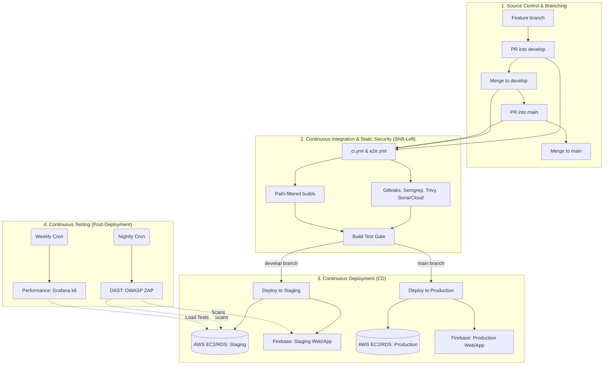

# CI/CD Pipeline Architecture (DevSecOps)

## 1. Overview

CanMakan uses **GitHub Actions** for a monorepo: Spring Boot (`server/backend`), React/Vite (`client/web`), and Kotlin Android (`client/mobile`).

**CI** (verify and scan) is one workflow. **CD** stays in separate workflows so deploy secrets are not on every PR runner.

| Stack | CI | Staging CD (`develop`) | Production CD (`main`) |
| --- | --- | --- | --- |
| Backend | `mvn verify` vs job-local MySQL 8; upload `backend-jar` | After successful CI: download JAR, SCP to Staging EC2, Nginx blue/green | After successful CI: download JAR, SCP to Production EC2, Nginx blue/green |
| Web | Vitest + Vite build | `push` to `develop`: Playwright, then Staging Firebase Hosting | `push` to `main`: Playwright, then Production Firebase Hosting |
| Mobile | `assembleDebug testDebugUnitTest` | `push` to `develop`: signed APK → Firebase App Distribution (Staging QA) | `push` to `main`: signed APK → Firebase App Distribution (Production QA) |

Engineers open pull requests into **`develop`**, then promote **`develop` → `main`**. Direct pushes to `main` are not used. **`develop` acts as the integration and staging branch** (deploying to a dedicated AWS EC2/RDS and Firebase instance). **`main` is production**.

Security jobs in CI: **Gitleaks** (secrets), **Semgrep** (SAST), **Trivy fs** (SCA vulns), **Trivy config** (Actions YAML). **SonarCloud** is the maintainability / coverage quality gate on each stack build. **Gitar** (`gitar-bot`) reviews pull requests on GitHub. Post-deployment security and load testing (OWASP ZAP and Grafana k6) run against the live Staging environment on automated schedules.

## 2. DevSecOps tooling

Each category has **one primary tool**. Overlaps (Trivy can scan secrets; Dependabot and Trivy both talk about dependencies) are split on purpose so a red job has a single meaning.

| Category | Tool | Where it runs | Config | Why this tool |
| --- | --- | --- | --- | --- |
| Secret scanning | Gitleaks **8.21.2** | `ci.yml` job `gitleaks` | [`.gitleaks.toml`](https://github.com/CanMakan-Team/CanMakan/blob/develop/.gitleaks.toml) (`[allowlist]`, `useDefault = true`); [`.gitleaksignore`](https://github.com/CanMakan-Team/CanMakan/blob/develop/.gitleaksignore); `fetch-depth: 0` | Built for git history and one allowlist. Trivy `fs` can also flag secrets; we turn that off so Trivy red means CVEs, not the test JWT Gitleaks allowlists. |
| SAST | Semgrep **1.173.0** | `ci.yml` job `sast-scan` | Docker `semgrep/semgrep:1.173.0 semgrep --config p/default`; [`.semgrepignore`](https://github.com/CanMakan-Team/CanMakan/blob/develop/.semgrepignore) | Fast security-pattern scan on every PR. CodeQL would be a second, slower SAST. SonarCloud is the quality gate, not this SAST job. |
| SCA (CVE scan) | Trivy filesystem | `ci.yml` job `sca-scan` | `aquasecurity/trivy-action@v0.36.0`, `scan-type: fs`, `scanners: vuln`, `severity: CRITICAL,HIGH`; CycloneDX artefact `trivy-sbom` | Answers “does the tree **right now** contain a known CRITICAL/HIGH CVE?” and fails **Build Test**. SBOM is an artefact, not the gate. |
| SCA (upgrade PRs) | Dependabot | GitHub (not Actions YAML) | [`.github/dependabot.yml`](https://github.com/CanMakan-Team/CanMakan/blob/develop/.github/dependabot.yml): weekly Monday, npm / Maven / Gradle / Actions | Answers “move us off old versions **before** they become a gate failure.” |
| IaC / config | Trivy config | `ci.yml` job `config-scan` | `scan-type: config`, `scan-ref: .github`, CRITICAL/HIGH | Same Trivy family, different scan type: misconfigured Actions/Dependabot YAML. |
| Quality gate | SonarCloud | Inside `build-backend`, `build-web`, `build-mobile` | Org **`canmakan-team`**. Keys `canmakan-backend`, `canmakan-web`, `canmakan-mobile`. `sonar.qualitygate.wait=true` | Semgrep does not rate complexity, duplication, or coverage. That gate belongs here. |
| DAST | OWASP ZAP | `dast.yml` | Nightly cron (`0 18 * * *`); targets Staging Web & API; authenticated via `DAST_TEST_JWT` | Actively probes the live Staging environment for runtime vulnerabilities (e.g., misconfigured headers, broken access control). |
| Performance / Load | Grafana k6 | `load-test.yml` | Weekly cron (`0 19 * * 0`); targets Staging API (`p(95)<500`); virtual user authentication via `LOAD_TEST_EMAIL` | Validates application latency and infrastructure scaling limits under concurrent load before production release. |
| E2E | Playwright | `e2e.yml`; `deploy-frontends.yml` | `npx playwright test` in `client/web` | Checks user journeys. Does not send security payloads at the API. |
| AI PR review | Gitar (`gitar-bot`) | GitHub App | Org/repo install. Label `gitar-skip`. Not a required check | Extra review comments and optional fixes on the PR. Does not replace Semgrep or Trivy. |

## 3. Workflows

| Workflow | Trigger | Role |
| --- | --- | --- |
| [`ci.yml`](https://github.com/CanMakan-Team/CanMakan/blob/develop/.github/workflows/ci.yml) | PR / push to `develop` and `main`, `workflow_dispatch` | Gitleaks, Semgrep, Trivy fs, Trivy config, path-filtered builds + SonarCloud, **Build Test**, `backend-jar` upload |
| [`e2e.yml`](https://github.com/CanMakan-Team/CanMakan/blob/develop/.github/workflows/e2e.yml) | PR to `develop`/`main`, push to `develop`, `workflow_dispatch` | Playwright when `client/web/**` changes |
| [`deploy.yml`](https://github.com/CanMakan-Team/CanMakan/blob/develop/.github/workflows/deploy.yml) | `workflow_run`: CI on `main` and `develop`, and `backend-jar` exists | EC2 blue/green of the verified JAR. Dynamically targets Staging or Production. |
| [`deploy-frontends.yml`](https://github.com/CanMakan-Team/CanMakan/blob/develop/.github/workflows/deploy-frontends.yml) | `push` to `main` and `develop` (web/mobile paths) | Web: Playwright then Hosting. Mobile: App Distribution. Dynamically targets Staging or Production. |
| [`dast.yml`](https://github.com/CanMakan-Team/CanMakan/blob/develop/.github/workflows/dast.yml) | `schedule` (nightly), `workflow_dispatch` | Runs OWASP ZAP baseline and API scans against the live Staging environment. |
| [`load-test.yml`](https://github.com/CanMakan-Team/CanMakan/blob/develop/.github/workflows/load-test.yml) | `schedule` (weekly), `workflow_dispatch` | Runs Grafana k6 performance scenarios against the live Staging API. |
| [`sync-branches.yml`](https://github.com/CanMakan-Team/CanMakan/blob/develop/.github/workflows/sync-branches.yml) | `push` to `main` | Opens a PR `main` → `develop` so hotfixes flow back |

## 4. GitHub repo settings (current)

| Setting | Value |
| --- | --- |
| Environments | **`production`** (limited to branch `main`) and **`staging`** (limited to branch `develop`). Both contain distinct infrastructure secrets (e.g., `EC2_HOST`, `MYSQL_PASSWORD`, `FIREBASE_PROJECT_ID`). |
| Deploy jobs | `environment: ${{ github.ref == 'refs/heads/main' && 'production' \|\| 'staging' }}` |
| Branch protection | On **`develop`** and **`main`**: require a PR (no direct pushes); require **Build Test**; require review from Code Owners; restrict who can push; restrict deletions; block force pushes. |
| Visibility | **Public** repository |
| SARIF upload | Trivy jobs always upload SARIF. On a **public** repo, GitHub Code Scanning can show those results in the Security tab without GitHub Advanced Security. Failure is still the **table** scan (`exit-code: 1`) |
| SonarCloud | Org **`canmakan-team`**. Projects **`canmakan-backend`**, **`canmakan-web`**, **`canmakan-mobile`**. Repo secret **`SONAR_TOKEN`**. Analysis is in `ci.yml` (not a separate `build.yml`). Scans skip until the token is set |
| App Distribution URL | Repo (or Environment) secret **`FIREBASE_APP_DISTRIBUTION_URL`**. Vite inlines it as `VITE_FIREBASE_APP_DISTRIBUTION_URL` on web CI build and `deploy-web`. Optional; the client falls back to `https://appdistribution.firebase.google.com/` |
| Gitar | GitHub App **Gitar** (`gitar-bot`) enabled on this repository. PR review only; no Actions secret required for the default App install |

## 5. Continuous integration (`ci.yml`)

Concurrency: `ci-${{ github.ref }}`. Permissions: `contents: read`, `pull-requests: read`.

| Job | When | What |
| --- | --- | --- |
| `detect-changes` | always | `dorny/paths-filter` on backend, web, mobile paths |
| `gitleaks` | always | `fetch-depth: 0`, Gitleaks **8.21.2** |
| `sast-scan` | always | Docker `semgrep/semgrep:1.173.0 --config p/default` |
| `sca-scan` | always | Trivy `fs`, `scanners: vuln` only, CRITICAL/HIGH, table + SARIF; CycloneDX SBOM |
| `config-scan` | always | Trivy `config` on `.github`, CRITICAL/HIGH, SARIF |
| `build-backend` | backend paths | JDK 21, MySQL **8.0** service, `mvn -B clean verify` (not RDS) + JaCoCo; SonarCloud; uploads **`backend-jar`** |
| `build-web` | web paths | Node 24, `npm ci`, Vitest with lcov, SonarCloud, `npm run build` |
| `build-mobile` | mobile paths | `assembleDebug testDebugUnitTest createDebugUnitTestCoverageReport`, JaCoCo XML, Gradle `sonar` |
| **Build Test** | `if: always()` | Fails if any needed job is `failure` or `cancelled`. |

**Coverage vs SAST.** Sonar’s coverage condition measures new **hand-written logic** that the stack unit job actually runs (JUnit, Vitest, Android `testDebugUnitTest`). New behavior should land with tests in that same job. Coverage exclusions (not `sonar.exclusions`) apply only to code those runners cannot honestly execute: Compose screens (`*Screen*.kt`), sheets, nav graphs, `CanMakanApp`, `MainActivity`, `ProfileDrawerContent`, camera `BarcodeAnalyzer`, Android OS wrappers such as `AndroidSystemNotifier`, `shared/ui` widgets, Hilt `*Module.kt`, and generated DI (`*_Factory*`, `Hilt_*`, `Dagger*`). Web coverage also omits `src/mocks/**` (fixture data, not product logic). Binary launcher/mascot assets (`*.webp`, `*.png`) and generated `tokens.css` are excluded from analysis entirely. Generated code is still compiled and shipped; it is not a coverage target. Semgrep and Sonar **issues** still scan the UI and modules (except those binary/generated assets). Do not treat coverage as a security control.

There is no repo-root `.github/workflows/build.yml` or root `sonar-project.properties`. SonarCloud’s sample assumes a single project on `master`. This monorepo already scans web from `ci.yml` (`projectBaseDir: client/web`, scanner **v8.1.0**) after Vitest coverage. A root properties file would label backend and mobile as `canmakan-web`.

### End-to-end (`e2e.yml`)

Concurrency: `e2e-${{ github.ref }}`. Path job `detect-frontend-changes`; Playwright job runs only if `client/web/**` changed. Report artefact `playwright-report`, 30 days. Sparse-checkout includes `client/web`, `client/shared`, and `client/mobile/app/src/main/res/mipmap-xxxhdpi` (web favicon).

Pushes to **`main` do not** run this workflow. Web production deploy runs Playwright in `deploy-frontends.yml` instead.

## 6. Continuous testing (Post-Deployment)

Because continuous dynamic and stress testing disrupts development workflows and exhausts burstable infrastructure credits, they are executed out-of-band against the Staging environment.

* **DAST (OWASP ZAP):** Executes on a nightly cron schedule. It runs two parallel jobs: a Web Baseline scan against the Firebase staging URL, and an OpenAPI scan against the Spring Boot staging URL using an injected test JWT.
* **Performance (Grafana k6):** Executes on a weekly cron schedule. It simulates a standard user login and data retrieval flow to ensure P95 latency remains below 500ms on the `t3.small` staging instance.

## 7. Continuous deployment

### Backend (`deploy.yml`)

`on.workflow_run` of workflow name **`CI`**, `types: completed`, `branches: [main, develop]`.

| Job | When | What |
| --- | --- | --- |
| `resolve-artifact` | CI conclusion is `success` | `gh api` lists artefacts for that CI `run-id`; sets `has_jar` |
| `deploy-backend` | `has_jar == true` | Dynamically selects `staging` or `production` environment. Downloads verified JAR. SCP, blue/green **8080/8081**, `/actuator/health`, Nginx upstream swap, `SIGTERM` of old process. |

### Frontends (`deploy-frontends.yml`)

`push` to `main` and `develop` with web/mobile path filters, plus `workflow_dispatch` for manual retries.

- **Web** (`deploy-web`): needs Playwright job `e2e` (bypassed on `workflow_dispatch`), then Vite build (`VITE_USE_MOCK_API: 'false'`, `VITE_FIREBASE_APP_DISTRIBUTION_URL` from secret `FIREBASE_APP_DISTRIBUTION_URL`). Injects version tags (e.g. `-STG` or `-PROD`) and deploys Firebase Hosting `channelId: live` on the environment-specific project. Concurrency `deploy-web-${{ github.ref }}`.
- **Mobile** (`deploy-mobile`): `needs` path detection only. Signed `assembleRelease`, shred keystore, App Distribution group `qa-team`. Release notes prefixed with `[STAGING]` or `[PRODUCTION]`. Concurrency `deploy-mobile-${{ github.ref }}`.

## 8. Pipeline diagram

End-to-end path from a feature branch to production, including the Staging tier and continuous testing feedback loops.

## 9. Identified gaps and areas for improvement

With the Staging environment, DAST, and Performance Testing implemented, the pipeline aligns closely with standard DevSecOps practices. The remaining gaps are structural to the application architecture:

### Gap 1: Direct host execution

The JAR runs directly on the EC2 OS. Implementing Docker (and a container registry) would freeze the Java runtime, allow **image** SCA scanning in CI, and transition the blue/green deployment from host process swapping to reliable container swapping.

### Gap 2: Manual database schema management

RDS DDL changes are currently applied manually. Integrating Flyway or Liquibase would version SQL scripts in Git, ensuring a release cannot deploy a backend JAR without automatically executing the matching schema migrations.

### Gap 3: Mobile store delivery

Testers install manually from Firebase App Distribution. Promoting builds directly to the Google Play Store internal testing tracks is not yet automated. Furthermore, instrumented tests (Compose UI, CameraX, ML Kit) must be implemented and connected to SonarCloud if those surfaces are to count toward the CI quality gate.
