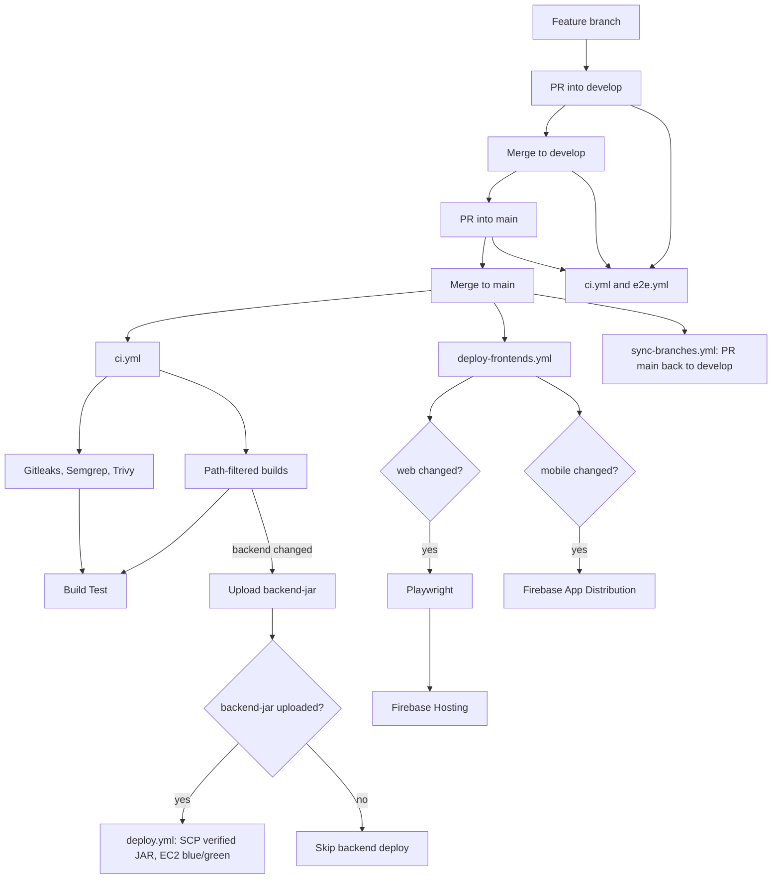

# CI/CD Pipeline Architecture (DevSecOps)

## 1. Overview

CanMakan uses **GitHub Actions** for a monorepo: Spring Boot (`server/backend`), React/Vite (`client/web`), and Kotlin Android (`client/mobile`).

**CI** (verify and scan) is one workflow. **CD** stays in separate workflows so deploy secrets are not on every PR runner.

| Stack | CI | Production CD (`main` only) |
|-------|----|-----------------------------|
| Backend | `mvn verify` vs job-local MySQL 8; upload `backend-jar` | After successful CI: download that JAR, SCP to EC2, Nginx blue/green |
| Web | Vitest + Vite build | `push` to `main`: Playwright, then Firebase Hosting |
| Mobile | `assembleDebug testDebugUnitTest` | `push` to `main`: signed APK → Firebase App Distribution (does not wait on Playwright) |

Engineers open pull requests into **`develop`**, then promote **`develop` → `main`**. Direct pushes to `main` are not used. **`develop` is integration only** (CI + Playwright; no staging host). **`main` is production**.

Security jobs in CI: **Gitleaks** (secrets), **Semgrep** (SAST), **Trivy fs** (SCA vulns), **Trivy config** (Actions YAML). There is no CodeQL, Sonar, or Snyk workflow. There is no separate `secret-scan.yml`.

## 2. Workflows

| Workflow | Trigger | Role |
|----------|---------|------|
| [`ci.yml`](.github/workflows/ci.yml) | PR / push to `develop` and `main`, `workflow_dispatch` | Gitleaks, Semgrep, Trivy fs, Trivy config, path-filtered builds, **Build Test**, `backend-jar` upload |
| [`e2e.yml`](.github/workflows/e2e.yml) | PR to `develop`/`main`, push to `develop`, `workflow_dispatch` | Playwright when `client/web/**` changes |
| [`deploy.yml`](.github/workflows/deploy.yml) | `workflow_run`: successful **CI** on `main`, and artefact `backend-jar` exists | EC2 blue/green of the verified JAR |
| [`deploy-frontends.yml`](.github/workflows/deploy-frontends.yml) | `push` to `main` and web/mobile (or this workflow file) | Web: Playwright then Hosting. Mobile: App Distribution |
| [`sync-branches.yml`](.github/workflows/sync-branches.yml) | `push` to `main` | Opens (or no-ops) a PR `main` → `develop` so hotfixes flow back |

Branch protection should require **Build Test** on `develop` and `main`. Drop any leftover required check named **Secret Scan** (that workflow is gone). Do not require Gitleaks/Semgrep/Trivy as separate checks: they already fail **Build Test** if they fail or are cancelled. Unused stack builds `skip` and do not fail the aggregator.

`workflow_run` for backend deploy is registered from the **default branch**. The updated `deploy.yml` only takes effect after it is on that branch.

## 3. GitHub repo settings (current)

These are not in YAML; they are required for CD to match this design.

| Setting | Value |
|---------|--------|
| Environment | **`production`**, limited to branch **`main`**, optional reviewers |
| Repository Actions variable | **`DEPLOY_ENVIRONMENT=production`** (`vars.`, not an Environment secret) |
| Deploy jobs | `environment: ${{ vars.DEPLOY_ENVIRONMENT }}` (a literal `environment: production` fails the Actions language service until the Environment exists) |
| SARIF upload | Trivy jobs always upload SARIF. On a **private** repo this only appears in the Security tab if GitHub Advanced Security is enabled; there is no “Allow SARIF” toggle. Failure is still the **table** scan (`exit-code: 1`) |

## 4. Continuous integration (`ci.yml`)

Concurrency: `ci-${{ github.ref }}` (cancel superseded runs). Permissions: `contents: read`, `pull-requests: read`.

| Job | When | What |
|-----|------|------|
| `detect-changes` | always | `dorny/paths-filter` on `server/backend/**`, `client/web/**`, `client/mobile/**` |
| `gitleaks` | always | `fetch-depth: 0`, Gitleaks **8.21.2**, `gitleaks detect --config .gitleaks.toml` |
| `sast-scan` | always | Docker `semgrep/semgrep:1.173.0 --config=auto` (needs network) |
| `sca-scan` | always | Trivy `fs`, `scanners: vuln` only (secrets left to Gitleaks), CRITICAL/HIGH, table then SARIF (`aquasecurity/trivy-action@v0.36.0`) |
| `config-scan` | always | Trivy `config` on `.github`, CRITICAL/HIGH, SARIF, `exit-code: 1` |
| `build-backend` | backend paths | JDK 21, MySQL **8.0** service, `mvn -B clean verify` (not RDS). Step env: test JWT, AI/LLM off, Tavily placeholder, Resend off. Stages one fat JAR (skips `*.jar.original`), uploads artefact **`backend-jar`** (14 days) |
| `build-web` | web paths | Node 24, `npm ci`, `npm test`, `npm run build` |
| `build-mobile` | mobile paths | `android-actions/setup-android`, `assembleDebug testDebugUnitTest` |
| **Build Test** | `if: always()` | Fails if any needed job is `failure` or `cancelled`; `skipped` stack builds are allowed |

Gitleaks allowlists ([`.gitleaks.toml`](.gitleaks.toml), Gitleaks **8.21.x** `[allowlist]` syntax, `useDefault = true`): CI test JWT `dGVzdC1vbmx5LXNpZ25pbmcta2V5LTMyLWJ5dGVzISE=`, path `google-services.json`. Fingerprints in [`.gitleaksignore`](.gitleaksignore). Restrict the Firebase Android client key in GCP.

Dependabot ([`.github/dependabot.yml`](.github/dependabot.yml)) opens weekly PRs (Monday) for npm, Maven, Gradle, and GitHub Actions.

## 5. End-to-end (`e2e.yml`)

Concurrency: `e2e-${{ github.ref }}`. Path job `detect-frontend-changes`; Playwright job runs only if `client/web/**` changed. Report artefact `playwright-report`, 30 days.

Pushes to **`main` do not** run this workflow. Web production deploy runs Playwright in `deploy-frontends.yml` instead.

## 6. Continuous deployment

### Backend (`deploy.yml`)

`on.workflow_run` of workflow name **`CI`**, `types: completed`, `branches: [main]`. Permissions: `contents: read`, `actions: read`. Concurrency: `deploy-backend` (cancel in progress).

`workflow_run` cannot use `on.push.paths`. Path filtering stays in **CI** `detect-changes`. Deploy infers “backend changed” from whether CI uploaded **`backend-jar`**.

| Job | When | What |
|-----|------|------|
| `resolve-artifact` | CI conclusion is `success` | `gh api` lists artefacts for that CI `run-id`; sets `has_jar` |
| `deploy-backend` | `has_jar == true` | Environment from `vars.DEPLOY_ENVIRONMENT`. Download artefact into `server/backend/target` (no checkout, no Maven). SCP, blue/green **8080/8081**, `/actuator/health`, Nginx upstream swap, `SIGTERM` of the old process, logrotate if missing |

Docs-only (or non-backend) CI on `main` succeeds with no JAR → `has_jar=false` → skip deploy. Failed CI does not start `resolve-artifact`. Runtime **RDS** `MYSQL_*` and other app secrets are forwarded to EC2 at JAR start; CI never uses those for tests.

### Frontends (`deploy-frontends.yml`)

`push` to `main` with `client/web/**`, `client/mobile/**`, or this workflow file. Job `detect-frontend-changes` filters web vs mobile on the **push SHA** (not `workflow_run`). Frontend CD is **not** coupled to `e2e.yml`, so a mobile-only change is not blocked by Playwright.

- **Web** (`deploy-web`): needs Playwright job `e2e`, then Vite build (`VITE_USE_MOCK_API: 'false'`) and Firebase Hosting `channelId: live`. Concurrency `deploy-web-${{ github.ref }}`.
- **Mobile** (`deploy-mobile`): `needs` path detection only. Signed `assembleRelease`, shred keystore, App Distribution group `qa-team`. Concurrency `deploy-mobile-${{ github.ref }}`.

Both deploy jobs use `environment: ${{ vars.DEPLOY_ENVIRONMENT }}`.

## 7. Pipeline diagram

End-to-end path from a feature branch to production. `develop` is integration only (no deploy). A feature-branch **push** does not start workflows until a PR targets `develop` or `main`.

The `ci.yml and e2e.yml` box is the same pair of workflows on both PRs and on push to `develop` (Playwright only if web changed). `e2e.yml` does not run on push to `main`; web production Playwright is inside `deploy-frontends.yml`. The `ci.yml` under `main` is that same CI workflow: backend CD waits for that run and only proceeds when `backend-jar` is present. Frontend CD does not wait on CI.

## 8. Identified gaps and areas for improvement

### Gap 1: No staging environment

`develop` is integration only (CI + Playwright). There is no staging EC2, staging Firebase project, or staging APK channel. Env-specific failures show up first in production on `main`.

### Gap 2: Direct host execution

The JAR runs on the EC2 OS. Docker (and a registry) would freeze the Java runtime and make blue/green an image swap instead of two host processes.

### Gap 3: Manual database schema management

RDS DDL is not applied by the pipeline. Flyway or Liquibase would version SQL in git.

### Gap 4: Code quality gate

Semgrep is SAST, not a maintainability/coverage quality gate. SonarCloud (or ESLint / Detekt / Checkstyle in CI) is not implemented.

### Gap 5: Mobile store delivery

Testers install from Firebase App Distribution. Play Store internal tracks are not automated.
