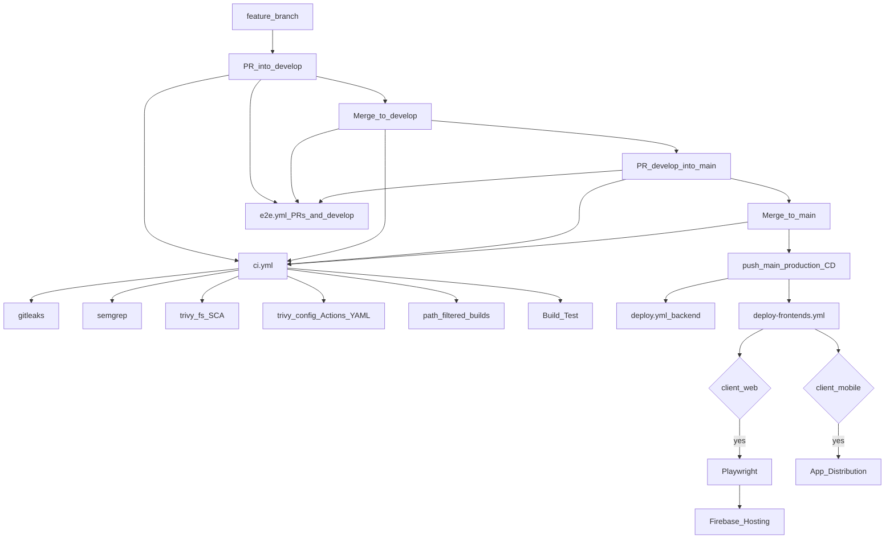

# CI/CD Pipeline Architecture (DevSecOps)

## 1. Overview

CanMakan uses **GitHub Actions** for a monorepo: Spring Boot (`server/backend`), React/Vite (`client/web`), and Kotlin Android (`client/mobile`).

**CI** (verify and scan) is one workflow. **CD** stays in separate workflows with deploy secrets and `push` to `main` only.

Engineers open pull requests into **`develop`**, then promote **`develop` → `main`**. **`develop` is the integration branch** (CI and E2E only; nothing is deployed to a staging host). **`main` is production**: deploys run on GitHub’s merge `push` to `main`.

## 2. Workflows

| Workflow | Trigger | Role |
|----------|---------|------|
| [`ci.yml`](.github/workflows/ci.yml) | PR / push to `develop` and `main`, `workflow_dispatch` | Gitleaks, Semgrep, Trivy fs, Trivy config, path-filtered builds, **Build Test** |
| [`e2e.yml`](.github/workflows/e2e.yml) | PR to `develop`/`main`, push to `develop`, `workflow_dispatch` | Playwright when `client/web/**` changes |
| [`deploy.yml`](.github/workflows/deploy.yml) | Push to `main` and `server/backend/**` | EC2 blue/green JAR deploy |
| [`deploy-frontends.yml`](.github/workflows/deploy-frontends.yml) | Push to `main` and web/mobile paths | Web: Playwright then Firebase Hosting. Mobile: App Distribution (no E2E wait) |

Branch protection should require **Build Test**. Gitleaks, Semgrep, Trivy, and config scan always run inside that aggregator, so unused stack jobs can skip without blocking.

## 3. Continuous integration (`ci.yml`)

Concurrency: `ci-${{ github.ref }}` (cancel superseded runs). Default permissions: `contents: read`.

| Job | When | What |
|-----|------|------|
| `detect-changes` | always | Path filter backend / web / mobile |
| `gitleaks` | always | Secret scan, `fetch-depth: 0`, Gitleaks 8.21.2 `--config .gitleaks.toml`; test JWT allowlisted in [`.gitleaks.toml`](.gitleaks.toml) and [`.gitleaksignore`](.gitleaksignore) |
| `sast-scan` | always | Semgrep `semgrep/semgrep:1.173.0` `--config=auto` (needs network) |
| `sca-scan` | always | Trivy filesystem **vuln** SCA only (secrets left to Gitleaks), CRITICAL/HIGH, table log + SARIF |
| `config-scan` | always | Trivy `config` on `.github` (workflow YAML + Dependabot), CRITICAL/HIGH, `exit-code: 1`, SARIF upload |
| `build-backend` | `server/backend/**` | JDK 21, MySQL 8 service, `mvn -B clean verify` (not RDS) |
| `build-web` | `client/web/**` | Node 24, `npm ci`, `npm test` (Vitest), `npm run build` |
| `build-mobile` | `client/mobile/**` | `assembleDebug testDebugUnitTest` |
| **Build Test** | always | Fails if any of the above failed or was cancelled; skipped stack builds are allowed |

There is no separate `secret-scan.yml`. Dependabot ([`.github/dependabot.yml`](.github/dependabot.yml)) still opens weekly upgrade PRs (SCA complementary to Trivy).

## 4. End-to-end (`e2e.yml`)

Playwright on PRs into `develop`/`main` and on pushes to **`develop`** when `client/web/**` changes. Reports upload for 30 days.

Pushes to **`main`** do not run this workflow. Web production deploy runs Playwright in `deploy-frontends.yml` instead, so `main` is not scanned twice.

## 5. Continuous deployment

### Backend (`deploy.yml`)

Push to `main` with `server/backend/**`. Maven package (`-DskipTests`), SCP to EC2, blue/green on ports 8080/8081, `/actuator/health`, Nginx swap, SIGTERM of the old process. The deploy job uses `environment: ${{ vars.DEPLOY_ENVIRONMENT }}` (set the Actions variable to `production` and create that Environment; optional reviewers).

### Frontends (`deploy-frontends.yml`)

Push to `main` with `client/web/**` or `client/mobile/**`. Path filter uses the push SHA (not `workflow_run`).

- **Web:** Playwright job, then Vite build and Firebase Hosting. Concurrency group `deploy-web-${{ github.ref }}`. Environment from `vars.DEPLOY_ENVIRONMENT`.
- **Mobile:** signed release APK to Firebase App Distribution (`qa-team`). Does **not** wait on Playwright. Concurrency group `deploy-mobile-${{ github.ref }}`. Environment from `vars.DEPLOY_ENVIRONMENT`. Keystore is removed after the job.

## 6. Pipeline diagram

`develop` does not deploy a staging stack. A feature-branch push does not start `ci.yml` until a PR targets `develop` or `main`.

## 7. Identified gaps and areas for improvement

### Gap 1: No staging environment

`develop` is integration only (CI + Playwright). There is no staging EC2, staging Firebase project, or staging APK channel. Env-specific failures show up first in production on `main`. A deploy-from-`develop` workflow to isolated staging targets would close this.

### Gap 2: CD still skipTests (no build-once artefact)

CI now runs `mvn verify` (ephemeral MySQL), Vitest, and Android unit tests. Backend **deploy** still uses `mvn package -DskipTests` and rebuilds on the deploy runner. Prefer promoting the JAR from the passing CI SHA, or `needs` a successful verify job before SCP.

### Gap 3: Direct host execution

The JAR runs on the EC2 OS. Docker (and a registry) would freeze the Java runtime and make blue/green an image swap instead of two host processes.

### Gap 4: Manual database schema management

RDS DDL is not applied by the pipeline. Flyway or Liquibase would version SQL in git.

### Gap 5: Branch protection still a repo setting

Deploy jobs use `environment: ${{ vars.DEPLOY_ENVIRONMENT }}`. Create Environment **`production`**, set repository variable **`DEPLOY_ENVIRONMENT`** to that name, optional reviewers. **Build Test** must still be marked required on `develop` and `main`. Remove any leftover **Secret Scan** required check.

### Gap 6: Code quality gate

Semgrep is SAST, not a maintainability/coverage quality gate. SonarCloud (or ESLint / Detekt / Checkstyle in CI) is not implemented.

### Gap 7: Mobile store delivery

Testers install from Firebase App Distribution. Play Store internal tracks are not automated.
