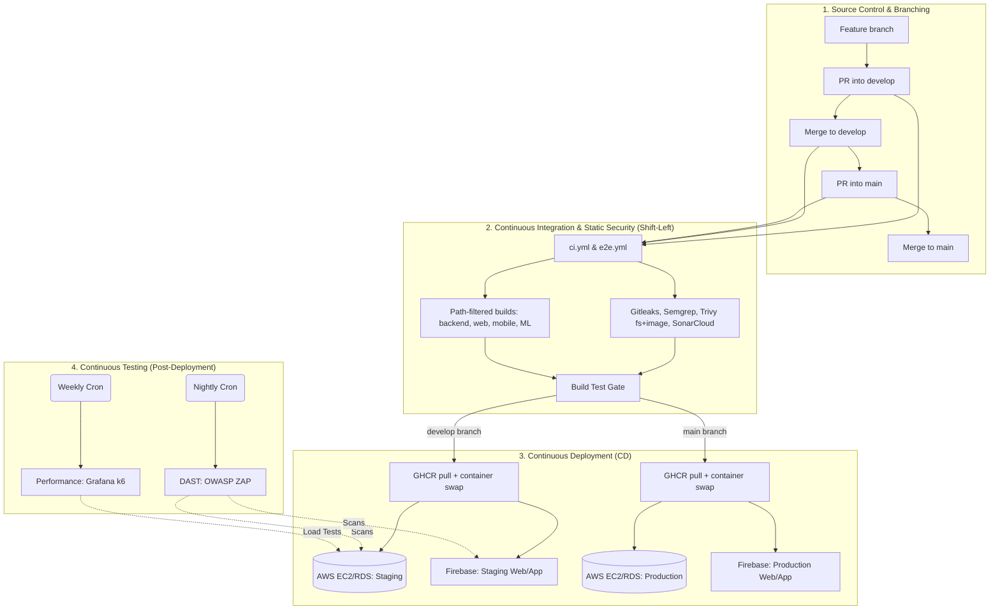

# CI/CD Pipeline Architecture (DevSecOps)

## 1. Overview

CanMakan utilises **GitHub Actions** to manage a monorepo comprising of 3 deployable products: Spring Boot (`server/backend`), React/Vite (`client/web`), and Kotlin/Android Jetpack Compose (`client/mobile`). CI also verifies, images, and deploys the Python recommendation ranker (`server/machine-learning`) when that tree or the product seed SQL changes.

**CI** (verify and scan) is one workflow. **CD** stays in separate workflows so deploy secrets are not on every PR runner. The repository is governed by centralised `.github` configurations, including standardised issue/PR templates, automated triage, and ownership rules.

| Stack            | CI                                                                                                                                                  | Staging CD (`develop`)                                                                                                                                  | Production CD (`main`)                                                             |
| ---------------- | --------------------------------------------------------------------------------------------------------------------------------------------------- | ------------------------------------------------------------------------------------------------------------------------------------------------------- | ---------------------------------------------------------------------------------- |
| Backend          | `mvn verify`, Docker image, Trivy **image** scan; upload `backend-jar`; push `ghcr.io/.../canmakan-backend:<sha>` on `develop`/`main`               | After successful CI: GHCR pull, container blue/green on Staging EC2, Nginx swap                                                                         | After successful CI: GHCR pull, container blue/green on Production EC2, Nginx swap |
| Web              | Vitest + Vite build                                                                                                                                 | `push` to `develop`: Playwright, then Staging Firebase Hosting                                                                                          | `push` to `main`: Playwright, then Production Firebase Hosting                     |
| Mobile           | `assembleDebug testDebugUnitTest createDebugUnitTestCoverageReport lintDebug`                                                                       | `push` to `develop`: signed APK → Firebase App Distribution (Staging QA)                                                                                | `push` to `main`: signed APK → Firebase App Distribution (Production QA)           |
| Machine learning | `pytest --cov-fail-under=80`, train from `01_products.sql`, Docker image, Trivy **image**; push `ghcr.io/.../canmakan-ml:<sha>` on `develop`/`main` | After successful CI: pull ranker image, run `canmakan-ml` on Staging EC2 (network `canmakan`), recycle backend so Spring uses `http://canmakan-ml:8091` | Same on Production EC2                                                             |

Developers open pull requests into `develop`, then promote `develop` → `main`. Direct pushes to `main` are restricted by branch protection. `develop` **acts as the integration and staging branch** (deploying to a dedicated AWS EC2/RDS and Firebase Staging instance). `main` **is production**.

Security jobs in CI: **Gitleaks** (secrets), **Semgrep** (SAST), **Trivy fs** (SCA on the repo tree), **Trivy image** (SCA on backend and ML runtime images), **Trivy config** (Actions YAML). **SonarCloud** is the maintainability / coverage quality gate on each stack build. **Gitar** (`gitar-bot`) reviews pull requests on GitHub. Post-deployment security and load testing (OWASP ZAP and Grafana k6) run against the live Staging environment on automated schedules.

## 2. DevSecOps tooling

Each category has **one primary tool**.

| Category           | Tool                         | Where it runs                                                       | Config                                                                                                                                                                                                    | Why this tool                                                                                                                                                                                                                                                                                                |
| ------------------ | ---------------------------- | ------------------------------------------------------------------- | --------------------------------------------------------------------------------------------------------------------------------------------------------------------------------------------------------- | ------------------------------------------------------------------------------------------------------------------------------------------------------------------------------------------------------------------------------------------------------------------------------------------------------------ |
| Secret scanning    | Gitleaks **8.21.2**          | `ci.yml` job `gitleaks`                                             | `.gitleaks.toml` (`[allowlist]`, `useDefault = true`); `.gitleaksignore`; `fetch-depth: 0`                                                                                                                | Built for git history and one allowlist. Trivy `fs` can also flag secrets; we turn that off so Trivy red means CVEs, not the test JWT Gitleaks allowlists.                                                                                                                                                   |
| SAST               | Semgrep **1.173.0**          | `ci.yml` job `sast-scan`                                            | Docker `semgrep/semgrep:1.173.0 semgrep --config p/default`; `.semgrepignore`                                                                                                                             | Fast security-pattern scan on every PR. CodeQL would be a second, slower SAST. SonarCloud is the quality gate, not this SAST job.                                                                                                                                                                            |
| SCA (CVE scan)     | Trivy filesystem + **image** | `ci.yml` jobs `sca-scan`, `build-backend`, `build-machine-learning` | `fs` on the repo (CRITICAL/HIGH). After each runtime image is built: `scan-type: image` on `canmakan-backend:<sha>` (SARIF `trivy-image`) and `canmakan-ml:<sha>` (SARIF `trivy-ml-image`), CRITICAL/HIGH. ML image scans use `ignore-unfixed` so Debian CVEs with no patch yet do not fail **Build Test** or Code Scanning; fixable OS packages must still be upgraded in the Dockerfile. | Tree scan answers “do lockfiles/jars **right now** contain a known CRITICAL/HIGH CVE?” Image scan answers the same for the **frozen JRE + app JAR** and the **Python slim + ranker**. Both fail **Build Test** on fixable CRITICAL/HIGH. MEDIUM findings still appear in SARIF / the Security tab. SBOM is an artefact, not the gate. |
| SCA (upgrade PRs)  | Dependabot                   | GitHub                                                              | `.github/dependabot.yml`: weekly Monday, npm / Maven / Gradle / Actions                                                                                                                                   | Answers “move us off old versions **before** they become a gate failure.”                                                                                                                                                                                                                                    |
| IaC / config       | Trivy config                 | `ci.yml` job `config-scan`                                          | `scan-type: config`, `scan-ref: .github`, CRITICAL/HIGH                                                                                                                                                   | Same Trivy family, different scan type: misconfigured Actions/Dependabot YAML.                                                                                                                                                                                                                               |
| Quality gate       | SonarCloud                   | Inside `build-backend`, `build-web`, `build-mobile`                 | Org `canmakan-team`. Keys `canmakan-backend`, `canmakan-web`, `canmakan-mobile`. `sonar.qualitygate.wait=true`                                                                                            | Semgrep does not rate complexity, duplication, or coverage. That gate belongs here.                                                                                                                                                                                                                          |
| DAST               | OWASP ZAP                    | `dast.yml`                                                          | Nightly cron (`0 18 * * *`); targets Staging Web & API; authenticated via `DAST_TEST_JWT`                                                                                                                 | Actively probes the live Staging environment for runtime vulnerabilities (e.g., misconfigured headers, broken access control).                                                                                                                                                                               |
| Performance / Load | Grafana k6                   | `load-test.yml`                                                     | Weekly cron (`0 19 * * 0`); script located at `.github/scripts/k6-load-test.js`                                                                                                                           | Validates application latency and infrastructure scaling limits under concurrent load before production release.                                                                                                                                                                                             |
| E2E                | Playwright                   | `e2e.yml`; `deploy-frontends.yml`                                   | `npx playwright test` in `client/web`                                                                                                                                                                     | Checks user journeys. Does not send security payloads at the API.                                                                                                                                                                                                                                            |
| AI PR review       | Gitar (`gitar-bot`)          | GitHub App                                                          | Org/repo install. Label `gitar-skip`. Not a required check                                                                                                                                                | Extra review comments and optional fixes on the PR. Does not replace Semgrep or Trivy.                                                                                                                                                                                                                       |
| Operational Triage | GitHub Actions               | `triage.yml`                                                        | Automatically parses issue content based on keywords                                                                                                                                                      | Automatically categorises, labels, and assigns incoming bugs or feature requests to streamline backlog grooming.                                                                                                                                                                                             |
|                    |                              |                                                                     |                                                                                                                                                                                                           |                                                                                                                                                                                                                                                                                                              |

## 3. Workflows

All operational and deployment pipelines are securely centralised in the `.github/workflows/` directory.

| Workflow                                                         | Trigger                                                                            | Role                                                                                                                                                                                                                     |
| ---------------------------------------------------------------- | ---------------------------------------------------------------------------------- | ------------------------------------------------------------------------------------------------------------------------------------------------------------------------------------------------------------------------ |
| `[ci.yml](.github/workflows/ci.yml)`                             | PR / push to `develop` and `main`, `workflow_dispatch`                             | Gitleaks, Semgrep, Trivy fs, Trivy config, path-filtered backend / web / mobile / ML builds + SonarCloud, backend + ML images + Trivy image, **Build Test**, `backend-jar` / `ml-image` upload, GHCR push on branch push |
| `[e2e.yml](.github/workflows/e2e.yml)`                           | PR to `develop`/`main`, push to `develop`, `workflow_dispatch`                     | Playwright when `client/web/**` changes                                                                                                                                                                                  |
| `[deploy.yml](.github/workflows/deploy.yml)`                     | `workflow_run`: CI on `main` and `develop`, and `backend-jar` or `ml-image` exists | EC2 container deploy of backend and/or ranker. Dynamically targets Staging or Production.                                                                                                                                |
| `[deploy-frontends.yml](.github/workflows/deploy-frontends.yml)` | `push` to `main` and `develop` (web/mobile paths)                                  | Web: Playwright then Hosting. Mobile: App Distribution. Dynamically targets Staging or Production.                                                                                                                       |
| `[dast.yml](.github/workflows/dast.yml)`                         | `schedule` (nightly), `workflow_dispatch`                                          | Runs OWASP ZAP baseline and API scans against the live Staging environment.                                                                                                                                              |
| `[load-test.yml](.github/workflows/load-test.yml)`               | `schedule` (weekly), `workflow_dispatch`                                           | Runs Grafana k6 performance scenarios against the live Staging API.                                                                                                                                                      |
| `[sync-branches.yml](.github/workflows/sync-branches.yml)`       | `push` to `main`                                                                   | Opens a PR `main` → `develop` so hotfixes flow back                                                                                                                                                                      |
| `[triage.yml](.github/workflows/triage.yml)`                     | `issues` (opened, edited)                                                          | Operational workflow to automatically label and route incoming issues based on content.                                                                                                                                  |
|                                                                  |                                                                                    |                                                                                                                                                                                                                          |

## 4. Repository Governance & `.github` Structure

CanMakan employs a strict configuration-as-code approach for repository governance, utilizing the `.github/` directory to enforce team standards:

- **Code Ownership:** `.github/CODEOWNERS` requires review from `@Codemelia` and `@K4i-Z3r` on every path (`*`).
- **Standardized Issue Tracking:** `.github/ISSUE_TEMPLATE/issue.md` enforces a uniform format for reporting bugs and requesting features.
- **Pull Request Governance:** `.github/pull_request_template.md` mandates a structured checklist for developers to complete before requesting a review.
- **Dependency Management:** `.github/dependabot.yml` automates the upgrading of npm, Maven, Gradle, and Actions dependencies to mitigate CVEs.
- **Performance Scripts:** Centralized test definitions, such as `.github/scripts/k6-load-test.js`, ensure the CI pipelines have consistent access to performance benchmarking instructions.

### 4.1 GitHub Repo Settings (Current)

| Setting              | Value                                                                                                                                                                                                                                                                                                        |
| -------------------- | ------------------------------------------------------------------------------------------------------------------------------------------------------------------------------------------------------------------------------------------------------------------------------------------------------------ |
| Environments         | `production` (limited to branch `main`) and `staging` (limited to branch `develop`). Both contain distinct infrastructure secrets (e.g., `EC2_HOST`, `MYSQL_PASSWORD`, `FIREBASE_PROJECT_ID`).                                                                                                               |
| Deploy jobs          | Backend (`workflow_run`): `environment: ${{ github.event.workflow_run.head_branch == 'main' && 'production'                                                                                                                                                                                                  |
| Branch protection    | On `develop` and `main`: require a PR (no direct pushes); require **Build Test**; require review from Code Owners (via `CODEOWNERS`); restrict who can push; restrict deletions; block force pushes.                                                                                                         |
| Visibility           | **Public** repository                                                                                                                                                                                                                                                                                        |
| SARIF upload         | Trivy jobs always upload SARIF. On a **public** repo, GitHub Code Scanning can show those results in the Security tab without GitHub Advanced Security. Failure is still the **table** scan (`exit-code: 1`)                                                                                                 |
| SonarCloud           | Org `canmakan-team`. Projects `canmakan-backend`, `canmakan-web`, `canmakan-mobile`. Repo secret `SONAR_TOKEN`. Analysis is in `ci.yml` (not a separate `build.yml`). Scans skip until the token is set                                                                                                      |
| App Distribution URL | Repo (or Environment) secret `FIREBASE_APP_DISTRIBUTION_URL`. Vite inlines it as `VITE_FIREBASE_APP_DISTRIBUTION_URL` on web CI build and `deploy-web`; the backend JAR receives the same secret for invite-email “mobile” links. Optional; both fall back to `https://appdistribution.firebase.google.com/` |
| Gitar                | GitHub App **Gitar** (`gitar-bot`) enabled on this repository. PR review only; no Actions secret required for the default App install                                                                                                                                                                        |
|                      |                                                                                                                                                                                                                                                                                                              |

## 5. Continuous integration (`ci.yml`)

Concurrency: `ci-${{ github.ref }}`. Workflow permissions: `contents: read`, `pull-requests: read`. Trivy jobs also set `security-events: write` so SARIF can upload.

| Job                      | When                         | What                                                                                                                                                                                                                                                    |
| ------------------------ | ---------------------------- | ------------------------------------------------------------------------------------------------------------------------------------------------------------------------------------------------------------------------------------------------------- |
| `detect-changes`         | always                       | `dorny/paths-filter` on backend (`server/backend/**`), web (`client/web/**`, `client/shared/**`), mobile (`client/mobile/**`, `client/shared/**`), machine-learning (`server/machine-learning/**`, `server/backend/src/main/resources/01_products.sql`) |
| `gitleaks`               | always                       | `fetch-depth: 0`, Gitleaks **8.21.2**                                                                                                                                                                                                                   |
| `sast-scan`              | always                       | Docker `semgrep/semgrep:1.173.0 --config p/default`                                                                                                                                                                                                     |
| `sca-scan`               | always                       | Trivy `fs`, `scanners: vuln` only, CRITICAL/HIGH, table + SARIF; CycloneDX SBOM                                                                                                                                                                         |
| `config-scan`            | always                       | Trivy `config` on `.github`, CRITICAL/HIGH, SARIF                                                                                                                                                                                                       |
| `build-backend`          | backend paths                | JDK 21, MySQL **8.0** service, `mvn -B clean verify` (not RDS) + JaCoCo; SonarCloud; Docker image from the verified JAR; Trivy **image**; GHCR push on `push` to `develop`/`main`; uploads `backend-jar`                                                |
| `build-machine-learning` | ML paths or product seed SQL | Python **3.12**, pytest coverage gate, train `tfidf_ranker.joblib`, Docker image, Trivy **image**, GHCR push on `push` to `develop`/`main`; uploads `ml-image` marker                                                                                   |
| `build-web`              | web paths                    | Node 24, `npm ci`, Vitest with lcov, SonarCloud, `npm run build`                                                                                                                                                                                        |
| `build-mobile`           | mobile paths                 | `assembleDebug testDebugUnitTest createDebugUnitTestCoverageReport lintDebug`; stage JaCoCo XML; Gradle `sonar` (also reads Android lint XML)                                                                                                           |
| **Build Test**           | `if: always()`               | Security jobs must `success`. Path-filtered stack jobs may be `success`, `skipped`, or `cancelled`. Fails on any other result.                                                                                                                          |

**Coverage vs SAST.** Sonar’s coverage condition measures new **hand-written logic** that the stack unit job actually runs (JUnit, Vitest, Android `testDebugUnitTest`). New behavior should land with tests in that same job. Coverage exclusions (not `sonar.exclusions`) apply only to code those runners cannot honestly execute: Compose screens (`*Screen.kt`, `*Screens.kt`), sheets, nav graphs, `CanMakanApp`, `CanMakanApplication`, `MainActivity`, `ProfileDrawerContent`, camera `BarcodeAnalyzer`, Android OS wrappers such as `AndroidSystemNotifier`, `shared/ui` widgets, Hilt `*Module.kt`, and generated DI (`*_Factory*`, `Hilt_*`, `Dagger*`). Web coverage also omits `src/mocks/`** (fixture data, not product logic). Binary launcher/mascot assets (`*.webp`, `*.png`) and generated `tokens.css` are excluded from analysis entirely. Generated code is still compiled and shipped; it is not a coverage target. Semgrep and Sonar **issues** still scan the UI and modules (except those binary/generated assets). Do not treat coverage as a security control.

There is no repo-root `.github/workflows/build.yml` or root `sonar-project.properties`. SonarCloud’s sample assumes a single project on `master`. This monorepo already scans web from `ci.yml` (`projectBaseDir: client/web`, scanner **v8.1.0**) after Vitest coverage. A root properties file would label backend and mobile as `canmakan-web`.

### End-to-end (`e2e.yml`)

Concurrency: `e2e-${{ github.ref }}`. Path job `detect-frontend-changes`; Playwright job runs only if `client/web/**` changed. Report artefact `playwright-report`, 30 days. Sparse-checkout includes `client/web`, `client/shared`, and `client/mobile/app/src/main/res/mipmap-xxxhdpi` (web favicon).

Pushes to `main` **do not** run this workflow. Web production deploy runs Playwright in `deploy-frontends.yml` instead.

## 6. Continuous testing (Post-Deployment)

Since continuous dynamic and stress testing disrupt development workflows and exhaust burstable infrastructure credits, they are executed out-of-band against the Staging environment.

- **DAST (OWASP ZAP):** Executes on a nightly cron schedule. It runs two parallel jobs: a Web Baseline scan against the Firebase staging URL, and an OpenAPI scan against the Spring Boot staging URL using an injected test JWT.
- **Performance (Grafana k6):** Executes on a weekly cron schedule via `.github/scripts/k6-load-test.js`. It simulates a standard user login and data retrieval flow to ensure P95 latency remains below 500ms on the `t3.small` staging instance.

## 7. Continuous deployment

### Backend and ranker (`deploy.yml`)

`on.workflow_run` of workflow name `CI`, `types: completed`, `branches: [main, develop]`. Deploy only proceeds when that CI run was a `push` (merge to `develop`/`main`), not a pull-request CI run, and `backend-jar` and/or `ml-image` exists.

| Job                | When                       | What                                                                                                                                                                                                                                                                                                                                                                                                                                                                       |
| ------------------ | -------------------------- | -------------------------------------------------------------------------------------------------------------------------------------------------------------------------------------------------------------------------------------------------------------------------------------------------------------------------------------------------------------------------------------------------------------------------------------------------------------------------- |
| `resolve-artifact` | CI conclusion is `success` | `gh api` lists artefacts for that CI `run-id`; sets `has_jar` and `has_ml`                                                                                                                                                                                                                                                                                                                                                                                                 |
| `deploy-backend`   | `has_jar` or `has_ml`      | Dynamically selects `staging` or `production`. Pulls GHCR images. Ensures Docker network `canmakan`. Replaces `canmakan-ml` (health `GET /health` → `ok` on candidate port 8092, then 8091). Blue/green backend on **8080/8081** with `--network canmakan` and `CANMAKAN_RECOMMENDATION_ML_RANKER_URL=http://canmakan-ml:8091` when the ranker container is running. ML-only CI recycles the currently running backend image so it joins the network and picks up the URL. |

Images: `ghcr.io/<lowercase-owner>/canmakan-backend:<sha>` and `ghcr.io/<lowercase-owner>/canmakan-ml:<sha>` (also tagged `develop` / `main`). The host still runs Nginx as TLS reverse proxy. Ranker port 8091 is bound to `127.0.0.1` only (not Nginx).

### Frontends (`deploy-frontends.yml`)

`push` to `main` and `develop` with path filters on `client/web/**`, `client/mobile/**`, `client/shared/**`, and this workflow file, plus `workflow_dispatch` for manual retries.

- **Web** (`deploy-web`): needs Playwright job `e2e` (bypassed on `workflow_dispatch`), then Vite build (`VITE_USE_MOCK_API: 'false'`, `VITE_FIREBASE_APP_DISTRIBUTION_URL` from secret `FIREBASE_APP_DISTRIBUTION_URL`). Injects version tags (e.g. `-STG` or `-PROD`) and deploys Firebase Hosting `channelId: live` on the environment-specific project. Concurrency `deploy-web-${{ github.ref }}`.
- **Mobile** (`deploy-mobile`): `needs` path detection only. Signed `assembleRelease`, shred keystore, App Distribution group `qa-team`. Release notes prefixed with `[STAGING]` or `[PRODUCTION]`. Concurrency `deploy-mobile-${{ github.ref }}`.

### 7.1 Operator setup (not in Git — do these once per environment)

The workflows do not create GHCR packages, bind them to the repo, or fill Environment secrets. Complete the following so a merge to `develop` (then `main`) can pull images and call the ranker.

**1. Merge, then bind GHCR packages**

1. Merge to `develop` so CI **pushes** `canmakan-backend` and, when ML paths or `01_products.sql` change, `canmakan-ml`. Packages do not appear until that first successful push.
2. Open the repo **Packages** tab. Confirm `canmakan-backend` and `canmakan-ml`.
3. For each package: **Package settings → Manage Actions access** — this repository must have **Read** (CI already uses `packages: write`). If the package is **private**, bind it to this repository so the deploy job’s `GITHUB_TOKEN` (`packages: read`) can `docker pull`. On a public repo you can instead make the package **public**.
4. No extra PAT is required if the bind is correct. `deploy.yml` logs into GHCR with `secrets.GITHUB_TOKEN`.

**2. GitHub Environments** `staging` **and** `production`

1. Leave `CANMAKAN_RECOMMENDATION_ML_RANKER_URL` **unset**. CD writes `http://canmakan-ml:8091` into the backend env-file. A secret of `http://127.0.0.1:8091` is wrong **inside** the backend container (that loopback is the container, not the ranker).
2. Set `CANMAKAN_RECOMMENDATION_ML_ENABLED` to `true` if you want Tier C + Python rank (application default is already `true` when the env var is missing). Set `false` only to force heuristic ranking.
3. You do **not** need `CANMAKAN_RECOMMENDATION_ML_ARTIFACT_PATH` for the FastAPI service; the joblib file is baked into the ML image. That path is only the legacy Java vector file.
4. Existing secrets (`EC2_HOST`, `EC2_SSH_KEY`, MySQL, JWT, …) stay as they are. Do not open 8091 on the AWS security group.

**3. EC2 host**

1. The Ubuntu user used by `appleboy/ssh-action` must be able to `sudo docker`. First deploy installs `docker.io` if Docker is missing.
2. Watch disk if pulls fail with “no space”; deploy prunes unused images at the end.
3. Optional smoke after deploy (SSH): `curl -sS http://127.0.0.1:8091/health` should return `{"status":"ok"}`.

**4. First enablement sequence**

1. Merge to `develop` including `server/machine-learning/**`. Wait for CI `build-machine-learning` to push GHCR and for **Deploy Backend to AWS EC2** to finish on **staging**.
2. Confirm Packages + `curl` health as above.
3. Repeat on `main` for production after the usual `develop` → `main` PR.
4. Until the first `canmakan-ml` image exists, backend-only deploys log that the branch tag is missing and Spring keeps the Java ranker.

**5. If Trivy image fails Build Test**

Backend image: CRITICAL/HIGH in Temurin or the JAR (e.g. Netty) fails `build-backend`. Pin the library or bump the JRE tag.

ML image: the Dockerfile runs `apt-get upgrade` so Debian packages that already have a **Fixed Version** (for example util-linux) must be patched or the job fails. CRITICAL/HIGH with **no Debian fix yet** (perl-base, gzip, ncurses, OpenSSL QUIC, …) use `ignore-unfixed` on both the ML table gate and SARIF, so empty “Fixed Version” rows do not fail **Build Test** or reopen as Code Scanning alerts. Do not set `exit-code: 0` on the table scan.

## 8. Pipeline diagram

End-to-end path from a feature branch to production, including the Staging tier and continuous testing feedback loops.

## 9. Identified gaps and areas for improvement

With Staging, DAST, performance testing, and **containerised backend + ranker deploy** in place, the remaining gaps are schema migration and mobile store delivery:

### Gap 1: Direct host execution — **done**

The backend runtime is `eclipse-temurin:21-jre-jammy` plus the CI-verified JAR (`server/backend/Dockerfile`). The ranker runtime is `python:3.12-slim-trixie` plus a CI-trained joblib (`server/machine-learning/Dockerfile`). CI scans both images with Trivy and, on `develop`/`main` pushes, publishes `canmakan-backend:<sha>` and `canmakan-ml:<sha>`. CD pulls them onto the same EC2 Docker network instead of `java -jar` on the host OS.

EC2 still needs Docker Engine (the deploy script installs `docker.io` if missing). Follow **§7.1** for GHCR package bind and Environment settings.

### Gap 2: Manual database schema management

RDS DDL changes are currently applied manually. Integrating Flyway or Liquibase would version SQL scripts in Git, ensuring a release cannot deploy a backend image without automatically executing the matching schema migrations.

### Gap 3: Mobile store delivery

Testers install manually from Firebase App Distribution. Promoting builds directly to the Google Play Store internal testing tracks is not yet automated. Furthermore, instrumented tests (Compose UI, CameraX, ML Kit) must be implemented and connected to SonarCloud if those surfaces are to count toward the CI quality gate.