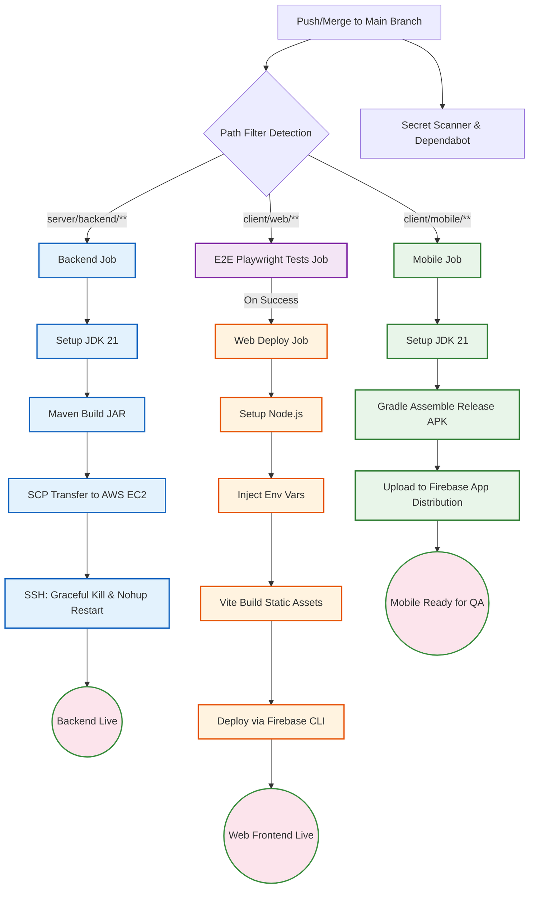

# CI/CD Pipeline Architecture Design

## 1. Overview
The continuous integration and continuous deployment (CI/CD) architecture leverages **GitHub Actions** to automate the building, testing, security scanning, and deployment of the CanMakan full-stack application.
The pipeline employs a monorepo strategy utilising **path-based filtering** and **concurrency controls** to independently route deployments for the Spring Boot backend, React web frontend, and Kotlin Android mobile application without executing unnecessary jobs. It now features an integrated End-to-End (E2E) testing workflow to ensure web application stability prior to deployment.

## 2. Implemented Architecture
### A. Code Quality & Security (CI)
* **Secret Scanning:** Automated scanning workflows (`secret-scan.yml`) intercept and audit pull requests for accidentally committed credentials, API keys, and sensitive data.
* **Dependency Management:** GitHub Dependabot is configured (`dependabot.yml`) to audit and update vulnerable repository dependencies routinely.
* **Build Assembly Checks:** PRs must pass compilation and build steps before merging to the `main` branch to prevent broken code from entering the deployment pipeline.

### B. Backend Deployment (`deploy.yml`)
* **Trigger:** Push to `main` with changes in `server/backend/**`.
* **Build:** Configures JDK 21 (Temurin) and executes a clean Maven package (`mvn package -DskipTests`).
* **Deploy (AWS EC2):**
* Transfers the compiled `.jar` artefact to the EC2 instance via SCP.
* Executes an SSH script to cleanly terminate the existing Java process running on port 8080.
* Injects system environment variables (`/etc/environment`) and launches the new artefact in the background using `nohup`.

### C. End-to-End Testing (E2E)
* **Web App Testing (Playwright)**
* **Trigger:** Push or Pull Request to `main` with changes in `client/web/**`.
* **Execution:** Installs Node.js 24, resolves dependencies, caches Playwright browsers, and runs the E2E test suite (`npx playwright test`).
* **Test Coverage:**
* Authentication and Route Guarding: Unauthenticated users are redirected to login.
* Authentication and Route Guarding: Valid credentials grant access to the portal.
* Authentication and Route Guarding: Sign out clears the session and redirects to login.
* Authentication and Route Guarding: Session persists across page reloads.
* Verify responsiveness of CanMakan Web Navigation Elements.

* **Reporting:** Uploads `playwright-report` as a GitHub artefact (retained for 30 days) for debugging.

### D. Frontend Deployments (`deploy-frontends.yml`)
* **Web App (React/Vite -> Firebase Hosting)**
* **Trigger:** Successful completion of the "E2E Playwright Tests" workflow (`workflow_run`) with detected changes in `client/web/**`.
* **Build:** Configures Node.js, resolves dependencies, and executes `npm run build`. GitHub Variables (e.g., `VITE_API_BASE_URL`) are injected into the environment during build-time to replace Vite placeholders.
* **Deploy:** Pushes the compiled static `dist` folder to Firebase Hosting using the Firebase Extended action.

* **Mobile App (Kotlin -> Firebase App Distribution)**
* **Trigger:** Successful workflow run with detected changes in `client/mobile/**`.
* **Build:** Configures JDK 21 (Temurin), grants Gradle execution permissions, and assembles the release APK.
* **Deploy:** Shreds decoded keystore post-build for security, then uploads the `app-release.apk` to Firebase App Distribution for the `qa-team` testing group.

---

## 3. Pipeline Architecture Diagram

---

## 4. Identified Gaps & Future Enhancements
While the current pipeline fulfils standard CI/CD requirements, several architectural gaps exist that can be optimised for a production-grade environment.

### Gap 1: Brief Backend Downtime During Deployment
* **Current State:** The deployment script forcefully terminates the old Java process before starting the new one, resulting in a few seconds of API downtime.
* **Future Enhancement:** Implement **Blue/Green Deployments** or **Rolling Updates**. Run two instances of the Spring Boot app on the EC2 machine (e.g., ports 8080 and 8081) and use an Nginx reverse proxy to silently switch traffic to the new instance only after it passes health checks.

### Gap 2: Direct Host Execution (Lack of Containerization)
* **Current State:** The JAR file runs directly on the EC2 OS, making it vulnerable to environment drift (e.g., Java version mismatches).
* **Future Enhancement:** Introduce **Docker**. Containerize the Spring Boot application and update the GitHub Action to push the image to a registry (like Docker Hub or AWS ECR). Deploying a container ensures the application runs exactly as it did during testing.

### Gap 3: Skipped Automated Testing in CD
* **Current State:** The backend build executes `mvn package -DskipTests`, bypassing unit and integration tests during deployment to speed up execution.
* **Future Enhancement:** Split the backend pipeline into discrete `Test` and `Deploy` jobs. Run Unit/Integration tests automatically, and only allow the SCP deployment to proceed if the `Test` job passes.

### Gap 4: Manual Database Schema Management
* **Current State:** There is no automated workflow for executing database schema changes (DDL) on the AWS RDS instance.
* **Future Enhancement:** Integrate a database migration tool like **Flyway** or **Liquibase** into the Spring Boot backend. This allows the application to automatically and safely apply version-controlled SQL scripts upon startup.

### Gap 5: Mobile App Delivery Limits
* **Current State:** The mobile application is delivered to Firebase App Distribution, requiring manual download by testers.
* **Future Enhancement:** Integrate **Fastlane** into the GitHub Actions mobile workflow to automate signing, screenshot generation, and direct publishing to the Google Play Store internal testing tracks.
