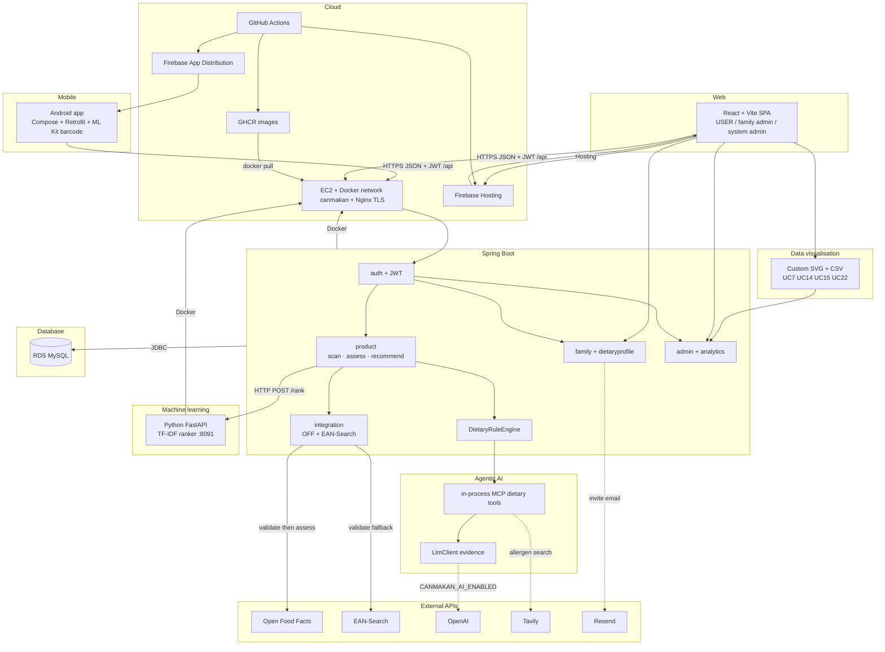

# CanMakan

CanMakan is an AI-assisted barcode ingredient interpreter: scan packaged food, see a deterministic dietary verdict for the active profile, and get safer catalog substitutes when the product is not SAFE.

Clients do not compute food safety. Android, React, the Python ranker, and in-process Agentic AI integrate through one Spring Boot API (Java 21) and MySQL. Charts are custom SVG on the web client. Staging/production: Docker on EC2 plus Firebase Hosting / App Distribution.

| Actor | Client | Typical work |
| --- | --- | --- |
| Consumer | Android | Scan, verdict, alternatives, history, profile switch, invite accept |
| Family admin (`PRIMARY_ADMIN`) | Web `/family/*` | Circle, roster, restriction summary, family history, verdict trends |
| System admin (JWT `ADMIN`) | Web `/system/*` | Accounts, consumer trends, usage, health, scan feedback |

## Project deliverables

AD Project source artefacts in this repository. Canvas-only items are not duplicated here.

| PDF deliverable | In this repository |
| --- | --- |
| Source code + how to run locally | This README |
| Database files | [`server/backend/src/main/resources/`](server/backend/src/main/resources/) ([`00_schema.sql`](server/backend/src/main/resources/00_schema.sql) + numbered seeds) |
| Architecture | Diagram below + [`docs/architecture/`](docs/architecture/) |
| Database / ER | [`docs/architecture/data-model.md`](docs/architecture/data-model.md) |
| Use cases / backlog | [`docs/requirements/`](docs/requirements/), [`docs/sprint/`](docs/sprint/) |
| API contracts | [`docs/api/`](docs/api/) |
| DevSecOps (CI/CD, SAST/DAST) | [`docs/devsecops/CICD-PIPELINE.md`](docs/devsecops/CICD-PIPELINE.md) |
| Demo video, slides, ICR, PSR, screenshots | Canvas (not in repo) |

## Architecture

Software architecture by product stack. Table/ER detail: [`docs/architecture/data-model.md`](docs/architecture/data-model.md). Locally, MySQL replaces RDS and Nginx/Firebase are skipped.



Agentic AI is **in-process** in Spring (`knowledgebase/mcp` + `ai/`); it is not a separate container. Data visualisation is **in the web SPA** (no Chart.js / Recharts). Validate uses Open Food Facts then **EAN-Search**; assess uses OFF only. Ranker stays on the Docker network (`http://canmakan-ml:8091`), not on Nginx.

Expanded notes: [`docs/architecture/system-overview.md`](docs/architecture/system-overview.md). Assess sequence: [`mcp-agent-architecture.md`](docs/architecture/mcp-agent-architecture.md). UC5: [`uc5-alternative-recommender.md`](docs/architecture/uc5-alternative-recommender.md). Pipeline jobs: [`CICD-PIPELINE.md`](docs/devsecops/CICD-PIPELINE.md).

### Component ownership

| Component | Owns in this product |
| --- | --- |
| Mobile | Barcode capture, verdict/recommendation/history UI, dietary profile, notifications, profile switch, invite accept |
| Web | Personal `/me` desk, family-admin household tools (`PRIMARY_ADMIN`), system-admin portal |
| Backend | JWT, dietary rule engine, family/scan APIs, persistence, orchestration |
| Agentic AI | In-process MCP dietary tools + Tier-3 LLM evidence ([`knowledgebase/mcp`](server/backend/src/main/java/com/canmakan/backend/knowledgebase/README.md), [`ai/`](server/backend/src/main/java/com/canmakan/backend/ai/README.md)); not a separate deploy |
| ML | Python TF-IDF rank of SAFE substitutes after the Java safety filter |
| Data visualisation | Web SVG dashboards/CSV (UC7/14/15/22); aggregate JSON from backend analytics APIs |

### Machine learning

| File | Why it matters |
| --- | --- |
| [`api.py`](server/machine-learning/src/canmakan_ml/api.py) | FastAPI `GET /health`, `POST /rank` |
| [`ranker.py`](server/machine-learning/src/canmakan_ml/ranker.py) | Field-weighted TF-IDF + cosine rank |
| [`train_ranker.py`](server/machine-learning/scripts/train_ranker.py) | Offline train from `01_products.sql`; artefact not committed |
| [`PythonTfidfRankClient.java`](server/backend/src/main/java/com/canmakan/backend/product/recommendation/ranking/PythonTfidfRankClient.java) | Spring calls `/rank` after `filterAcceptable` |
| [`MlContentBasedRanker.java`](server/backend/src/main/java/com/canmakan/backend/product/recommendation/ranking/MlContentBasedRanker.java) | Java fallback if ranker URL is empty or the sidecar is down |

Setup: [`server/machine-learning/README.md`](server/machine-learning/README.md).

### Agentic AI

| File | Why it matters |
| --- | --- |
| [`DietaryKnowledgeMcpServer.java`](server/backend/src/main/java/com/canmakan/backend/knowledgebase/mcp/server/DietaryKnowledgeMcpServer.java) | Registers the five in-process dietary tools |
| [`LlmClient.java`](server/backend/src/main/java/com/canmakan/backend/ai/llm/LlmClient.java) | Tier-3 ChatClient; evidence only |
| [`AssessmentOrchestrator.java`](server/backend/src/main/java/com/canmakan/backend/product/assessment/AssessmentOrchestrator.java) | Tier 1 → optional escalate → persist |
| [`LlmEscalationService.java`](server/backend/src/main/java/com/canmakan/backend/product/assessment/service/LlmEscalationService.java) | WARNING + `dataComplete` + AI enabled |
| [`mcp-agent-architecture.md`](docs/architecture/mcp-agent-architecture.md) | Flow and tool list |

`CANMAKAN_AI_ENABLED` defaults to false; [`DietaryRuleEngine`](server/backend/src/main/java/com/canmakan/backend/product/verdict/DietaryRuleEngine.java) always owns the verdict. [`server/agentic-ai/`](server/agentic-ai/README.md) is reserved/empty.

### Mobile

| File | Why it matters |
| --- | --- |
| [`BarcodeAnalyzer.kt`](client/mobile/app/src/main/java/sg/edu/nus/iss/canmakan/features/product/scan/BarcodeAnalyzer.kt) | ML Kit barcode (no OCR) |
| [`ScannerViewModel.kt`](client/mobile/app/src/main/java/sg/edu/nus/iss/canmakan/features/product/scan/ScannerViewModel.kt) | Validate then assess |
| [`ProductDetailScreen.kt`](client/mobile/app/src/main/java/sg/edu/nus/iss/canmakan/features/product/verdict/ProductDetailScreen.kt) | Verdict + alternatives tab |
| [`CanMakanNavGraph.kt`](client/mobile/app/src/main/java/sg/edu/nus/iss/canmakan/navigation/CanMakanNavGraph.kt) | Consumer shell and routes |
| [`AuthSessionStore.kt`](client/mobile/app/src/main/java/sg/edu/nus/iss/canmakan/features/auth/session/AuthSessionStore.kt) | Encrypted session; Bearer + refresh |

Debug allows cleartext to the emulator; release requires HTTPS `BASE_URL`. Details: [`client/mobile/README.md`](client/mobile/README.md).

### Web

| File | Why it matters |
| --- | --- |
| [`AppRoutes.tsx`](client/web/src/app/router/AppRoutes.tsx) | USER vs system-admin route gates |
| [`authService.ts`](client/web/src/features/auth/api/authService.ts) | Live JWT login/register/refresh |
| [`FamilyDashboardPage.tsx`](client/web/src/features/family/pages/FamilyDashboardPage.tsx) | Household home (`PRIMARY_ADMIN`) |
| [`SystemDashboardPage.tsx`](client/web/src/features/admin/pages/SystemDashboardPage.tsx) | Admin portal entry |
| [`client/web/README.md`](client/web/README.md) | Routes, CORS, mock flag |

Household web tools are for `PRIMARY_ADMIN`. Members scan on mobile. Auth and family create/`/me` always hit the live API; keep `VITE_USE_MOCK_API=false` (default).

### Data visualisation

Custom SVG (no Chart.js / Recharts). CSV is client-side from the loaded aggregate.

| File | Why it matters |
| --- | --- |
| [`ConsumerTrendsCharts.tsx`](client/web/src/features/analytics/components/ConsumerTrendsCharts.tsx) | UC7 anonymised consumer trends |
| [`VerdictTrendChart.tsx`](client/web/src/features/analytics/components/VerdictTrendChart.tsx) | UC14 family SAFE/WARNING/UNSAFE over time |
| [`UsageStatisticsResult.tsx`](client/web/src/features/analytics/components/UsageStatisticsResult.tsx) | UC15 usage KPIs |
| [`consumerTrendsReport.ts`](client/web/src/features/analytics/lib/consumerTrendsReport.ts) | UC22 CSV export |
| [`ConsumerTrendsService.java`](server/backend/src/main/java/com/canmakan/backend/analytics/service/ConsumerTrendsService.java) | Anonymised aggregate JSON |

## Repository layout

```text
client/mobile          Android (Compose)
client/web             React + Vite
client/shared          Shared mascot PNGs
server/backend         Spring Boot + MySQL schema/seeds
server/machine-learning  Python TF-IDF ranker
server/agentic-ai      Reserved pointer; agent is in-process Spring
docs/                  Requirements, architecture, API, sprint, code quality, DevSecOps
design-tokens/         Shared colours → Color.kt + tokens.css
.github/workflows      GitHub Actions (see docs/devsecops/CICD-PIPELINE.md)
```

Package READMEs: [`server/backend/README.md`](server/backend/README.md), [`client/mobile/README.md`](client/mobile/README.md), [`client/web/README.md`](client/web/README.md), [`server/machine-learning/README.md`](server/machine-learning/README.md). Workflow: [`CONTRIBUTING.md`](CONTRIBUTING.md).

## Stack and prerequisites

| Piece | Version used here |
| --- | --- |
| Backend | Java 21, Spring Boot 3.5.4, Maven Wrapper |
| Web | Node 24 (CI), React 19, Vite |
| Mobile | JDK 21, Kotlin 1.9.24, min API 26, compile/target SDK 37; Android SDK Platform 34+ for local SDK install |
| ML | Python 3.12 (CI), FastAPI on port 8091 |
| Data | MySQL 8 on `localhost:3306`, database `canmakan` (JDBC creates it if missing) |

## Run locally

Order: MySQL → backend → optional ML → web → Android. Optional: VS Code / Cursor task **Run Full Stack** ([`.vscode/tasks.json`](.vscode/tasks.json)).

**1. MySQL** on `localhost:3306`. Defaults: user `root`, empty password, database `canmakan`. Override with `MYSQL_USERNAME` / `MYSQL_PASSWORD` / `MYSQL_DB` if needed.

**2. Backend** (Java 21). Set `JWT_SIGNING_SECRET` (Base64, ≥32 bytes) and, for local HTTP cookies, `REFRESH_COOKIE_SECURE=false`:

```powershell
cd server/backend
$env:JWT_SIGNING_SECRET = [Convert]::ToBase64String([byte[]](1..32 | ForEach-Object { Get-Random -Maximum 256 }))
$env:REFRESH_COOKIE_SECURE = "false"
.\mvnw.cmd spring-boot:run
```

On macOS/Linux: `export JWT_SIGNING_SECRET="$(openssl rand -base64 32)"`, `export REFRESH_COOKIE_SECURE=false`, then `./mvnw spring-boot:run`.

Health: `http://localhost:8080/actuator/health`. Keys, CORS, and AI/Tavily flags: [`server/backend/README.md`](server/backend/README.md). Dev profile (`spring.profiles.default=dev`) reseeds MySQL on restart (`spring.sql.init.mode=always`); accounts created since last start are dropped.

**3. Optional ML ranker** (Python 3.12, port 8091). Train then serve — [`server/machine-learning/README.md`](server/machine-learning/README.md) — and in the **same shell** as Spring:

```powershell
$env:CANMAKAN_RECOMMENDATION_ML_RANKER_URL = "http://127.0.0.1:8091"
```

Empty URL or downtime uses the Java ranker (`MlContentBasedRanker`).

**4. Web** (API default `http://localhost:8080` when `VITE_API_BASE_URL` is unset). Do not copy the ngrok host from [`client/web/.env.example`](client/web/.env.example) for local work.

```powershell
cd client/web
npm install
npm run dev
```

**5. Android** (JDK 21, min API 26). From `client/mobile`: `.\gradlew.bat :app:assembleDebug`, or open that folder in Android Studio. Emulator API base: `http://10.0.2.2:8080/api/` — [`local.properties.example`](client/mobile/local.properties.example).

### Access clients

| Client | How |
| --- | --- |
| Web (local) | [http://localhost:5173/login](http://localhost:5173/login) — USER / family admin. [http://localhost:5173/system-admin-login](http://localhost:5173/system-admin-login) — system admin. |
| Web (hosted) | [https://canmakan-project.web.app](https://canmakan-project.web.app) (production), [https://canmakan-staging.web.app](https://canmakan-staging.web.app) (staging). |
| Mobile (local) | Android Studio, `app` on API 26+. Emulator API base: `http://10.0.2.2:8080/api/` — [`local.properties.example`](client/mobile/local.properties.example). |
| Mobile (hosted) | Firebase App Distribution (tester link; not stored in source). |

Seeded emails: [`04_roles_users.sql`](server/backend/src/main/resources/04_roles_users.sql). Households: [`05_household_dietary_data.sql`](server/backend/src/main/resources/05_household_dietary_data.sql). All seed users share one BCrypt hash (dev-only; ask the team for the plaintext, or register a new USER at `/register`).

| Email | Role | Notes |
| --- | --- | --- |
| `sysadmin@canmakan.com` | `ADMIN` | System portal (`/system-admin-login`) |
| `sarah@example.com` | `USER` | Tan family `PRIMARY_ADMIN` — web `/family/*` |
| `michael@example.com` | `USER` | Tan family member — scan on mobile |
| `david@example.com` | `USER` | Lim family `PRIMARY_ADMIN` |

## Tests

Run the checks for the component you changed ([`CONTRIBUTING.md`](CONTRIBUTING.md)):

```powershell
cd server/backend; .\mvnw.cmd test
cd client/web; npm run verify
cd client/mobile; .\gradlew.bat :app:assembleDebug testDebugUnitTest
cd server/machine-learning; pytest --cov=canmakan_ml --cov-fail-under=80
```

Backend smoke assess (seeded DB + access token): `.\scripts\smoke-assess.ps1 -AccessToken "<jwt>"` from `server/backend`.

## DevSecOps

PRs target `develop` (staging). `main` is production. GitHub Actions: Gitleaks, Semgrep, Trivy, SonarCloud, path-filtered builds, GHCR images, EC2 + Firebase deploy, nightly ZAP, weekly k6. Pipeline diagram and jobs: [`CICD-PIPELINE.md`](docs/devsecops/CICD-PIPELINE.md). Secure-coding checks (injection, secrets, broken auth) run in that pipeline; ZAP/k6 reports are CI artefacts, not committed PDFs.

## Future work

See [`docs/requirements/future-work.md`](docs/requirements/future-work.md).

1. **Agentic AI is easy to miss in a demo** — implemented in Spring but `CANMAKAN_AI_ENABLED=false` by default; no UC21 reasoning UI.
2. **No-barcode path is schema-only (UC24)** — scan API is barcode-only; `ocr_scan_results` is unused.
3. **Subscriptions and `PREFERENCE` are unfinished** — seeded `subscription_*` tables have no API; live severities are `STRICT_AVOID` and `INTOLERANCE` only.

## License

Apache License 2.0. See [`LICENSE`](LICENSE).
