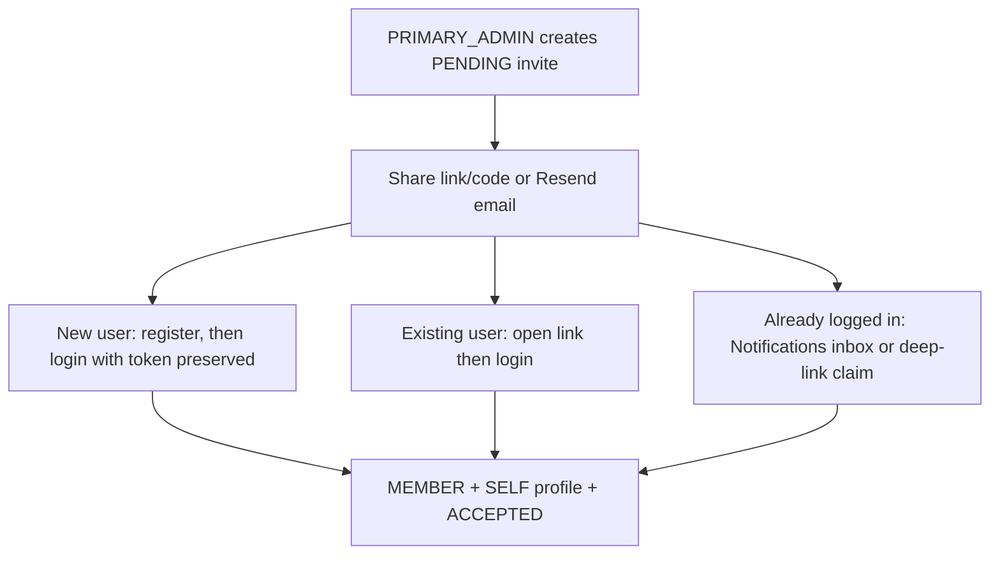

# features/family

Family membership context and active profile switching on mobile.

## Client ownership (family lifecycle)

| Action | Mobile | Web | Notes |
| --- | --- | --- | --- |
| Create Family Circle (UC8) | Yes | Yes | Very simple |
| Invite Member — link/code + share (UC9) | Yes | Yes | Mobile preferred for native share |
| Accept / Decline Invitation (UC10) | Yes | Optional | Mainly mobile |
| Switch Profile (UC11) | Yes | — | Daily use |
| Manage Family Circle (UC12) | Optional / limited | Primary | Roster, edit, remove, toggle active |

## Responsibilities (current)
- Resolve the caller's family via `GET /api/families/me` (Bearer JWT via auth interceptor)
- Create a family circle via `POST /api/families` when authenticated and no membership (UC8)
- Load household profiles for switcher (`GET /api/families/{familyId}/profiles`; inactive omitted)
- Switch active dietary profile for scan / history (UC11 — `GET`/`PUT /api/families/me/active-profile`)

## Create family circle (UC8)

When `/families/me` returns 404 and the user is signed in, the drawer shows a short message plus **Create family circle**. That opens `CreateFamilyCircleScreen`, which calls `POST /api/families` and refreshes membership on success.

Create is hidden when the user already has a family. Without a UC19 session, the drawer asks the user to sign in.

## Invite (UC9) and accept (UC10)

PRIMARY_ADMIN can open **Invite to Family** from the drawer (`showManageFamilyActions`
when `memberRole == PRIMARY_ADMIN`). `AddProfileToFamilyScreen` searches by email,
creates a PENDING invitation, and opens the system share sheet with `inviteUrl` +
`inviteCode`. Invitees preserve the token through register/login; claim runs only after
authentication (post-login continuation or **Notifications** inbox).

| Path | Mobile entry |
| --- | --- |
| Register then claim | Invite landing → Register (token offered) → Login → `PostLoginContinuationViewModel` claim |
| Deep link / login claim | `canmakan://invite/{token}` → `PendingInvitationStore` → Login offer → post-login claim |
| Inbox accept / decline | Top-bar **Notifications** bell → notifications inbox (`InvitationsScreen`) |

The inbox is account-wide (not admin-only): family invitations today, with room for
profile-update notices later. It is not listed under Manage Family in the drawer.

Full API contract and HTTP guards: `docs/api/families.md` (Invite → join workflow).

Dependant profile create is live on mobile for PRIMARY_ADMIN; dependants appear in the
mobile profile switcher and UC6 summary once created.

## Switch profile (UC11)

On login/startup, `CanMakanNavGraphViewModel` loads `GET /api/families/me/active-profile`
after `/me` and family profiles. Drawer profile selection updates
`ActiveProfileManager` immediately (optimistic), then confirms with
`PUT /api/families/me/active-profile`. Failed PUT (403 outside family, 409 inactive,
or network error) rolls back to the previous profile and shows an inline error.
`ActiveProfileManager` uses `UNSET_PROFILE_ID = 0` until the server (or registration
`profileId`) resolves.

## Manage members (UC12)

Full roster admin is **web-primary**; mobile manage stays limited to invite (UC9)
and dependant create.

## Notes
The actual dietary data of each member lives in `dietaryprofile`.
Session identity is owned by `AuthSessionStore` (UC19), not a separate prefs store.
