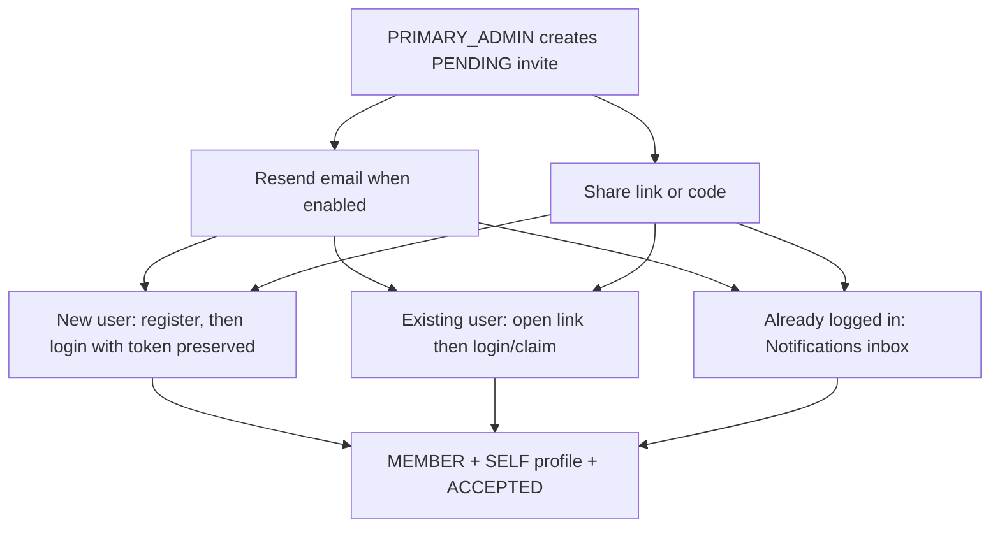

# Family circle APIs (UC8 / UC9 / UC10 / UC11 / UC6)

## Progress

| Area | Status |
| --- | --- |
| Schema D2 `UNIQUE(family_members.user_id)` | Done |
| `POST /api/families` (PRIMARY_ADMIN + SELF profile) | Done |
| `GET /api/families/me` | Done |
| Request validation (`@Valid` family name) | Done |
| Web create empty-state (`FamilyMeGate`) | Done |
| JWT principal on family routes | Done (UC19) |
| Mobile resolve via `/me` (AC10) | Done (create-when-empty) |
| UC11 GET/PUT `/families/me/active-profile` | Done |
| UC9 user-search / invitations / dependant profiles | Done |
| Post-login claim of PENDING invite | Done (authenticated `invitationToken`) |
| Spring Data repos (Family / Member / Invitation) | Done |
| `GET /api/families/me/members` roster list | Done (UC12 list; manage CRUD later) |
| UC10 invitee inbox list / accept / decline | Done (mobile primary; web inbox optional) |
| UC10 Resend invitation email | Done (optional; no-op when disabled) |

---

## Identity

Family create/`/me`/invite/dependant/restriction-summary and invitation inbox routes
require a Bearer access JWT. Controllers
read the caller from `@AuthenticationPrincipal AuthUserDetails` and pass
`userId` into `FamilyService`. Mutations that change household membership or
dependants require **PRIMARY_ADMIN** membership (not a JWT role claim).
Invitee accept/decline requires only that the authenticated email matches the invite.

```http
Authorization: Bearer <access-token>
```

---

## Create family circle

`POST /api/families`

Headers: `Authorization`, `Content-Type: application/json`

Request:

```json
{
  "familyName": "Wong Family"
}
```

Success `201` returns the same shape as `GET /families/me`.

| Status | Meaning |
| --- | --- |
| 400 | Blank / invalid family name |
| 401 | Missing/invalid JWT or unknown account |
| 409 | Caller already belongs to a family (D2) |

---

## Current family context

`GET /api/families/me`

Headers: `Authorization`

Success `200` body includes `familyId`, `familyName`, `memberRole`, `selfProfileId`, `createdByUserId`.

| Status | Meaning |
| --- | --- |
| 401 | Missing/invalid JWT |
| 404 | Authenticated user is not a family member |

---

## Active profile (UC11)

Persist which dietary profile subsequent scans use. Stored in `user_preferences.active_profile_id`.

### Get active profile

`GET /api/families/me/active-profile`

Headers: `Authorization`

Success `200`:

```json
{
  "profileId": 77,
  "profileName": "Wong",
  "relationship": "SELF",
  "familyId": 10,
  "isPrimary": true
}
```

**Default when no stored preference (or stored id is invalid):**

| Caller state | Default `profileId` |
| --- | --- |
| Family member | Caller's `selfProfileId` from membership |
| No family | Caller's standalone linked SELF profile (`family_id` NULL) |

On GET, a stale stored id (deleted profile, wrong family, inactive) falls back to the default and clears the stored FK.

### Set active profile

`PUT /api/families/me/active-profile`

Headers: `Authorization`, `Content-Type: application/json`

Request:

```json
{
  "profileId": 88
}
```

Success `200` returns the same shape as GET.

| Status | Meaning |
| --- | --- |
| 401 | Missing/invalid JWT |
| 403 | Profile is outside the caller's family (or not linked to caller when no family) |
| 409 | Profile exists but `is_active = 0` (inactive) |

**List filtering:** `GET /api/families/{familyId}/profiles` omits inactive profiles from the switcher list.

---

## Family members roster (UC12 list)

`GET /api/families/me/members`

Headers: `Authorization`

Any family member may list. Returns linked users and dependant profiles:

```json
[
  {
    "memberId": 10,
    "profileId": 77,
    "linkedUserId": 10,
    "profileName": "Admin",
    "relationship": "SELF",
    "ageGroup": "UNSPECIFIED",
    "commonRequirements": ["HALAL"],
    "restrictions": ["PEANUT_ALLERGY"],
    "source": "REGISTERED_USER",
    "maskedEmail": "a***n@example.com",
    "memberRole": "PRIMARY_ADMIN",
    "profileActive": true
  },
  {
    "memberId": 2,
    "profileId": 2,
    "linkedUserId": null,
    "profileName": "Toddler",
    "relationship": "CHILD",
    "ageGroup": "UNSPECIFIED",
    "commonRequirements": [],
    "restrictions": [],
    "source": "DEPENDANT_PROFILE",
    "maskedEmail": null,
    "memberRole": null,
    "profileActive": true
  }
]
```

| Field | Notes |
| --- | --- |
| `memberId` | `userId` for `REGISTERED_USER`; dietary `profileId` for `DEPENDANT_PROFILE` (compat) |
| `profileId` | Dietary profile id — use for UC12 manage APIs |
| `linkedUserId` | Present for registered members; null for dependants |
| `memberRole` | `PRIMARY_ADMIN` / `MEMBER` / null for dependants |
| `profileActive` | `dietary_profiles.is_active` |
| `ageGroup` | Always `UNSPECIFIED` until age is persisted on profiles |
| `commonRequirements` | Restriction codes whose catalog category is `RELIGIOUS` |
| `restrictions` | All other catalog categories (allergens, diets, etc.) |
| `maskedEmail` | Present for linked users only |

| Status | Meaning |
| --- | --- |
| 401 | Missing/invalid JWT |
| 404 | Authenticated user is not a family member |

---

## Manage profiles (UC12)

### List profiles (including inactive)

`GET /api/families/me/profiles` — authenticated family member; returns all profiles in the
caller’s family (active and inactive). Differs from `GET /families/{id}/profiles`, which
omits inactive rows for the switcher.

### Update metadata

`PUT /api/families/me/profiles/{profileId}`

PRIMARY_ADMIN only.

```json
{
  "profileName": "Child",
  "relationship": "CHILD",
  "commonRequirements": ["HALAL"],
  "restrictions": ["PEANUT_ALLERGY"]
}
```

`commonRequirements` / `restrictions` are optional catalog **codes**. Omit both to leave
selections unchanged. When included, D3 applies: caller may edit only **self** linked profile
or **unlinked dependants** (another adult’s linked profile → **403**).

Returns a roster row. **403** if not admin / wrong family / D3 deny; **404** if profile missing.

### Activate / deactivate

`PATCH /api/families/me/profiles/{profileId}`

PRIMARY_ADMIN only. Toggles `dietary_profiles.is_active` only (never `users.is_active`).

```json
{ "active": false }
```

Inactive profiles cannot be selected (UC11) or assessed (UC2) — HTTP **409**.

### Soft-remove linked member

`DELETE /api/families/me/members/{userId}`

PRIMARY_ADMIN only. Deactivates membership + linked profile; does not hard-delete rows
(preserves scan history). **409** if removing the last PRIMARY_ADMIN. **204** on success.

### Soft-remove dependant profile

`DELETE /api/families/me/profiles/{profileId}`

PRIMARY_ADMIN only. Deactivates and detaches the dependant (`family_id` null); keeps the
profile row for scan FK. Linked members must use `DELETE /members/{userId}` instead.

CORS allows `DELETE` and `PATCH`.

### Family scan history

`GET /api/families/me/scans` — **PRIMARY_ADMIN only**; returns recent scans for all
profiles currently in the caller’s family (web dashboard / history). Non-admin members
receive **403**. Verdicts on the wire are `SAFE` | `WARNING` | `UNSAFE` only.

---

## Profiles by family id

`GET /api/families/{familyId}/profiles` — authenticated; returns active dietary
profiles for the family when `{familyId}` matches the caller's membership.
Returns **403** when the caller is not a member of that family.
Inactive profiles are omitted from the list.

---

## User search (UC9)

`GET /api/families/me/user-search?email=`

PRIMARY_ADMIN only. Always `200` for a syntactically valid email:

| `accountStatus` | Meaning |
| --- | --- |
| `ACTIVE` / `INACTIVE` | Registered account |
| `NOT_REGISTERED` | No user row — still a valid invite target |

| `familyLinkStatus` | Meaning |
| --- | --- |
| `NOT_LINKED` | Can invite |
| `ALREADY_LINKED` | User already in a family (D2) |
| `PENDING` | Pending invite already exists for this family + email |

| Status | Meaning |
| --- | --- |
| 400 | Invalid email |
| 403 | Caller is not PRIMARY_ADMIN |
| 404 | Caller has no family |

---

## Invite → join workflow (UC9 / UC10)

Admin creates a **PENDING** invitation (no membership yet). The invitee joins by
an authenticated claim/accept path; all successful joins apply the same server outcome:
insert **MEMBER**, attach/create **SELF** dietary profile on that family, mark
invitation **ACCEPTED**. Decline only sets **DECLINED** and leaves the user
outside the family.



| Path | How | APIs |
| --- | --- | --- |
| **A. Register then claim** | New account with matching email; client preserves `invitationToken` through explicit login | `POST /api/auth/register`, `POST /api/auth/login`, then `POST /api/families/me/invitations/claim` |
| **B. Deep link / login claim** | Open `…/invite/{token}` or `canmakan://invite/{token}`, then register or sign in | `POST /api/families/me/invitations/claim` |
| **C. Inbox accept** | Signed-in invitee opens pending list and Accepts (or Declines) | `GET /api/invitations/me`, `POST /api/invitations/{token}/accept` or `…/decline` |

Guards on accept/claim: **403** email mismatch, **410** expired, **409** already
in a family or invitation already final, **404** unknown token.

After join, the invitee appears on `GET /api/families/me/members` and can use the
household profile context for scanning (active-profile persistence is UC11).

---

## Create invitation (UC9)

`POST /api/families/me/invitations`

```json
{ "email": "invitee@example.com" }
```

Creates a `PENDING` invitation for a **registered or unknown** email. Does **not**
insert `family_members`. Response includes shareable fields and email status:

```json
{
  "invitationId": 1,
  "invitedEmail": "invitee@example.com",
  "invitationToken": "<opaque>",
  "inviteCode": "ABCD1234",
  "inviteUrl": "http://localhost:5173/invite/<opaque>",
  "status": "PENDING",
  "expiresAt": "2026-08-16T00:00:00Z",
  "inviteeRegistered": false,
  "emailSent": true
}
```

`inviteUrl` base comes from `canmakan.invites.public-base-url` (default local Vite).

When Resend is enabled (`canmakan.email.resend.enabled=true` / env
`CANMAKAN_EMAIL_RESEND_ENABLED=true`, non-blank `CANMAKAN_EMAIL_RESEND_API_KEY`, and
`CANMAKAN_EMAIL_RESEND_FROM`), the server emails the invitee after create using the
standard HTML template (family name, accept link, invite code, expiry). Set
`CANMAKAN_INVITES_PUBLIC_BASE_URL` to the public web origin used in accept links.

`emailSent` is `true` only when Resend accepted the send. A `PENDING` row is kept
only after a successful send so the admin can retry the same email if delivery
fails. A later `POST` for the same family+email **resends** that pending invite
instead of returning **409**.

Email failures or a disabled provider are logged and do **not** fail the create
response (`emailSent: false`).

Mobile invite UI calls this endpoint directly (Cancel / Invite). HTTP **409**
messages are shown as red inline errors (already in a family circle).

| Status | Meaning |
| --- | --- |
| 201 | Invitation created, or existing PENDING resent |
| 400 | Invalid email |
| 403 | Not PRIMARY_ADMIN |
| 409 | Already a member of a family circle |

There is **no** production `POST /api/families/me/members/link` silent-link endpoint.

---

## Claim invitation (UC9)

`POST /api/families/me/invitations/claim`

```json
{ "invitationToken": "<opaque>" }
```

Same membership rules as UC10 accept (below). Used by register/login deep-link flows.

Registration does not claim invitations. `POST /api/auth/register` temporarily
accepts an optional `invitationToken` for older clients but creates only the
account. Clients preserve the token, complete explicit login, and then call this
authenticated claim endpoint. Invalid or expired claims cannot roll back the
already committed account.

| Status | Meaning |
| --- | --- |
| 200 | Joined family (same shape as `/families/me`) |
| 400 | Missing token |
| 403 | Authenticated email does not match invite |
| 404 | Unknown invitation token |
| 409 | Already in a family, or invitation already final |
| 410 | Invitation expired |

---

## Invitation inbox (UC10)

Authenticated invitee APIs (Bearer JWT). Protected under `/api/invitations/**`.

### List pending

`GET /api/invitations/me`

Returns PENDING invitations for the caller's email (newest first):

```json
[
  {
    "invitationId": 1,
    "familyId": 10,
    "familyName": "Wong Family",
    "invitedByDisplayName": "admin@example.com",
    "invitationToken": "<opaque>",
    "inviteCode": "ABCD1234",
    "status": "PENDING",
    "expiresAt": "2026-08-17T00:00:00Z",
    "expired": false
  }
]
```

Expired PENDING rows may still appear with `expired: true` (Accept disabled on clients).

### Accept

`POST /api/invitations/{token}/accept`

Inserts `MEMBER`, attaches SELF dietary profile to the family, marks invitation
`ACCEPTED`. Response shape matches `/families/me`.

| Status | Meaning |
| --- | --- |
| 200 | Joined family |
| 403 | Email mismatch |
| 404 | Unknown token |
| 409 | Already in a family, or invitation already final |
| 410 | Expired (status may be updated to `EXPIRED`) |

### Decline

`POST /api/invitations/{token}/decline`

Marks invitation `DECLINED`. No membership row is created. Expired PENDING invites
may still be declined.

| Status | Meaning |
| --- | --- |
| 204 | Declined |
| 403 | Email mismatch |
| 404 | Unknown token |
| 409 | Invitation is no longer pending |

---

## Create dependant profile (UC9)

`POST /api/families/me/profiles`

PRIMARY_ADMIN only.

```json
{
  "profileName": "Child",
  "relationship": "CHILD",
  "commonRequirements": ["PEANUT"],
  "restrictions": []
}
```

Persists `dietary_profiles` with `family_id` set, `linked_user_id` NULL,
`is_primary=false`. Does **not** insert `family_members`. Optional restriction
codes are applied via the dietary profile service.

| Status | Meaning |
| --- | --- |
| 201 | `{ profileId, profileName, relationship, familyId }` |
| 400 | Validation / unknown restriction code |
| 403 | Not PRIMARY_ADMIN |

Dependants appear in `GET /families/{id}/profiles` and in
`GET /families/me/restriction-summary` (`userId` is `0`; `profileId` is set).

---

## Restriction summary (UC6)

`GET /api/families/me/restriction-summary`

Unions active `family_members` linked profiles **and** dependant profiles
(`linked_user_id IS NULL`) for the caller's family.
