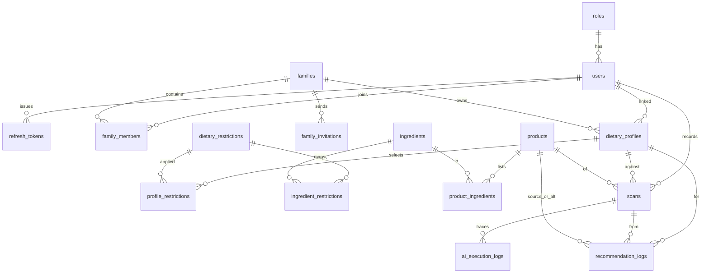

# Data model

Logical ER of **core** tables. Full DDL: [`00_schema.sql`](../../server/backend/src/main/resources/00_schema.sql).

Subscription / plan / feature-usage tables are seeded but have **no product API** (UC23). `ocr_scan_results` is schema-only (UC24).

| Cluster | Tables | Used by |
| --- | --- | --- |
| Auth | `roles`, `users`, `refresh_tokens` | [`auth`](../../server/backend/src/main/java/com/canmakan/backend/auth/README.md) |
| Family | `families`, `family_members`, `family_invitations` | [`family`](../../server/backend/src/main/java/com/canmakan/backend/family/README.md) |
| Diet | `dietary_profiles`, `dietary_restrictions`, `profile_restrictions` | [`dietaryprofile`](../../server/backend/src/main/java/com/canmakan/backend/dietaryprofile/README.md) |
| Catalog | `products`, `ingredients`, `product_ingredients` | scan + UC5 |
| Assess | `scans`, `ai_execution_logs`, `recommendation_logs` | [`product`](../../server/backend/src/main/java/com/canmakan/backend/product/README.md), [`ai`](../../server/backend/src/main/java/com/canmakan/backend/ai/README.md) |
