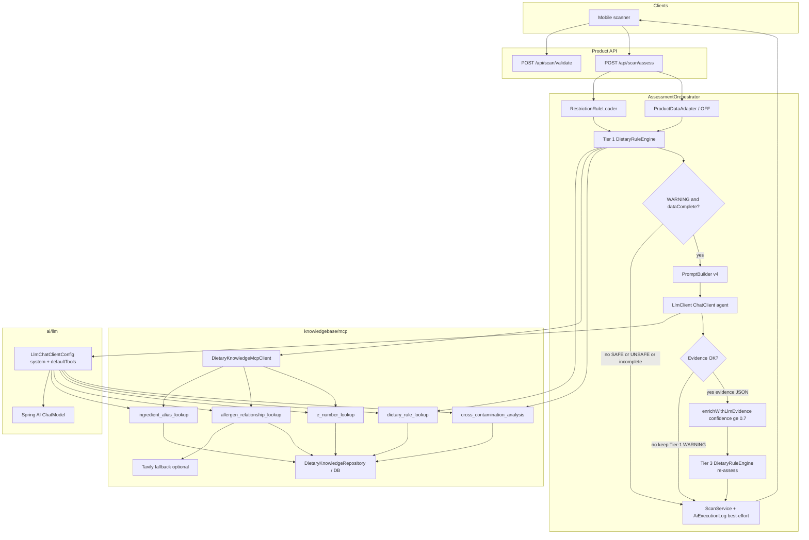
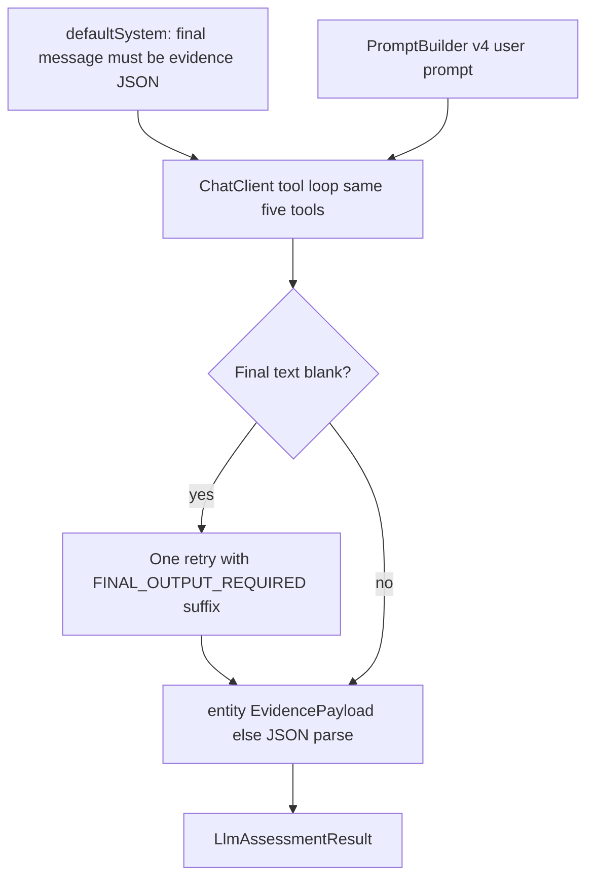
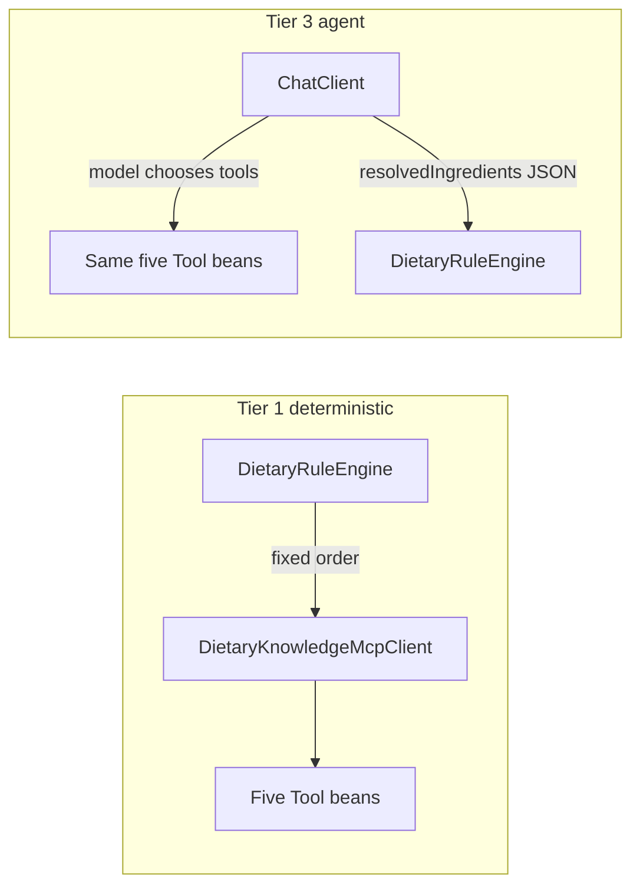

# CanMakan MCP Agent Architecture

**Audience:** backend and mobile teammates  
**Status:** Implemented (hybrid Tier 1 + Tier 3)  
**How to PDF:** Open this file in Cursor / VS Code / GitHub → Print → Save as PDF  
(Or paste Mermaid blocks into [mermaid.live](https://mermaid.live) for PNG/SVG exports.)

---

## Summary

CanMakan’s assess path uses a **hybrid MCP-style agent**:

1. **Tier 1** — deterministic `DietaryRuleEngine` calls dietary knowledge tools in a fixed order.
2. **Tier 3** (optional) — on WARNING escalation with AI enabled, an LLM `ChatClient` may call the **same five tools** autonomously, then returns **evidence only**.
3. The **rule engine always owns** SAFE / WARNING / UNSAFE. The LLM never emits the final verdict.

Tools are **in-process Spring beans** (not a remote MCP protocol client).

---

## End-to-end flow

1. Mobile: `POST /api/scan/validate` then `POST /api/scan/assess`
2. Load profile restriction rules + Open Food Facts product snapshot (`ProductDataAdapter`; assess does **not** call validate/EAN-Search)
3. **Tier 1:** dietary-rule filter → resolve ingredients → restriction checkers → cross-contamination (`traces_tags` included)
4. Escalate only when Tier-1 verdict is **WARNING** and product `dataComplete` is true
5. If escalating and AI enabled: **Tier 3 agent** → evidence JSON → enrich (confidence ≥ 0.7) → engine re-assess → `TIER_3_LLM`
6. If AI disabled / provider failure / invalid evidence: keep Tier-1 WARNING, `TIER_1_RULES`
7. Best-effort persist scan (+ AI/rules execution log) → return `AssessmentResponse` (verdict still returned if DB write fails; `scanId` may be null)



---

## Escalation policy

| Tier-1 outcome | Escalates to Tier 3? |
|----------------|----------------------|
| SAFE | No |
| UNSAFE | No |
| WARNING + `dataComplete` | Yes (if AI enabled and agent succeeds) |
| WARNING + incomplete / missing ingredients | No (`shouldEscalate` requires `dataComplete`) |

AI off or agent failure → response stays **WARNING** with `"tier": "TIER_1_RULES"`.

Trusted LLM roots only when `confidence >= 0.7` and `rootAllergen` is non-blank; otherwise the ingredient stays unresolved for the engine re-assess.

---

## Tier 3 agent internals



| Piece | Behavior |
|-------|----------|
| `LlmChatClientConfig` | `defaultSystem` (must end with JSON text, no verdict) + `defaultTools` (five knowledge tools) |
| `PromptBuilder` | `canmakan-evidence-v4`: tool-use rules, `tracesTags`, `FINAL_OUTPUT` (no tool-only empty turn) |
| `LlmClient` | Tool loop → if blank content, log diagnostics and **retry once** → prefer `ChatClient.entity(EvidencePayload)` → fall back to manual JSON parse |
| Failure modes | AI disabled; provider error; blank after retry; invalid JSON / schema → orchestrator keeps Tier-1 WARNING |

`canmakan.ai.agent.max-tool-iterations` exists in `application.properties` as a soft-limit contract note; the live agent currently relies on Spring AI’s default tool-calling loop (plus the blank-content retry above).

---

## Package boundaries

| Package | Owns |
|---------|------|
| `knowledgebase` / `knowledgebase/mcp` | Ingredient aliases, E-numbers, allergen hierarchy, dietary rules, cross-contam tools + client |
| `ai` / `ai/llm` | Prompt building, ChatClient tool agent, structured evidence parse/audit |
| `product` | Scan/assess orchestration, verdict engine, persistence |

MCP lives under **knowledgebase** because the tools expose domain knowledge, not AI plumbing.

---

## Five dietary knowledge tools

| Tool name | Role |
|-----------|------|
| `ingredient_alias_lookup` | Synonyms / catalog roots |
| `allergen_relationship_lookup` | Parent → root hierarchy (+ optional Tavily) |
| `e_number_lookup` | Additive metadata / animal-derived / root |
| `dietary_rule_lookup` | Restriction definition gate (drop UNKNOWN) |
| `cross_contamination_analysis` | May-contain phrases + OFF `traces_tags` |

---

## Two callers, same tool beans



| Path | How tools run |
|------|----------------|
| Tier 1 | Fixed pipeline via `DietaryKnowledgeMcpClient` |
| Tier 3 | LLM tool loop via `ChatClient.defaultSystem(...)` + `defaultTools(...)` |

---

## Verdict ownership

| Component | Responsibility |
|-----------|----------------|
| LLM agent | Evidence only: `resolvedIngredients`, `analysisNotes` (`EvidencePayload`) |
| `DietaryRuleEngine` | Final SAFE / WARNING / UNSAFE + findings |
| Mobile | Displays API verdict / flags |

Prompt and system message explicitly forbid outputting SAFE, WARNING, or UNSAFE.

---

## Persistence resilience

- `ScanService.record` upserts a minimal `products` row when the barcode is OFF-only (FK for `scans.barcode`).
- Scan / AI-log DB failures are caught: the API still returns the verdict; `scanId` may be `null`.
- Tier-3 success writes the AI execution log; Tier-1 (including failed escalate) writes rules-only latency when a scan id exists.

---

## Enable Tier 3 locally

Set env vars in the **same shell** that starts Spring Boot (a JVM already running will not pick them up):

```powershell
$env:OPENAI_API_KEY = "sk-your-real-key"
$env:CANMAKAN_AI_ENABLED = "true"
.\mvnw.cmd spring-boot:run
```

From `server/backend`. Defaults keep AI off (`canmakan.ai.enabled=false`).

Optional:

```powershell
$env:TAVILY_API_KEY = "tvly-your-real-key"
```

Smoke assess (backend running + seeded DB):

```powershell
.\scripts\smoke-assess.ps1
```

On escalate failure the backend logs `Tier-3 escalate skipped ...` (and `LlmClient` may log blank-content diagnostics / truncated raw JSON).

---

## Key source files

| File | Role |
|------|------|
| `product/assessment/AssessmentOrchestrator.java` | Tier 1 → escalate → enrich → Tier 3; soft persist |
| `product/verdict/DietaryRuleEngine.java` | Verdict authority |
| `product/scan/ScanService.java` | Scan persist + product upsert for OFF-only barcodes |
| `knowledgebase/mcp/DietaryKnowledgeMcpClient.java` | Tier 1 tool orchestration |
| `knowledgebase/mcp/server/*Tool.java` | Five `@Tool` beans |
| `ai/llm/LlmChatClientConfig.java` | ChatClient system prompt + defaultTools |
| `ai/llm/LlmClient.java` | Tool agent, blank retry, entity/JSON evidence parse |
| `ai/llm/EvidencePayload.java` | Structured evidence DTO |
| `ai/llm/PromptBuilder.java` | Evidence prompt v4 + tool-use + FINAL_OUTPUT |

---

## Out of scope (by design)

- Remote MCP protocol client (tools stay in-process)
- Agent-owned final verdict
- Replacing Tier 1 deterministic tool use
- Committing API keys
