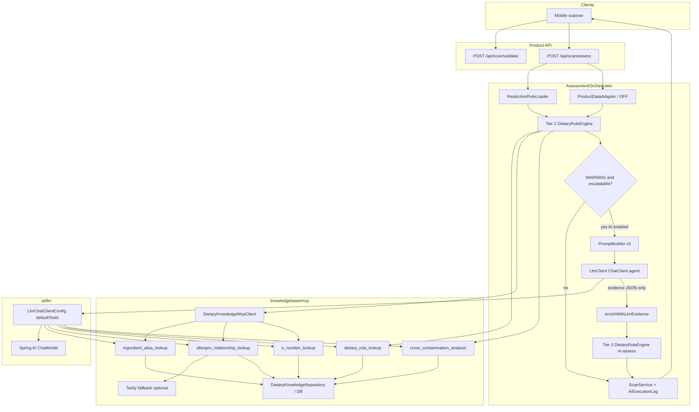
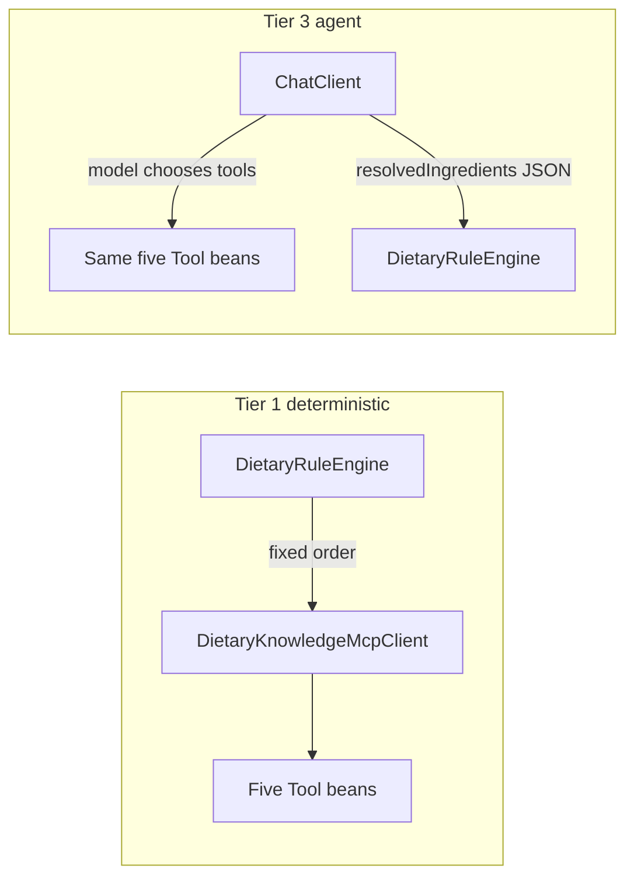

# CanMakan MCP Agent Architecture

**Audience:** backend and mobile teammates  
**Status:** Implemented (hybrid Tier 1 + Tier 3)  
**How to PDF:** Open this file in Cursor / VS Code / GitHub → Print → Save as PDF  
(Or paste Mermaid blocks into [mermaid.live](https://mermaid.live) for PNG/SVG exports.)

---

## Summary

CanMakan’s assess path uses a **hybrid MCP-style agent**:

1. **Tier 1** — deterministic `DietaryRuleEngine` calls dietary knowledge tools in a fixed order.
2. **Tier 3** (optional) — on WARNING escalation with AI enabled, an LLM `ChatClient` may call the **same five tools** autonomously, then returns **evidence only**.
3. The **rule engine always owns** SAFE / WARNING / UNSAFE. The LLM never emits the final verdict.

Tools are **in-process Spring beans** (not a remote MCP protocol client).

---

## End-to-end flow

1. Mobile: `POST /api/scan/validate` then `POST /api/scan/assess`
2. Load profile restriction rules + Open Food Facts product snapshot
3. **Tier 1:** dietary-rule filter → resolve ingredients → restriction checkers → cross-contamination
4. If WARNING and AI enabled: **Tier 3 agent** → evidence JSON → enrich product → engine re-assess
5. Persist scan (+ AI log when Tier 3) → return `AssessmentResponse` to mobile



---

## Package boundaries

| Package | Owns |
|---------|------|
| `knowledgebase` / `knowledgebase/mcp` | Ingredient aliases, E-numbers, allergen hierarchy, dietary rules, cross-contam tools + client |
| `ai` / `ai/llm` | Prompt building, ChatClient tool agent, LLM parse/audit |
| `product` | Scan/assess orchestration, verdict engine, persistence |

MCP lives under **knowledgebase** because the tools expose domain knowledge, not AI plumbing.

---

## Five dietary knowledge tools

| Tool name | Role |
|-----------|------|
| `ingredient_alias_lookup` | Synonyms / catalog roots |
| `allergen_relationship_lookup` | Parent → root hierarchy (+ optional Tavily) |
| `e_number_lookup` | Additive metadata / animal-derived / root |
| `dietary_rule_lookup` | Restriction definition gate (drop UNKNOWN) |
| `cross_contamination_analysis` | May-contain phrases + OFF `traces_tags` |

---

## Two callers, same tool beans



| Path | How tools run |
|------|----------------|
| Tier 1 | Fixed pipeline via `DietaryKnowledgeMcpClient` |
| Tier 3 | LLM tool loop via `ChatClient.defaultTools(...)` |

---

## Verdict ownership

| Component | Responsibility |
|-----------|----------------|
| LLM agent | Evidence only: `resolvedIngredients`, `analysisNotes` |
| `DietaryRuleEngine` | Final SAFE / WARNING / UNSAFE + findings |
| Mobile | Displays API verdict / flags |

Prompt explicitly forbids outputting SAFE, WARNING, or UNSAFE.

---

## Enable Tier 3 locally

```powershell
$env:OPENAI_API_KEY = "sk-your-real-key"
$env:CANMAKAN_AI_ENABLED = "true"
.\mvnw.cmd spring-boot:run
```

From `server/backend`. Defaults keep AI off (`canmakan.ai.enabled=false`).

Optional:

```powershell
$env:TAVILY_API_KEY = "tvly-your-real-key"
```

Smoke assess (backend running + seeded DB):

```powershell
.\scripts\smoke-assess.ps1
```

---

## Key source files

| File | Role |
|------|------|
| `product/assessment/AssessmentOrchestrator.java` | Tier 1 → escalate → Tier 3 |
| `product/verdict/DietaryRuleEngine.java` | Verdict authority |
| `knowledgebase/mcp/DietaryKnowledgeMcpClient.java` | Tier 1 tool orchestration |
| `knowledgebase/mcp/server/*Tool.java` | Five `@Tool` beans |
| `ai/llm/LlmChatClientConfig.java` | ChatClient + tools |
| `ai/llm/LlmClient.java` | Agent call + evidence parse |
| `ai/llm/PromptBuilder.java` | Evidence prompt v3 + tool-use instructions |

---

## Out of scope (by design)

- Remote MCP protocol client (tools stay in-process)
- Agent-owned final verdict
- Replacing Tier 1 deterministic tool use
- Committing API keys
