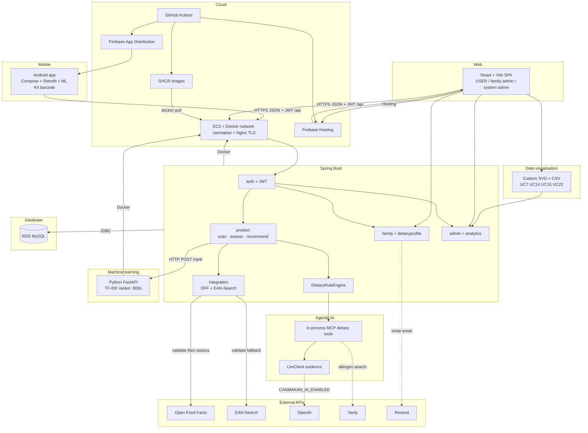

# System overview

CanMakan is one product. The software architecture is grouped by stack: mobile, web, data visualisation, Spring Boot, in-process agentic AI, machine learning, database, and cloud. Android and the React SPA call one Spring Boot API. Staging and production run that API and the Python ranker as Docker containers on EC2 (network `canmakan`), with MySQL on RDS. The SPA is Firebase Hosting; Android QA builds are Firebase App Distribution.

Same graph as the [root README](../../README.md). Scan/assess sequence: [MCP Agent Architecture](mcp-agent-architecture.md). UC5 ranking: [UC5 Alternative Recommender](uc5-alternative-recommender.md). Persistence tables: [Data model](data-model.md). Deploy jobs: [CICD-PIPELINE.md](../devsecops/CICD-PIPELINE.md).

Local development uses MySQL on `localhost:3306` instead of RDS, and skips Nginx / Firebase.

| Stack | What it is |
| --- | --- |
| Mobile | Consumer app; does not compute verdicts |
| Web | Family-admin and system-admin SPA |
| Data visualisation | Custom SVG/CSV **in the web SPA**; JSON from `admin`/`analytics` |
| Spring Boot | JWT API, rule engine, family/scan, OFF + EAN clients |
| Agentic AI | In-process MCP tools + `LlmClient`; not a separate container ([`server/agentic-ai/`](../../server/agentic-ai/README.md) is empty) |
| Machine learning | Python TF-IDF ranker after Java safety filter |
| Database | RDS MySQL (local: MySQL 8) |
| Cloud | GitHub Actions, GHCR, EC2/Docker/Nginx, Firebase Hosting and App Distribution |
| External APIs | OFF (validate + assess), EAN-Search (validate fallback), optional OpenAI / Tavily / Resend |

Validate uses Open Food Facts then **EAN-Search**. Assess uses OFF only (optional Tavily for unresolved allergen labels). UC5 catalog scoring does not call Tavily. Ranker port 8091 is Docker-internal (`http://canmakan-ml:8091`); Nginx does not expose it.
