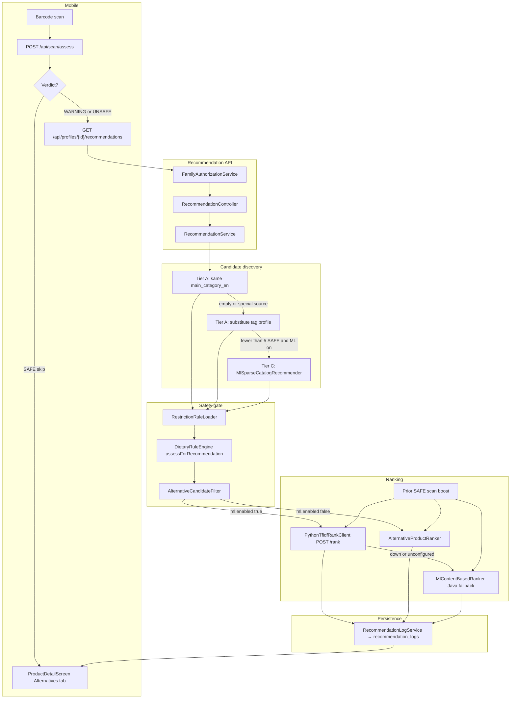
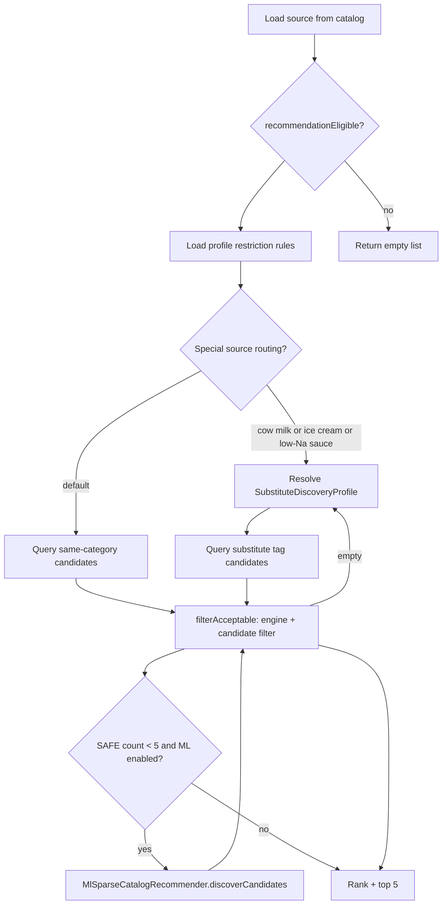
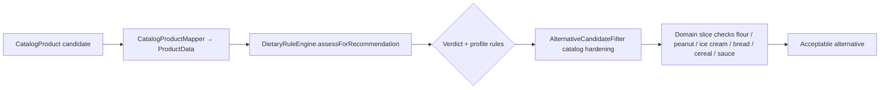
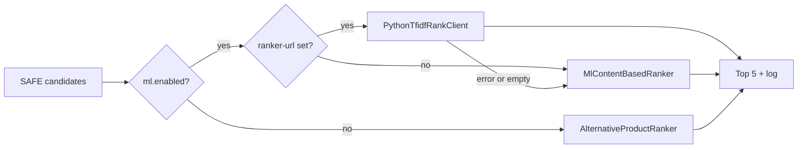
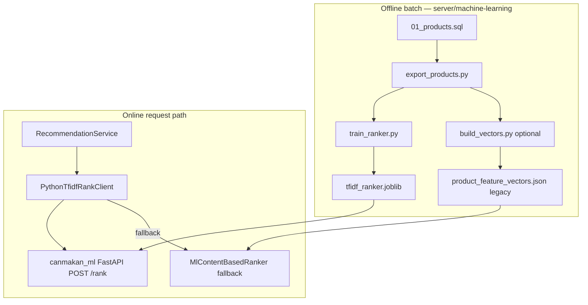

# UC5 — Alternative Product Recommender

**Audience:** backend, mobile, and ML teammates  
**Status:** Implemented (Tier A catalog + Tier C recall expansion + Python/Java ranking)  
**How to PDF:** Open this file in Cursor / VS Code / GitHub → Print → Save as PDF  
(Or paste Mermaid blocks into [mermaid.live](https://mermaid.live) for PNG/SVG exports.)

---

## Summary

UC5 suggests **safer substitute products** from the local catalog when a scan returns **WARNING** or **UNSAFE** for the active dietary profile. The scanned barcode is always excluded.

The recommender is **profile-aware and safety-first**:

1. **Discovery** — find catalog candidates (same category, then curated substitute tags, then optional ML expansion).
2. **Safety filter** — run each candidate through `DietaryRuleEngine` and `AlternativeCandidateFilter`.
3. **Ranking** — order SAFE (or profile-tolerant WARNING) candidates: **Python TF-IDF** (`POST /rank`) when `ml.enabled=true` and `ranker-url` is set → else Java `MlContentBasedRanker` when `ml.enabled=true` → else `AlternativeProductRanker` heuristics.
4. **Return top 5** — log to `recommendation_logs` (UC17 history) and respond to mobile.

UC5 does **not** generate a new verdict. It reuses `DietaryRuleEngine` with recommendation-specific acceptance rules for intolerance profiles. Catalog scoring calls `assessForRecommendation`, which resolves ingredients from the local knowledge base only (no Tavily) and caches identical ingredient/label rows within one request. Scan/assess still may use Tavily for unresolved OFF labels.

**UC17 boundary:** listing past recommendation sessions is a separate read API. UC5 only writes logs at recommendation time.

---

## End-to-end flow

1. Mobile scans barcode → `POST /api/scan/assess` → verdict (`SAFE` / `WARNING` / `UNSAFE`).
2. If verdict is **SAFE**, mobile **skips** recommendations (Alternatives tab hidden).
3. If verdict is **WARNING** or **UNSAFE**, mobile calls  
   `GET /api/profiles/{profileId}/recommendations?sourceBarcode=&scanId=`.
4. Backend loads source product from catalog, profile restriction rules, and prior SAFE scan barcodes.
5. Backend discovers candidates (Tier A → Tier C if needed), filters, ranks (Python → Java → heuristic), logs, returns up to 5 alternatives.



---

## Discovery tiers

| Tier | Class | When it runs | Pool |
|------|--------|--------------|------|
| **Tier A — same category** | `AlternativeProductQueryService.findSameCategoryCandidates` | Default first step | Up to 50 rows sharing `main_category_en` (source excluded) |
| **Tier A — substitute tags** | `SubstituteDiscoveryProfiles` + `findSubstituteTagCandidates` / `findExpandedSubstituteCandidates` | Same-category pool empty or all rejected | Curated `category_tags`, optional `labels_tags`, sibling categories |
| **Tier C — ML sparse** | `MlSparseCatalogRecommender` | Fewer than 5 acceptable candidates **and** `canmakan.recommendation.ml.enabled=true` | Tag-expanded slice in SQL popularity order (`unique_scans_n`, `completeness`), capped at 50. For milk, flour, bread, cereal, and peanut profiles, **narrow** discovery limits label/sibling expansion to tag recall only. |

Logged `discoveryTier` values: `TIER_A_CATALOG` (default) or `TIER_C_ML_SPARSE` when ML expansion contributed candidates. Tier C expands **recall** only; ranking cosine runs in Python or Java rankers, not in `MlSparseCatalogRecommender`.

### Source routing exceptions

Some products skip the coarse same-category pool because it mixes incompatible rows (e.g. `Dairies` with spreads):

| Source signal | Behavior |
|---------------|----------|
| Cow drinkable milk (`isCowMilkSource`) | Skip same-category; go straight to oat/dairy substitute tags |
| Ice cream (`isIceCreamSource`) | Skip same-category; go to `ice-creams-and-sorbets` substitutes |
| Low-sodium sauce preference + sauce source | Use expanded substitute discovery (labels + siblings) |



---

## Curated substitute profiles

`SubstituteDiscoveryProfiles` maps source categories (and tag/name heuristics) to substitute slices. Examples:

| Source | Substitute include tags | Notes |
|--------|-------------------------|-------|
| Fresh / UHT milks | `en:milk-substitutes`, `en:dairy-substitutes` | Beverage boost: oat/soy/almond drinks; deprioritize cooking creams |
| Wheat / white flours | `en:gluten-free-flour`, catalog GF flour tags | Flour-like rows only (`AlternativeCandidateFilter`) |
| Peanut butters | `en:nut-butters`, `en:tahini`, … | Exclude honey; exclude `en:peanuts` traces |
| Ice creams | `ice-creams-and-sorbets` | Dairy-free frozen desserts |
| Breads | `Gluten free bread` | GF bread rows only |
| Breakfast cereals | `Gluten free Breakfast cereals` | GF cereal without oats |
| Sauces / soy sauces | `Gluten Free sauces` or `Low sodium sauces` | Gluten-free or low-sodium paths |

Tag coverage is extended offline via `server/machine-learning/scripts/audit_substitute_tags.py` → `01c_recommendation_substitute_tags.sql`. Demo barcodes live in `01f_uc5_demo_gold_set.sql`.

---

## Safety filter

Every candidate is scored with `DietaryRuleEngine.assessForRecommendation` (same verdict rules as assess, local catalog ingredients only — no Tavily), then recommendation-specific gates.



| Profile pattern | Acceptance beyond strict SAFE |
|-----------------|------------------------------|
| DAIRY intolerance | WARNING allowed if no dairy trigger; reject cow milk / dairy spreads |
| GLUTEN avoidance | WARNING GF substitutes when no GLUTEN finding (flour, bread, cereal paths) |
| PEANUT avoidance | WARNING peanut-free spreads when no PEANUT finding |
| LOW_SODIUM preference | WARNING low-salt sauce substitutes |
| No intolerance rules | SAFE only |

Catalog hardening rejects obvious same-category triggers (e.g. another cow-milk row for a dairy-intolerant profile) even when the engine returns SAFE.

---

## Ranking

Ranking runs **after** `filterAcceptable` — only SAFE (or profile-tolerant WARNING) candidates are scored.



When `canmakan.recommendation.ml.ranker-url` is set **and** `ml.enabled=true`, Spring calls the **Python TF-IDF rank service** (`POST /rank`) first. On failure or empty response, Java `MlContentBasedRanker` runs. When `ml.enabled=false`, only `AlternativeProductRanker` heuristics apply (Python is skipped even if `ranker-url` is set).

### Python rank service (`canmakan_ml`)

Field-weighted sklearn TF-IDF (joblib artifact) plus domain boosts mirroring Java:

```
score = min(0.99,
      cosineSimilarity × 0.63
    + nutritionSimilarity
    + 0.12 unsweetened boost
    + packSizeBoost
    + domainAdjustment (secondaryIncludeTags +0.03, flour type +0.05, nut-butter +0.02, cooking −0.10)
    + 0.10 prior SAFE scan
)
```

Train: `server/machine-learning/scripts/train_ranker.py`. Local API: `uvicorn canmakan_ml.api:app --app-dir src --port 8091`. Staging/production: GHCR image `canmakan-ml` on Docker network `canmakan`; Spring `ranker-url` is `http://canmakan-ml:8091`.

### Heuristic ranker (`AlternativeProductRanker`)

| Signal | Effect |
|--------|--------|
| Same-category order | `1.0 − position × 0.01` |
| Substitute-tag order | `0.95 − position × 0.01` |
| `secondaryIncludeTags` match (e.g. oat/soy drinks) | `+0.03` |
| Nut-butter profile + `en:nut-butters` | `+0.02` |
| Deprioritized cooking tag | `−0.10` |
| Milk substitute pack-size proximity | `PackSizeParser.weightedBoost` |
| Prior SAFE scan of candidate | `+0.10` (cap `0.99`) |

### ML hybrid ranker (`MlContentBasedRanker`) — Java fallback

Used when Python is unavailable or `ranker-url` is empty. Sparse **TF-IDF cosine similarity** (via `ProductFeatureEncoder` / optional `product_feature_vectors.json` artifact) plus hand-tuned boosts:

```
score = min(0.99,
      cosineSimilarity × 0.63
    + nutritionSimilarity     (sugars + sodium per 100g when both sides present)
    + 0.12 unsweetened boost  (LOW_SUGAR profile, no nutrition pair)
    + packSizeBoost           (milk substitutes: volume ml similarity)
    + domainAdjustment        (secondaryIncludeTags +0.03, nut-butter +0.02, cooking −0.10)
    + 0.10 prior SAFE scan
)
```

Query vectors downweight allergen tokens (`encodeQuery`) so neighbors match **use-type**, not the same allergen (e.g. other peanut butters).



See `server/machine-learning/README.md` for train, Docker, and GHCR deploy. Legacy `product_feature_vectors.json` supports Java inline encoding and `evaluate.py` only; production ranking should use the same `tfidf_ranker.joblib` artifact as Python.

---

## Mobile behavior

| Verdict | Recommendations API | Alternatives tab |
|---------|---------------------|------------------|
| SAFE | Not called | Hidden |
| WARNING | Called after assess | Shown; loading overlay `FETCHING_ALTERNATIVES` |
| UNSAFE | Called after assess | Shown |

`ScannerViewModel` passes `scanId` when available so UC17 can group history rows. Errors surface as `alternativesError` on the tab without blocking the verdict screen.

---

## API contract

```
GET /api/profiles/{profileId}/recommendations
    ?sourceBarcode={barcode}
    &scanId={optional}
```

- **Auth:** JWT + `assertProfileAuthorizedForScan` (same gate as scan/assess).
- **Response:** `AlternativeProductResponse` — `sourceBarcode` + up to 5 `AlternativeProductDto` (barcode, name, brand, `matchReason`, `score`).
- **Empty:** valid response when source missing, ineligible, or no SAFE candidates.

`matchReason` examples: `category_match`, `substitute_category`, `substitute_category_cooking`, `substitute_pack_size`, `prior_safe_scan`, `ml_similarity`, `ml_nutrition_match`, `ml_unsweetened_substitute`, `ml_pack_size_match`, `ml_prior_safe_scan`.

---

## Configuration

| Property | Default | Effect |
|----------|---------|--------|
| `canmakan.recommendation.ml.enabled` | `true` | Tier C recall expansion + Java `MlContentBasedRanker` fallback; `false` → Tier A discovery + heuristic rank only |
| `canmakan.recommendation.ml.ranker-url` | empty | Python rank service base URL (e.g. `http://canmakan-ml:8091`). Empty → skip Python; use Java/heuristic rankers |
| `canmakan.recommendation.ml.ranker-connect-timeout-ms` | `500` | HTTP connect timeout for Python rank client |
| `canmakan.recommendation.ml.ranker-read-timeout-ms` | `2000` | HTTP read timeout for Python rank client |
| `canmakan.recommendation.ml.artifact-path` | empty | Optional path to `product_feature_vectors.json` for Java `MlContentBasedRanker`; inline encoding when unset |
| `canmakan.recommendation.llm.enabled` | `false` | LLM discovery service exists but is **not** on the MVP path |

Environment overrides: `CANMAKAN_RECOMMENDATION_ML_ENABLED`, `CANMAKAN_RECOMMENDATION_ML_RANKER_URL`, `CANMAKAN_RECOMMENDATION_ML_RANKER_CONNECT_TIMEOUT_MS`, `CANMAKAN_RECOMMENDATION_ML_RANKER_READ_TIMEOUT_MS`, `CANMAKAN_RECOMMENDATION_ML_ARTIFACT_PATH`.

---

## Persistence and UC17

`RecommendationLogService` best-effort writes one row per returned alternative into `recommendation_logs` (profile, scan, source barcode, candidate, tier, score, match reason).

UC17 reads grouped history via `GET /api/profiles/{profileId}/recommendation-history`. It does not generate new alternatives.

---

## Key source files

| File | Role |
|------|------|
| `product/recommendation/RecommendationController.java` | HTTP entry |
| `product/recommendation/RecommendationService.java` | Orchestration: discover → filter → rank → log |
| `product/recommendation/catalog/AlternativeProductQueryService.java` | Same-category and tag-based catalog queries |
| `product/recommendation/filter/SubstituteDiscoveryProfiles.java` | Curated source → substitute tag profiles |
| `product/recommendation/filter/AlternativeCandidateFilter.java` | Profile-tolerant acceptance + catalog hardening |
| `product/recommendation/ranking/PythonTfidfRankClient.java` | Online Python rank HTTP client |
| `product/recommendation/ranking/AlternativeProductRanker.java` | Tier A heuristic ranking |
| `product/recommendation/ranking/MlSparseCatalogRecommender.java` | Tier C tag recall expansion (SQL popularity order) |
| `product/recommendation/ranking/MlContentBasedRanker.java` | Java TF-IDF ranking fallback |
| `product/recommendation/ranking/ProductFeatureEncoder.java` | Sparse vectors for Java ranker (artifact or inline) |
| `product/recommendation/filter/PackSizeParser.java` | Milk pack-size proximity |
| `product/recommendation/history/RecommendationLogService.java` | UC17 write side |
| `client/mobile/.../scan/ScannerViewModel.kt` | SAFE skip + alternatives fetch |
| `client/mobile/.../verdict/ProductDetailScreen.kt` | Alternatives tab UI |
| `server/machine-learning/scripts/train_ranker.py` | Train `tfidf_ranker.joblib` (primary rank artifact) |
| `server/machine-learning/scripts/build_vectors.py` | Legacy `product_feature_vectors.json` (Java fallback / evaluate) |

---

## Out of scope (by design)

- Generating alternatives from Open Food Facts at request time (catalog is local DB)
- Tavily / web search while scoring catalog alternatives (scan/assess fallback only)
- LLM-owned substitute discovery on the MVP path (`LlmRecommendationDiscoveryService` disabled by default)
- Replacing `DietaryRuleEngine` verdict authority
- Recommendation history UI (UC17)
- End-user explanation of why each substitute was chosen beyond `matchReason` codes

---

## Related docs

- Sprint scope: `docs/sprint/sprint2-mvp-epics.md` (UC5, UC17)
- Offline ML pipeline: `server/machine-learning/README.md`
- Assess / verdict flow: [MCP Agent Architecture](mcp-agent-architecture.md)
