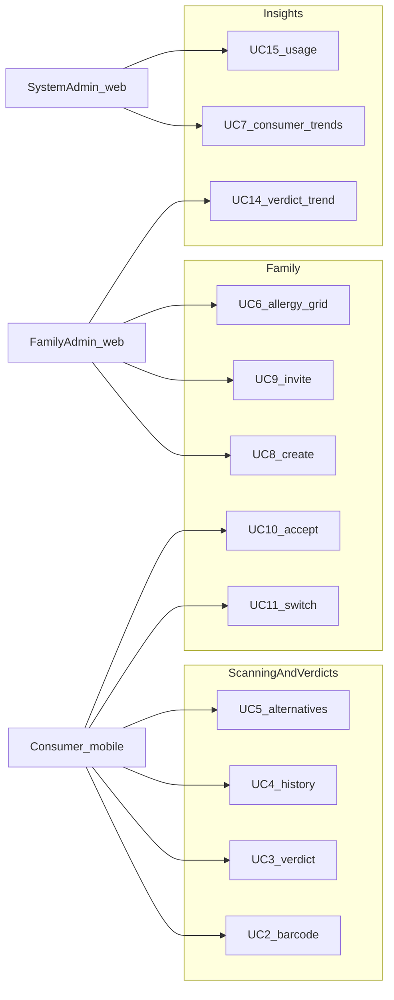

# Requirements

CanMakan is a barcode ingredient interpreter for households: scan packaged food, get a deterministic SAFE / WARNING / UNSAFE verdict against the active dietary profile, and (when not SAFE) see safer catalog substitutes.

It is one product through a common Spring Boot API. Clients do not compute food-safety verdicts.

## Actors

| Actor | Client | Typical work |
| --- | --- | --- |
| Consumer | [Android](../../client/mobile/README.md) | Scan, verdict, alternatives, profile switch, invite accept |
| Family admin (`PRIMARY_ADMIN`) | [Web](../../client/web/README.md) `/family/*` | Circle, roster, restriction summary, family history, verdict trends |
| System admin (JWT `ADMIN`) | Web `/system/*` | Accounts, consumer trends, usage, health, scan feedback |

## Use cases (high level)

Narrative and acceptance criteria: [Sprint 2 epics](../sprint/sprint2-mvp-epics.md). Prioritisation: [backlog](../sprint/sprint2-jira-backlog.md). After Jira import, Jira is the source of truth for status.

Core path also needs [UC18 register](../api/README.md#uc18-user-registration) and [UC19 login](../api/README.md#login-uc19-jwt).

## Rule engine

Deterministic restriction rules: [dietary-rule-specification.md](dietary-rule-specification.md). Implementation: [`DietaryRuleEngine`](../../server/backend/src/main/java/com/canmakan/backend/product/verdict/DietaryRuleEngine.java).

## Non-functionals

AuthN/Z, secrets, SAST/DAST, and cloud deploy: [CICD-PIPELINE.md](../devsecops/CICD-PIPELINE.md). Secure-coding intent matches OWASP (injection, broken auth, sensitive data) via Gitleaks, Semgrep, Trivy, and ZAP in that pipeline — not a separate committed report.

## Out of current product

[Future work](future-work.md): default-off Agentic AI demo path, OCR (UC24), subscriptions (UC23) / `PREFERENCE` severity.
