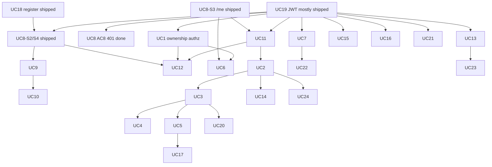

# CanMakan — Sprint 2 Use-Case Epics

| Field | Value |
| --- | --- |
| **Role** | Use-case narrative, acceptance criteria, and design context |
| **Prioritisation** | Core MVP (UC1–UC13) · Enhanced (UC14–UC19) · Nice-to-Have (UC20–UC24) |
| **Execution plan** | [`sprint2-jira-backlog.md`](sprint2-jira-backlog.md) |
| **Architecture packages** | Authentication & Security · Family · Dietary · Scanning & Verdicts · Analytics · Administration · Monitoring |
| **Tech stack** | Android Kotlin + ML Kit; React; Spring Boot + Security + JWT; AWS RDS MySQL; OFF; OpenAI; EC2; Resend |

UC IDs and packages match the [prioritisation table](sprint2-jira-backlog.md#0-prioritisation-strategy-features-and-technology-stack) and [architecture packages](sprint2-jira-backlog.md#0b-architecture-centric-feature-packages). Owners: [task assignment](sprint2-jira-backlog.md#0c-task-assignment).

### How to read each UC

1. Owner + package + architecture group + primary technologies  
2. Current code state  
3. User story  
4. Context (UI/UX, class & sequence diagrams, backend, client, testing)  
5. Acceptance criteria (checklist — one row per criterion)  
6. Jira child stories (AC # map — same UC epic; see [backlog §5](sprint2-jira-backlog.md#5-proposed-jira-child-stories))  
7. Dependencies and boundaries  

**Diagram expectation:** Design class and sequence diagrams for each UC; store under `docs/architecture/`.

**Acceptance criteria format:** Each criterion is a single checklist row. Mark Done in Jira/QA; do not expand scope beyond the UC notes and [alignment rules](sprint2-jira-backlog.md#0d-alignment-rules-schema-engineering). Stories inherit the [shared DoD](sprint2-jira-backlog.md#8-shared-definition-of-done-proposed). Thick ACs are split into multiple Jira sub-tasks under the same UC; the AC # map shows which checklist rows each story closes.

### Status legend

| Status | Meaning |
| --- | --- |
| Not started | No meaningful UI or API |
| Partial | Mock, stub, or incomplete API |
| Mostly complete | E2E path with known gaps |
| Complete | Meets MVP acceptance |

### Package overview

| Package | UC IDs |
| --- | --- |
| **Core MVP** | UC1–UC13 |
| **Enhanced** | UC14–UC19 |
| **Nice-to-Have** | UC20–UC24 |

### Task assignment (summary)

| Person | Assignments |
| --- | --- |
| **Kwok Heng** | UC1, UC4 |
| **Khai** | UC2, UC6; DevSecOps/CI/CD (owner) |
| **Huayuan** | UC3, UC14 |
| **Chai Lee** | UC5, UC17; Database Setup & Maintenance (owner) |
| **Amelia** | UC8–UC12; DevSecOps/CI/CD (support); Database (support) |
| **Maowei** | UC7, UC13, UC18, UC19 |
| *Unassigned* | UC15, UC16, UC20–UC24 |

Full table: [backlog §0c](sprint2-jira-backlog.md#0c-task-assignment).

---

# Core MVP

## UC1 — Manage App User Dietary Profile

**Owner:** Kwok Heng · **Package:** Core MVP · **Architecture:** Dietary Profile / Mobile Client  
**Tech:** Android Kotlin; Spring Boot REST; AWS RDS MySQL  
**Current code state:** Partial — live catalog/PUT + mobile editor; JWT + ownership authz still open; severity fixed `STRICT_AVOID`

- **Backend:** `DietaryProfileController` — live `GET /api/restrictions` and `GET|PUT /api/profiles/{profileId}/restrictions`; JWT required; GET uses family-scan authz; PUT uses D3 (`assertMayEditRestrictions`: self + unlinked dependants).
- **Mobile:** `DietaryRestrictionSheet` + ViewModel wired from the drawer; loads/saves against the live API for the active profile. Severity is fixed to `STRICT_AVOID` in the VM (no PREFERENCE / INTOLERANCE picker). Loading/error paths exist.
- **Missing:** unknown-code → consistent HTTP 400 mapping; JWT + ownership authz on restriction endpoints (UC1-S1 / remaining UC19-S3). SELF bootstrap after registration is via **UC8** create-circle (register leaves `family_id` NULL until then).

### User story

As an app user, I want to change my personal restrictions, allergens, and preferences, and create a dietary profile after registration, so that scans reflect what I can and cannot have.

### Alignment

Profile create after registration must respect `dietary_profiles.family_id NOT NULL` — prefer **UC8** bootstrap SELF profile unless owners approve a schema change.

### Context

**Design:** Mobile restriction editor (catalog + severity); create/onboarding flow tied to registration + family bootstrap.  
**Diagrams:** DietaryProfileController, service, entities; sequences for load catalog → PUT restrictions; create path.  
**Backend:** `GET /api/restrictions`; `GET|PUT /api/profiles/{id}/restrictions`; ownership authz.  
**Mobile:** DietaryRestrictionSheet; wire create path without family-less orphans.  
**Testing:** PUT valid/unknown; authz denials; save round-trip.  
**Out of scope:** Free-text allergens beyond catalog; admin multi-member UI (UC12); orphan profiles without family.

### Acceptance criteria

| Done | # | Criterion |
| --- | --- | --- |
| [x] | 1 | Authenticated user can load the restriction catalog via `GET /api/restrictions`. |
| [x] | 2 | Authenticated user can load existing restrictions for an authorized profile via `GET /api/profiles/{profileId}/restrictions`. |
| [x] | 3 | User can add one or more catalog restrictions to their authorized profile. |
| [ ] | 4 | User can change severity for an existing profile restriction. *(mobile hard-codes `STRICT_AVOID`)* |
| [x] | 5 | User can remove a restriction from their authorized profile. |
| [x] | 6 | `PUT /api/profiles/{profileId}/restrictions` persists changes and a subsequent GET returns the saved set. |
| [x] | 7 | The next successful scan/assess for that profile uses the updated restrictions (not a stale set). |
| [x] | 8 | After registration (or first authenticated session), the user obtains a usable SELF dietary profile via the approved path (UC8 bootstrap, or an explicit schema-approved alternative). |
| [x] | 9 | Creating a profile does not invent an orphan row when `family_id` is NOT NULL (no silent family-less insert). *(register allows `family_id` NULL; UC8 attaches family)* |
| [ ] | 10 | Unknown restriction codes are rejected with HTTP 400. |
| [ ] | 11 | Unauthorized profile access (other adult’s linked profile under default D3) returns HTTP 403. |
| [ ] | 12 | Unknown profile id returns HTTP 404 (or equivalent documented not-found). |
| [x] | 13 | Mobile shows a loading state while catalog or profile restrictions load. |
| [ ] | 14 | Mobile shows an empty state when the catalog or saved restriction set is empty. |
| [x] | 15 | Mobile shows an error state on network or save failure without crashing. |
| [ ] | 16 | Restriction requests require authentication (UC19-S3 close-out — dietary routes still transitional `permitAll`). |

### Jira child stories

| Story | Closes AC # | Notes |
| --- | --- | --- |
| **UC1-S1** | 1–2, 10–12, 16 | Authz + catalog/load — **open** |
| **UC1-S2** | supports 3–6 | Codes / PREFERENCE (D8/M6) — **open** (severity picker) |
| **UC1-S3** | 3–7 | Mobile editor + save + next-scan — **mostly done** (AC4 severity open) |
| **UC1-S4** | 8–9 | Create-after-registration / UC8 bootstrap — **done** |
| **UC1-S5** | 13–15 | Loading / empty / error — **partial** (empty state polish) |

Full table: [backlog §5 UC1](sprint2-jira-backlog.md#uc1--dietary-profile).

### Dependencies

UC19, UC8 · Related: UC11, UC12

---

## UC2 — Scan Product Barcode

**Owner:** Khai · **Package:** Core MVP · **Architecture:** Scanning & Verdicts / Mobile Client  
**Tech:** Android; ML Kit Barcode; Spring Boot; Open Food Facts  
**Current code state:** Partial — camera → validate → assess JWT path shipped; profile ownership / inactive checks on assess done

- **Mobile:** `ScannerScreen` + ML Kit `BarcodeAnalyzer` → `ScannerViewModel` calls validate then assess and navigates to the verdict screen. Loading / non-food / network failure states exist. No web scan UI (by design).
- **Backend:** `ScanController` — live `POST /api/scan/validate` (still `permitAll`) and `POST /api/scan/assess` (JWT). `AssessmentOrchestrator` authorizes `profileId` via `FamilyService.assertProfileAuthorizedForScan`, loads OFF product data, runs `DietaryRuleEngine`, optionally LLM evidence, and records a scan.
- **Identity:** Assess uses `@AuthenticationPrincipal` for `scans.user_id` (no `X-User-Id`). Profile ownership / inactive 409 enforced on assess. Validate still `permitAll`; validate response is category/message (not rich product identity).

### User story

As an app user, I want to scan a product's barcode so that CanMakan can fetch the product and call the safety verdict agent against my active dietary profile.

### Context

**Design:** Full-bleed scanner; validate → assess states; no web scan.  
**Diagrams:** Scanner → validate → assess → UC3.  
**Backend:** `POST /api/scan/validate`, `/assess`; JWT; authorize profileId.  
**Out of scope:** OCR label scan (UC24); web scan UI; inventing Safe for unknown products.

### Acceptance criteria

| Done | # | Criterion |
| --- | --- | --- |
| [x] | 1 | Mobile camera captures a packaged-food barcode via ML Kit Barcode Scanning. |
| [x] | 2 | Client calls `POST /api/scan/validate` with the decoded barcode. |
| [ ] | 3 | On successful validate, backend returns product identity details needed to proceed to assess. *(validate returns category/message; rich identity comes on assess)* |
| [x] | 4 | Client calls `POST /api/scan/assess` with the active authorized `profileId`. *(server validates family/inactive ownership before assess)* |
| [x] | 5 | Assess requires authentication; `scans.user_id` is taken from the JWT (spoofable `X-User-Id` is not trusted as identity). |
| [x] | 6 | Assess rejects a `profileId` outside the caller’s family with HTTP 403. |
| [x] | 7 | Assess rejects an inactive profile (`dietary_profiles.is_active=0`) with HTTP 409 (or documented equivalent). |
| [x] | 8 | Unknown / not-found products show a clear failure state on mobile. |
| [ ] | 9 | Unknown / not-found products are never displayed or persisted as Safe. *(validate blocks many cases; assess edge cases remain)* |
| [x] | 10 | Non-food or unsupported barcode outcomes show a clear failure or guidance state (no false Safe). |
| [x] | 11 | Network / OFF upstream failure shows an error state without crashing the scanner. |
| [x] | 12 | Successful assess navigates to (or surfaces) the UC3 verdict view for that scan. |
| [x] | 13 | Web clients do not implement barcode scan for this UC. |

### Jira child stories

| Story | Closes AC # | Notes |
| --- | --- | --- |
| **UC2-S1** | 5–7 | JWT userId **done**; family ownership + inactive **done** |
| **UC2-S2** | 1–3 | Camera + validate — **mostly done** (AC3 product-identity polish) |
| **UC2-S3** | 4, 12 | Assess → UC3 — **done** |
| **UC2-S4** | 8–11 | Failure states — **mostly done** (AC9 harden) |
| **UC2-S5** | 13 | No web scan — **done** |

Full table: [backlog §5 scan path](sprint2-jira-backlog.md#uc2--uc3--uc4--uc5--scan-path).

### Dependencies

UC19-S3 (remaining public routes), UC11 · Related: UC1 (restriction quality), UC3, UC4, UC5

---

## UC3 — View Safety Verdicts

**Owner:** Huayuan · **Package:** Core MVP · **Architecture:** Scanning & Verdicts / Mobile Client  
**Tech:** Android; Spring Boot; Dietary Rule Engine; AI-assisted analysis; RDS  
**Current code state:** Mostly complete — colour-coded verdict + engine ownership shipped; Alternatives empty (UC5)

- **Engine:** `DietaryRuleEngine` + checkers; assess returns `SAFE` / `WARNING` / `UNSAFE`, findings, explanation, tier, `scanId`. LLM is evidence-only (engine re-owns final verdict). Cross-contam / incomplete data map to Warning (not fabricated Safe).
- **Mobile:** `ProductDetailScreen` — colour-coded Safe / Warning / Avoid (`UNSAFE` → Avoid), Flags & Details from findings, product name/barcode when present. Mapping via `ScannerViewModel.toVerdictDetail` and history → `VerdictDetail`.
- **Gaps:** Alternatives tab always present but empty (UC5). Post-nav loading relies on in-memory pending verdict (no refetch). E-number / complex-ingredient copy depends on assess payload richness.

### User story

As an app user, I want a detailed Safe / Warning / Unsafe verdict for a scanned product, explained simply, so that I can decide quickly and trust the result.

### Context

**Design:** Colour-coded verdict; ingredient findings; “may contain” as Warning; no complex charts.  
**Engine owns verdict;** LLM is evidence only. Wire `UNSAFE` (UI may say Avoid).  
**Out of scope:** Alternatives generation (UC5); recommendation history (UC17); trend charts (UC14); client-side verdict override.

### Acceptance criteria

| Done | # | Criterion |
| --- | --- | --- |
| [x] | 1 | After a successful assess, mobile displays a colour-coded verdict for the active profile. |
| [x] | 2 | Wire verdict values use backend `SAFE` \| `WARNING` \| `UNSAFE` (UI may label UNSAFE as Avoid). |
| [x] | 3 | Verdict includes a plain-language reason that names the relevant ingredient and rule where applicable. |
| [x] | 4 | Ingredient-level findings are shown in a simple colour-coded list/view (no complex charts). |
| [ ] | 5 | Complex ingredients and E-numbers are explained in simple language when the assess payload provides them. *(depends on payload / MCP quality)* |
| [x] | 6 | Cross-contamination / “may contain” signals are raised as Warning, not Safe. |
| [x] | 7 | Incomplete product data never results in a fabricated Safe verdict. |
| [x] | 8 | DietaryRuleEngine (or equivalent server authority) owns the final verdict; the client does not override it. |
| [x] | 9 | Optional AI/LLM output is treated as evidence only and cannot force Safe against engine rules. |
| [ ] | 10 | Loading and error states are handled if assess detail is still fetching or fails after navigation. *(in-memory pending verdict; limited post-nav refetch)* |
| [x] | 11 | Product name/barcode (when available) are shown with the verdict for user confirmation. |

### Jira child stories

| Story | Closes AC # | Notes |
| --- | --- | --- |
| **UC3-S1** | 1–5, 11 | Colour-coded UI + findings — **mostly done** (AC5 polish) |
| **UC3-S2** | 6–9 | Engine-owned + incomplete/may-contain — **done** |
| **UC3-S3** | 2 | Wire `UNSAFE` / Avoid — **done** |
| **UC3-S4** | 10 | Loading/error after navigation — **open** |

Full table: [backlog §5 scan path](sprint2-jira-backlog.md#uc2--uc3--uc4--uc5--scan-path).

### Dependencies

UC2 · Related: UC5, UC4

---

## UC4 — View Scan History

**Owner:** Kwok Heng · **Package:** Core MVP · **Architecture:** Shared Client  
**Tech:** Android + React + Spring Boot + RDS  
**Current code state:** Partial — mobile personal history live (no authz); family web list API missing  
**Coordination:** Family list API (UC4-S2) owned by Kwok Heng; Family Portal page shell/nav coordinates with Amelia.

- **Mobile (personal):** `HistoryScreen` + `ServerScanHistoryRepository` against live `GET /api/scan/profiles/{profileId}/history` (`ScanController`). Newest-first list; tap opens verdict detail. History GET is transitional `permitAll` with **no ownership authz**.
- **Persist:** Successful assess records product, verdict, timestamp, profile, JWT `user_id`.
- **Web (family):** `FamilyScanHistoryPage` expects `GET /api/families/me/scans` — **endpoint missing**; usable only when `VITE_USE_MOCK_API=true` (default is **false**). Page is list/detail (no trend chart). Web verdict types still include non-wire labels (`AVOID` / `INCOMPLETE`).
- **Out of this UC:** charts/trends (UC14); CSV export (UC22).

### User stories

1. As an app user, I want personal scan history on mobile so I can revisit past verdicts.  
2. As a Family Admin, I want a filterable household scan table on web so I can review assessments.

### Alignment

List/detail only. **Trend charts are UC14**, not UC4.

### Context

**APIs:** `GET /api/scan/profiles/{id}/history`; `GET /api/families/me/scans` (admin).  
**Clients:** HistoryScreen; FamilyScanHistoryPage (no chart).  
**Out of scope:** Daily/weekly time-series charts (UC14); anonymised platform trends (UC7).

### Acceptance criteria

| Done | # | Criterion |
| --- | --- | --- |
| [x] | 1 | Each successful assess persists product, verdict, timestamp, and profile used for the scan. |
| [ ] | 2 | Mobile lists the authenticated user’s personal scan history for an authorized profile via `GET /api/scan/profiles/{profileId}/history`. *(list works; auth/authz still open)* |
| [x] | 3 | Selecting a mobile history row reopens the stored assessment / verdict detail. |
| [ ] | 4 | Mobile history requires authentication and denies unauthorized `profileId` with 403. |
| [ ] | 5 | Family Admin can load household scans via `GET /api/families/me/scans`. |
| [ ] | 6 | Family history rows show at least product, profile, verdict, and time. |
| [ ] | 7 | Family history supports filters that narrow the list (e.g. profile, verdict, date range as implemented). |
| [ ] | 8 | Selecting a family history row opens assessment detail for that scan. |
| [x] | 9 | Family history page remains a list/detail view and does **not** render a daily/weekly trend chart. *(page shell exists; live data missing)* |
| [ ] | 10 | Non–Family Admin callers receive 403 on the family-wide scans API (per permission matrix). |
| [ ] | 11 | Family history returns only scans for the authenticated admin’s family (no cross-family leakage). |
| [ ] | 12 | Empty history shows an empty state on mobile and web (no fabricated demo rows when mock is off). |
| [x] | 13 | Loading and error states are handled on both clients. *(mobile yes; web mock path yes)* |
| [ ] | 14 | Web wire verdict values align with backend `SAFE` \| `WARNING` \| `UNSAFE` (UI label mapping allowed). |

### Jira child stories

| Story | Closes AC # | Notes |
| --- | --- | --- |
| **UC4-S1** | 1–4, 12–13 | Personal history — **partial** (persist + list/detail; authz/empty open) |
| **UC4-S2** | 5–6, 10–11 | Family list API — **open** |
| **UC4-S3** | 7–9, 12–13 | Family history web page — **partial** (shell; live API open) |
| **UC4-S4** | 14 | Verdict wire alignment — **open** |

Full table: [backlog §5 scan path](sprint2-jira-backlog.md#uc2--uc3--uc4--uc5--scan-path).

### Dependencies

UC2, UC3; UC8 for family list

---

## UC5 — View Alternative Product Recommendation

**Owner:** Chai Lee · **Package:** Core MVP · **Architecture:** Scanning & Verdicts / Mobile Client  
**Tech:** Android; Spring Boot; Open Food Facts; recommendation logic  
**Current code state:** Not started — Alternatives tab shell only (always empty on live assess)

- **Backend:** no recommendations controller/service.
- **Mobile:** `ProductDetailScreen` Alternatives tab is always visible; live assess returns empty alternatives. Sample data only in `ProductSampleData`.
- **Boundary:** No separate recommendation-history screen (UC17) exists.

### User story

As an app user, I want suitable alternatives when a product is Warning/Avoid, based on my active dietary profile.

### Alignment

Generating alternatives = UC5. **Listing past recommendations = UC17** (Enhanced).

### Context

**Out of scope:** Recommendation history list UI (UC17); ML ranking beyond agreed MVP algorithm; web alternatives UI unless later assigned.

### Acceptance criteria

| Done | # | Criterion |
| --- | --- | --- |
| [ ] | 1 | `GET /api/profiles/{profileId}/recommendations` (or equivalent) returns alternatives for an authorized profile. |
| [ ] | 2 | Alternatives are shown on mobile for Warning and Unsafe (Avoid) verdicts. |
| [ ] | 3 | Alternatives tab/section is hidden (or clearly inactive) for Safe verdicts. |
| [ ] | 4 | Returned alternatives are suitable for the active dietary profile under the agreed MVP algorithm (e.g. prior Safe history / category overlap). |
| [ ] | 5 | Current barcode/product is excluded from the recommendation list. |
| [ ] | 6 | When no alternatives exist, API returns an empty list and UI shows an appropriate empty state. |
| [ ] | 7 | Unauthorized profile access returns 403. |
| [ ] | 8 | Loading and error states are handled on the Alternatives UI. |
| [x] | 9 | This UC does not implement a separate recommendation-history screen (UC17). |

### Jira child stories

| Story | Closes AC # | Notes |
| --- | --- | --- |
| **UC5-S1** | 1, 4–5, 7 | Recommendations API — **open** |
| **UC5-S2** | 2–3, 6, 8 | Alternatives tab UX — **open** |
| **UC5-S3** | 9 | UC17 boundary — **done** |

Full table: [backlog §5 scan path](sprint2-jira-backlog.md#uc2--uc3--uc4--uc5--scan-path).

### Dependencies

UC2, UC3 · Feeds: UC17

---

## UC6 — View Family Allergy Summary Grid

**Owner:** Khai · **Package:** Core MVP · **Architecture:** Family Management / **Mobile Client** (primary; optional React web parity)  
**Tech:** Android (primary); React (optional parity); Spring Boot; RDS  
**Current code state:** Mostly complete — **UC6-S1 API + UC6-S2 mobile grid shipped**; web parity still mock-oriented

- **Backend:** live `GET /api/families/me/restriction-summary` (`FamilyController` / `FamilyService`) — JWT principal, membership-scoped; **active members plus dependant profiles** (`linked_user_id` NULL, `userId=0` / `profileId` set). Also `GET /api/families/{familyId}/profiles` (includes dependants; prefer `/me` for new work).
- **Mobile (primary):** drawer → `FamilyRestrictionSummaryScreen` + `FamilyRestrictionSummaryViewModel`; calls the live summary API with Bearer from `AuthSessionStore`; loading / empty / error + session gate. Empty-state edit CTA is local (no full UC12 manage route yet).
- **Web:** `FamilyRestrictionSummaryPage` at `/family/restrictions` can call the live summary API when mock is off; polish/parity remains UC6-S3.
- **Gaps:** `dietary_profiles.is_active` not in schema yet (UC12 migration); overlap highlighting polish as designed.

### User story

As a family account holder, I want a grid of family members and their allergies/restrictions so I can shop safely for the household.

### Context

**API:** `GET /api/families/me/restriction-summary`  
**Edit** navigates to UC12 — this UC is overview.  
**Out of scope:** Editing restrictions on the grid (UC12); system-admin anonymised trends (UC7).

### Acceptance criteria

| Done | # | Criterion |
| --- | --- | --- |
| Done | # | Criterion |
| --- | --- | --- |
| [x] | 1 | Authenticated family member can call `GET /api/families/me/restriction-summary`. |
| [x] | 2 | Response includes profiles in the caller’s family with their restrictions (code, display name, severity as designed). |
| [x] | 3 | **Primary client (mobile)** presents a matrix/grid of members (or profiles) against restrictions. |
| [ ] | 4 | Overlapping restrictions across members are visually highlighted as designed. |
| [x] | 5 | Only the authenticated user’s family data is returned (no cross-family leakage; `/me` scoping). |
| [x] | 6 | Inactive profiles are omitted or clearly marked per product choice documented with UC12. |
| [x] | 7 | Empty family / no restrictions shows an empty state with guidance (e.g. link toward UC12 members). |
| [ ] | 8 | Edit actions navigate to UC12 (or UC1 for self) and do not mutate restrictions inside this UC. *(empty CTA currently pops back; full UC12 manage not wired)* |
| [x] | 9 | Loading and error states are handled. |
| [x] | 10 | Production path works with mock API disabled. *(mobile uses live API; web mock still optional)* |
| [x] | 11 | Non-members cannot access another family’s summary. |
| [ ] | 12 | Optional web parity (if shipped) uses the same summary API and does not become a second source of truth. |

### Jira child stories

| Story | Closes AC # | Notes |
| --- | --- | --- |
| **UC6-S1** | 1–2, 5–6, 11 | **Mostly done** — API live; AC6 waits on UC12 `is_active` |
| **UC6-S2** | 3–4, 7–10 | **Mostly done** — mobile grid; polish AC4/AC8 |
| **UC6-S3** | 12 | Optional web parity |
Full table: [backlog §5](sprint2-jira-backlog.md#uc6--uc7--uc13).

### Dependencies

UC19, UC8, UC1 · Related: UC12

---

## UC7 — Generate Consumer Trends

**Owner:** Maowei · **Package:** Core MVP · **Architecture:** Analytics / Web Client (Admin)  
**Tech:** React Admin; Spring Boot aggregation; anonymisation; RDS  
**Current code state:** Partial (admin UI mock; DB rollup unused by Java)

- **Web:** `ConsumerTrendsPage` (+ dashboard entry) via `adminService.getConsumerTrends()` → mock when `VITE_USE_MOCK_API=true`; live path would hit missing `/api/admin/consumer-trends` (404). Period controls do not hit a real query API.
- **Schema:** `daily_consumer_trends` exists in `00_schema.sql` and may be seeded, but there is no Java controller/service reading or writing it from `scans`.
- **Security:** `/api/admin/**` requires `ROLE_ADMIN` once an API exists.
- **Missing:** anonymised aggregation job/API, SYSTEM_ADMIN authz on a real endpoint, live filters.

### User story

As a System Admin, I want anonymised consumer-trend insights from scan data.

### Alignment

UC7 = generate/view trends. **CSV export = UC22**. **Family charts = UC14**.

### Acceptance criteria

| Done | # | Criterion |
| --- | --- | --- |
| [ ] | 1 | System Admin can call `GET /api/admin/consumer-trends` (or equivalent) with agreed date/filter params. |
| [ ] | 2 | Backend aggregates scan data into category-level (or agreed) consumer trends. |
| [ ] | 3 | System Admin dashboard displays the aggregated trends. |
| [ ] | 4 | Response contains no user id, email, profile name, or family id (anonymised only). |
| [ ] | 5 | Non–System Admin callers receive HTTP 403. |
| [ ] | 6 | Empty range shows an empty state (no fabricated numbers when mock is off). |
| [ ] | 7 | Loading and error states are handled on the admin page. |
| [x] | 8 | This UC does not implement CSV download (UC22) or family verdict charts (UC14). |

### Jira child stories

| Story | Closes AC # | Notes |
| --- | --- | --- |
| **UC7-S1** | 1–2, 4–5 | Anonymised trends API — **open** |
| **UC7-S2** | 3, 6–8 | Admin dashboard UI — **partial** (shell/mock; AC8 boundary done) |

Full table: [backlog §5](sprint2-jira-backlog.md#uc6--uc7--uc13).

### Dependencies

UC19 · Related: UC22

---

## Family client ownership (product split)

| Action | Mobile | Web | Notes |
| --- | --- | --- | --- |
| Create Family Circle (UC8) | Yes | Yes | Very simple |
| Invite Member — link/code + share (UC9) | Yes | Yes | Mobile is better for sharing |
| Accept / Decline Invitation (UC10) | Yes | Optional | Mainly mobile |
| Switch Profile (UC11) | Yes | — | Daily use |
| Manage Family Circle (UC12) | Optional / limited | Primary | Roster, edit, remove, toggle active |

---

## UC8 — Create Family Circle

**Owner:** Amelia · **Package:** Core MVP · **Architecture:** Shared (Mobile + Web Family)  
**Tech:** Android; React; Spring Boot; RDS  
**Current code state:** Complete (MVP ACs) — **UC8-S1–S4 shipped** (API + web + mobile create-when-empty + JWT 401)

- **Schema:** `UNIQUE(family_members.user_id)` via `uq_family_members_user_id` in `00_schema.sql` (D2 / one circle per user). Seeds remain one membership per user.
- **Backend:** `POST /api/families` and `GET /api/families/me` via `FamilyService` / `FamilyController`. Create is transactional: `families` (`created_by_user_id`) + `PRIMARY_ADMIN` membership + SELF `dietary_profiles` (`linked_user_id`, `family_id`, `is_primary`). Package layout: `family/dto/`, `model/`, `repository/`, `exception/`. Contract: `docs/api/families.md`.
- **Identity:** Controllers take `@AuthenticationPrincipal AuthUserDetails` (Bearer JWT). Unauthenticated family calls return 401.
- **Role model:** DB `family_members.member_role = PRIMARY_ADMIN`; web portal maps JWT `USER` → `ROLE_FAMILY_ADMIN` for the family gate. Full RBAC alignment remains shared with UC13.
- **Web:** Register (`/family-register`) / login → `/family` → `FamilyMeGate` loads `/families/me`; **404** → `CreateFamilyCirclePage` (name + loading/validation/error). `apiClient` sends `Authorization: Bearer`. Feature packaged under `features/family/{api,components,pages,lib}`.
- **Mobile:** Resolves `/families/me` with Bearer from `AuthSessionStore`. When 404 and a session exists, drawer CTA → `CreateFamilyCircleScreen` (`POST /api/families`); create is hidden once the user already has a family. Invite (UC9) and limited manage (UC12) follow the ownership matrix above.
- **Tests:** Backend create success, blank name 400, second create 409, missing/invalid JWT 401 (`FamilyControllerTest` / `FamilyServiceTest`). Mobile repository + nav ViewModel cover `/me`, create, and session gates.
- **Diagrams:** Class/sequence under `docs/architecture/` for create-circle still **open** (planned `domain-family.mmd`).
- **Demo tip:** Seeded users 4–13 already have families — register a new account to hit empty-state create.
- **Gaps:** Architecture diagrams still open (`domain-family.mmd`). UC9–UC12 shipped on their intended clients.

### User story

As a registered app user, I want to create a family circle and become its Family Admin (PRIMARY_ADMIN).

### Context

**APIs:** `POST /api/families`; `GET /api/families/me`  
Bootstraps SELF dietary profile for UC1.  
**Out of scope:** Invites (UC9); accept (UC10); manage roster mutations (UC12).

### Acceptance criteria

| Done | # | Criterion |
| --- | --- | --- |
| [x] | 1 | Authenticated APP_USER without a family can submit a family name via `POST /api/families`. |
| [x] | 2 | On success, a `families` row is persisted. |
| [x] | 3 | Creator is inserted as `family_members.member_role = PRIMARY_ADMIN`. |
| [x] | 4 | A linked SELF dietary profile is created for the creator (`linked_user_id` = caller, `family_id` set). |
| [x] | 5 | `GET /api/families/me` returns the new family as the user’s current family context. |
| [x] | 6 | If one-family-per-user rule applies (D2), a second create returns HTTP 409. |
| [x] | 7 | Blank or invalid family name returns HTTP 400. |
| [x] | 8 | Unauthenticated create returns HTTP 401. *(UC19 JWT / Security filter)* |
| [x] | 9 | Web empty-state CTA allows create when `/families/me` is empty/404. *(mobile drawer CTA + create screen also shipped when session exists and `/me` is 404)* |
| [x] | 10 | Clients that previously hardcoded `familyId=1` can resolve family via `/families/me` for this flow. *(web + mobile resolve `/me`; full active-profile persistence remains UC11)* |
| [x] | 11 | Loading, validation, and error states are handled on the create UI. *(web + mobile)* |

### Jira child stories

| Story | Closes AC # | Notes |
| --- | --- | --- |
| **UC8-S1** | 6 | **Done** — UNIQUE membership |
| **UC8-S2** | 1–5, 7–8 | **Done** — create + JWT 401 (UC19) |
| **UC8-S3** | 5, 10 | **Done** — API + web + mobile `/me` resolve |
| **UC8-S4** | 9, 11 | **Done** — web + mobile create UX (mobile only when no family) |

Full table: [backlog §5 family lifecycle](sprint2-jira-backlog.md#uc8--uc9--uc10--family-lifecycle).

### Dependencies

UC19 (JWT shipped for family routes) · UC18 (register new users to demo empty-state) · Unblocks: UC9–UC12, UC6, UC11

---

## UC9 — Invite Family Member to Circle

**Owner:** Amelia · **Package:** Core MVP · **Architecture:** Shared (Mobile + Web Family) — mobile preferred for share  
**Tech:** Android; React; Spring Boot; RDS  
**Current code state:** Mostly complete — **UC9-S1–S4 shipped** (incl. deep-link polish + mobile login claim + live roster list)

- **Product:** Invite via **shareable link/code** on **both** clients; mobile uses native share. Dependant-create API + web-primary dependant UI (mobile optional path also live). Unknown emails are valid invite targets. Join via register/login **auto-claim** (no UC10 inbox required for the happy path).
- **Web:** `LinkExistingUserModal` creates PENDING invites (copy link/code; optional mailto). `CreateFamilyProfileModal` posts live dependant profiles. `/invite/:token` → register/login + claim. `FamilyMembersPage` lists via live `GET /api/families/me/members`. Silent `members/link` removed from live `familyApiService`.
- **Mobile:** `AddProfileToFamilyScreen` + share (`canmakan://invite/{token}` + web URL); manifest VIEW intent-filters + `singleTop`; invite landing offers register **or** sign-in; login claims `POST .../invitations/claim`; already-authed deep links claim via `PendingInvitationStore`. `CreateNewProfileScreen` posts live dependant profiles. Drawer manage CTAs when `PRIMARY_ADMIN`.
- **Backend:** Spring Data repos; invite/claim/dependant; `GET /api/families/me/members` roster (linked + dependants).
- **Gaps (residual):** Web UC10 inbox (optional by design).
- **Out of this epic:** UC12 manage mutations.

### User story

As a Family Admin, I want to invite someone with a shareable link/code (and optionally look up an existing user by email), **or** create an admin-managed dependant dietary profile, so the household can scan for each person.

### Acceptance criteria

| Done | # | Criterion |
| --- | --- | --- |
| [x] | 1 | PRIMARY_ADMIN can search an existing user by email (GET /api/families/me/user-search), including NOT_REGISTERED. |
| [x] | 2 | PRIMARY_ADMIN can create a PENDING invitation (POST /api/families/me/invitations) for registered or unknown emails. |
| [x] | 3 | Invitation is associated with the admin’s family circle. |
| [x] | 4 | Invitee is **not** added to `family_members` at invite time; join happens on register/login claim (UC9 auto-claim) or UC10 inbox accept. |
| [x] | 5 | Already-linked user returns HTTP 409 on invite. |
| [x] | 6 | Non-admin (MEMBER) cannot invite (HTTP 403). |
| [x] | 7 | Invalid email → 400; unknown but valid email is a valid invite target (NOT_REGISTERED), not a hard 404 block. |
| [x] | 8 | Production path does not use silent mock immediate membership link. |
| [x] | 9 | PRIMARY_ADMIN can create a dependant profile via POST /api/families/me/profiles with name and relationship. |
| [x] | 10 | Dependant profile is persisted with linked_user_id NULL. |
| [x] | 11 | Creating a dependant does **not** insert a `family_members` row. |
| [x] | 12 | Dependant appears in family profiles list + UC6 restriction summary (and is usable for switch/scan by profileId). Live web roster via `GET /me/members`. |
| [x] | 13 | Admin can set initial dietary rules for the dependant using restriction codes on create. |
| [x] | 14 | Loading, validation, and error states are handled for invite and dependant-create UIs. |
| [x] | 15 | Create-invitation response includes shareable `inviteUrl` + `inviteCode`. |
| [x] | 16 | Mobile PRIMARY_ADMIN can invite and **share** the code/link (native share + app deep link); web PRIMARY_ADMIN can invite and copy the code/link (optional mailto). OS intent-filters wired. |

### Jira child stories

| Story | Closes AC # | Notes |
| --- | --- | --- |
| **UC9-S1** | supports 2–4, 15 | Invitation schema (`invited_by`, `invite_code`) + `InvitationStatus` — **done** |
| **UC9-S2** | 1–7, 15 | Invite API + shareable payload + register/login claim — **done** |
| **UC9-S3** | 9–13 | Dependant create (web-primary UI; mobile optional live) — **done** |
| **UC9-S4** | 8, 14–16 | Mobile invite+share + deep links + web invite; mock-off — **done** |

Full table: [backlog §5 family lifecycle](sprint2-jira-backlog.md#uc8--uc9--uc10--family-lifecycle).

### Dependencies

UC19, UC8, UC1 · Related: UC10

---

## UC10 — Accept Family Invitation

**Owner:** Amelia · **Package:** Core MVP · **Architecture:** Mobile Client (primary) & Email; web optional  
**Tech:** Android; Spring Boot; RDS; **Resend** *(optional React web parity)*  
**Current code state:** Complete (MVP ACs) — **UC10-S1–S4 shipped** (inbox list/accept/decline + Resend optional; web inbox still optional residual)

- **Backend:** `GET /api/invitations/me`, `POST /api/invitations/{token}/accept|decline`; claim path aligned (403 mismatch, 410 expired, 409 final/already-in-family). Optional Resend email on invite create when configured.
- **Mobile:** Drawer **Family Invitations** → `InvitationsScreen` (loading/empty/error; Accept/Decline). UC9 deep-link claim remains.
- **Web:** `/invite/:token` claim path remains; full inbox UI still optional.
- **Workflow:** Invite → join diagram and path table in [`docs/api/families.md`](../api/families.md#invite--join-workflow-uc9--uc10).
- **Out of this epic:** Creating invitations (UC9); web inbox parity.

### User story

As an invited app user, I want to accept or decline a family invitation on mobile so I choose whether to join that household.

### Context

**Out of scope:** Creating invitations (UC9). Web accept/decline inbox is **optional** — mobile is the primary client.

### Acceptance criteria

| Done | # | Criterion |
| --- | --- | --- |
| [x] | 1 | Authenticated invitee can list pending invitations for their account/email (GET /api/invitations/me). |
| [x] | 2 | Each pending invitation displays family information needed to decide. |
| [x] | 3 | Accepting a valid PENDING invitation adds the user as MEMBER and links/creates their dietary profile in that family. |
| [x] | 4 | Accept marks the invitation ACCEPTED. |
| [x] | 5 | Declining marks the invitation DECLINED and leaves the user outside the family. |
| [x] | 6 | Expired invitations cannot be accepted (HTTP 410 or equivalent). |
| [x] | 7 | Expired/used/already-final invitations cannot be accepted again (idempotent or error as documented). |
| [x] | 8 | Email mismatch between token and authenticated user returns HTTP 403. |
| [x] | 9 | If one-family rule applies, accept while already in another family returns HTTP 409. |
| [x] | 10 | Primary client is mobile; accept/decline UX works on mobile. Web parity is optional. |
| [x] | 11 | Invitation email delivery via Resend works as designed for the invite flow (when email is enabled). |
| [x] | 12 | Loading, empty, and error states are handled on the invitations UI. |

### Jira child stories

| Story | Closes AC # | Notes |
| --- | --- | --- |
| **UC10-S1** | 1–2, 10, 12 | List pending (mobile primary; web optional) — **done** |
| **UC10-S2** | 3–4, 7–9 | Accept → MEMBER + profile — **done** |
| **UC10-S3** | 5–8 | Decline + expired/invalid guards — **done** |
| **UC10-S4** | 11 | Resend email — **done** (optional config) |

Full table: [backlog §5 family lifecycle](sprint2-jira-backlog.md#uc8--uc9--uc10--family-lifecycle).

### Dependencies

UC19, UC9

---

## UC11 — Switch Family Profile

**Owner:** Amelia · **Package:** Core MVP · **Architecture:** Mobile Client  
**Tech:** Android; Spring Boot; RDS  
**Current code state:** Done (server-persisted active profile; mobile GET on load + PUT on switch)

- **Mobile (required):** `ActiveProfileManager` + drawer (`ProfileDrawerContent`) lets the user pick a profile for scan/history/restrictions. On startup/login, nav graph loads `GET /api/families/me/active-profile` after `/me` + profiles; drawer selection calls `PUT /api/families/me/active-profile`. No `DEFAULT_PROFILE_ID=1L` fallback (`UNSET_PROFILE_ID=0` until resolved).
- **Profiles load:** Nav graph resolves membership via `GET /api/families/me`, then loads `GET /api/families/{familyId}/profiles` (inactive profiles omitted server-side). Users without a family get a single profile from GET active-profile.
- **Web:** Not required for MVP switch (ownership: mobile only). Any existing web selector must not become a divergent source of truth if kept for demos.

### User story

As an app user in a family circle, I want to select which eligible family profile subsequent scans use.

### Acceptance criteria

| Done | # | Criterion |
| --- | --- | --- |
| [x] | 1 | Authenticated member can list eligible in-family profiles for switching. *(via `/me` then `GET /families/{id}/profiles`; membership enforced on list)* |
| [x] | 2 | GET /api/families/me/active-profile returns the current active profile (or documented default). |
| [x] | 3 | PUT /api/families/me/active-profile sets the active profile for the caller. |
| [x] | 4 | Selection persists across app restart (server-backed, not memory-only). |
| [x] | 5 | Subsequent UC2 assess uses the selected profileId. *(in-session `ActiveProfileManager`)* |
| [x] | 6 | Profiles outside the user’s family cannot be selected (HTTP 403). |
| [x] | 7 | Inactive profiles (is_active=0) cannot be selected once UC12 activation exists. |
| [x] | 8 | Client path no longer hardcodes familyId=1L or DEFAULT_PROFILE_ID=1L for switch/scan context. |
| [x] | 9 | Loading and error states are handled on the **mobile** switcher UI. |
| [x] | 10 | Web profile switcher is **out of MVP scope**; if a demo selector remains, it must not override server active-profile for scanning. |

### Jira child stories

| Story | Closes AC # | Notes |
| --- | --- | --- |
| **UC11-S1** | supports 2–4 | `active_profile_id` migration — **done** |
| **UC11-S2** | 1–3, 6–7 | GET/PUT active-profile + authz — **done** |
| **UC11-S3** | 4–5, 8 | Persist + drive assess + remove hardcodes — **done** |
| **UC11-S4** | 9–10 | Mobile switcher UX (web not required) — **done** |

Full table: [backlog §5](sprint2-jira-backlog.md#uc11--uc12--switch--manage).

### Dependencies

UC19; UC8-S3 (/families/me) or seeded membership for early delivery · Critical for UC2

---

## UC12 — Manage Family Circle

**Owner:** Amelia · **Package:** Core MVP · **Architecture:** Web Client (Family) primary; mobile optional/limited  
**Tech:** React; Spring Boot; RDS *(optional Android limited surface)*  
**Current code state:** **Done (web + backend)** — roster, metadata PUT, D3 restrictions, soft-remove DELETE, PATCH active; mobile stays UC9 invite/dependant only.

- **Web (primary):** `FamilyMembersPage` live manage when mock is off (`GET /me/members`, PUT/PATCH/DELETE profiles/members). Inactive badge + confirm on deactivate/remove. Edit modal applies D3 (restrictions for self + dependants only).
- **Mobile (optional/limited):** UC9 invite + dependant create live for PRIMARY_ADMIN. Full UC12 roster edit/remove/activate stays web-primary.
- **Schema:** `dietary_profiles.is_active` shipped (distinct from `users.is_active`). `family_members.is_active` used for soft-remove of linked members.

### User stories

1. View all members (name, relationship, role, profile status).  
2. Update an existing member’s dietary profile.  
3. Remove a member (non-admin; confirm; last PRIMARY_ADMIN protected).  
4. Activate/deactivate a dietary profile for scanning (`dietary_profiles.is_active`, not `users.is_active`).

### Acceptance criteria

| Done | # | Criterion |
| --- | --- | --- |
| [x] | 1 | Migration adds `dietary_profiles.is_active` (default active); does **not** overload `users.is_active`. |
| [x] | 2 | PRIMARY_ADMIN can list members via `GET /api/families/me/members`. *(any family member may list)* |
| [x] | 3 | PRIMARY_ADMIN can list profiles via `GET /api/families/me/profiles`. |
| [x] | 4 | Roster shows name, relationship, role, and profile active status as designed. |
| [x] | 5 | List is family-scoped only (no other family’s members). |
| [x] | 6 | Dependant profiles without login appear in the profile/member management views. |
| [x] | 7 | PRIMARY_ADMIN can update allowed profile metadata via `PUT /api/families/me/profiles/{profileId}`. |
| [x] | 8 | PRIMARY_ADMIN can update dependant (and self, as allowed) restrictions via UC1 PUT rules; unauthorized adult edits follow D3 (default deny). |
| [x] | 9 | Profile/restriction updates persist and are visible on reload / subsequent scans for that profile. |
| [x] | 10 | PRIMARY_ADMIN can remove a non-admin member after confirmation (`DELETE /api/families/me/members/{userId}`). |
| [x] | 11 | Removed member no longer appears in the family list and loses access to that family circle. |
| [x] | 12 | Non-admin users cannot remove members (HTTP 403). |
| [x] | 13 | Sole/last PRIMARY_ADMIN cannot be removed without an allowed transfer process (HTTP 409). |
| [x] | 14 | Soft-remove preserves scan history when `scans.profile_id` FK would block hard delete. |
| [x] | 15 | PRIMARY_ADMIN can activate/deactivate a profile via `PATCH .../profiles/{profileId}` with `{active}`. |
| [x] | 16 | Inactive profiles are visibly identified in the admin UI. |
| [x] | 17 | Inactive profiles cannot be selected in UC11 and cannot be assessed (409). |
| [x] | 18 | Reactivating a profile makes it selectable again. |
| [x] | 19 | Loading, confirm, validation, and error states are handled for list/edit/remove/toggle. |
| [x] | 20 | Production path works with mock API disabled. |

### Jira child stories

| Story | Closes AC # | Notes |
| --- | --- | --- |
| **UC12-S1** | 1 | `is_active` migration — **done** |
| **UC12-S2** | 2–6 | View roster + `/me/profiles` + role/active — **done** |
| **UC12-S3** | 7, 9, 19 | Update metadata — **done** |
| **UC12-S4** | 8–9 | Update restrictions (UC1/D3) — **done** |
| **UC12-S5** | 10–14 | Remove member — **done** |
| **UC12-S6** | 15–18 | Activate/deactivate — **done** |
| **UC12-S7** | 19–20 | Mock-off + polish — **done** |

Full table: [backlog §5](sprint2-jira-backlog.md#uc11--uc12--switch--manage).

### Dependencies

UC19, UC8, UC1, UC11

---

## UC13 — Manage User Accounts and Access Rights

**Owner:** Maowei · **Package:** Core MVP · **Architecture:** Web Client (Admin)  
**Tech:** React Admin; Spring Boot; Spring Security; RBAC; RDS  
**Current code state:** Partial (admin UI shell/mock only; no admin users controller)

- **Web:** `UserAccessPage` + dashboard entry; `adminService` → `/api/admin/users` (and audit). Loading/error UI exists; live APIs **missing** (mock when forced on).
- **Schema/entity:** `users`, `roles`, `admin_audit_logs`; `UserAccount` with `is_active`. No list/PATCH/audit write controller/service.
- **Security:** `/api/admin/**` requires `ROLE_ADMIN` once implemented.
- **Missing:** SYSTEM_ADMIN RBAC end-to-end, real PATCH access + audit persistence, last-admin / self-lockout guards; mock still may show `ROLE_FAMILY_ADMIN` as a platform role (AC conflict).

### User story

As a System Admin, I want to manage user accounts, platform roles, and account status.

### Acceptance criteria

| Done | # | Criterion |
| --- | --- | --- |
| [ ] | 1 | System Admin can list user accounts via `GET /api/admin/users`. |
| [ ] | 2 | System Admin can change supported platform role and/or account status via `PATCH /api/admin/users/{userId}/access`. |
| [ ] | 3 | Access changes persist in the database. |
| [ ] | 4 | Access changes write an audit record (`admin_audit_logs` or equivalent). |
| [ ] | 5 | Platform roles are limited to agreed platform roles (e.g. APP_USER, SYSTEM_ADMIN) — not Family Admin. |
| [ ] | 6 | Suspend/deactivate account sets `users.is_active=0` and blocks login (UC19). |
| [ ] | 7 | Account suspend does **not** toggle `dietary_profiles.is_active` (UC12 concern). |
| [ ] | 8 | Server RBAC enforces System Admin only; non-admin callers receive 403 (React guards alone are insufficient). |
| [ ] | 9 | Protect last SYSTEM_ADMIN from self-demotion/suspend where applicable (HTTP 409). |
| [ ] | 10 | Admin can view audit entries via `GET /api/admin/audit` (or equivalent). |
| [x] | 11 | Loading and error states are handled on the admin UI. *(UI shell; not production-usable with mock off)* |
| [ ] | 12 | Production path works with mock API disabled. |

### Jira child stories

| Story | Closes AC # | Notes |
| --- | --- | --- |
| **UC13-S1** | 1, 11–12 | List users + admin page — **partial** (UI shell) |
| **UC13-S2** | 2–4, 10 | PATCH access + audit — **open** |
| **UC13-S3** | 5–9 | Roles / suspend / last-admin — **open** |
| **UC13-T1** | — | Role-model docs — **open** |

Full table: [backlog §5](sprint2-jira-backlog.md#uc6--uc7--uc13).

### Dependencies

UC19

---

# Enhanced

## UC14 — View Scan Verdict Trend

**Owner:** Huayuan · **Package:** Enhanced · **Architecture:** Web Client (Family)  
**Tech:** React chart library; Analytics API; RDS  
**Current code state:** Not started — no trends API or dedicated chart page (UC4 history is list-only; dashboard counts ≠ time-series)

### User story

As a Family Admin, I want charts of family Safe / Warning / Unsafe verdicts over time.

### Acceptance criteria

| Done | # | Criterion |
| --- | --- | --- |
| [ ] | 1 | PRIMARY_ADMIN can call `GET /api/families/me/scan-verdict-trends` with from/to and grain DAY\|WEEK. |
| [ ] | 2 | Response returns time buckets with Safe / Warning / Unsafe counts for the admin’s family only. |
| [ ] | 3 | Family Portal chart page renders the series with an agreed legend (Unsafe may display as Avoid). |
| [ ] | 4 | Empty periods / no scans show an appropriate empty state (no fabricated series when mock is off). |
| [x] | 5 | Chart is **not** implemented inside the UC4 family history list page. |
| [ ] | 6 | Data is distinct from UC7 anonymised platform trends (family-identifiable household patterns only; no other families). |
| [ ] | 7 | Non-admin members receive 403 if matrix stays admin-only. |
| [ ] | 8 | Loading and error states are handled. |

### Jira child stories

| Story | Closes AC # | Notes |
| --- | --- | --- |
| **UC14-S1** | 1–2, 6–7 | Family verdict-trends API — **open** |
| **UC14-S2** | 3–5, 8 | Chart page (not UC4 list) — **partial** (AC5 boundary done) |

Full table: [backlog §5 Enhanced](sprint2-jira-backlog.md#enhanced--nice-to-have).

### Dependencies

UC19, UC8, UC2–UC4

---

## UC15 — View Application Usage Statistics

**Owner:** *Unassigned* · **Package:** Enhanced · **Architecture:** Web Client (Admin)  
**Tech:** React Analytics Dashboard; Spring Boot Analytics API; RDS  
**Current code state:** Not started — Future Features placeholder card only; no usage-stats API

### User story

As a System Admin, I want overall engagement and usage metrics (e.g. active users, session length, inactive users).

### Acceptance criteria

| Done | # | Criterion |
| --- | --- | --- |
| [ ] | 1 | System Admin can open a usage statistics dashboard. |
| [ ] | 2 | Dashboard displays agreed measures (at least active users, session length, inactive users — or documented substitutes). |
| [ ] | 3 | Measures are sourced from backend data (not hardcoded client demos when mock is off). |
| [ ] | 4 | Non–System Admin access is denied (403). |
| [ ] | 5 | Loading, empty, and error states are handled. |
| [x] | 6 | This UC does not replace UC7 category consumer trends or UC14 family charts. |

### Jira child stories

| Story | Closes AC # | Notes |
| --- | --- | --- |
| **UC15-S1** | 1–6 | Usage stats API + dashboard — **open** (AC6 boundary done) |

Full table: [backlog §5 Enhanced](sprint2-jira-backlog.md#enhanced--nice-to-have).

---

## UC16 — View System Health Logs

**Owner:** *Unassigned* · **Package:** Enhanced · **Architecture:** Web Client (Admin)  
**Tech:** React Admin; Spring Boot Actuator; application logging; AWS EC2 monitoring  
**Current code state:** Not started — public `GET /actuator/health` only; Future Features “System Logs & Health” disabled; no admin health-events API/UI

### User story

As a System Admin, I want application and infrastructure health events/logs.

### Acceptance criteria

| Done | # | Criterion |
| --- | --- | --- |
| [ ] | 1 | System Admin can view health events (crashes, errors, outages as available from agreed sources). |
| [ ] | 2 | Events can be filtered or searched. |
| [ ] | 3 | Access is restricted to System Admins (403 otherwise). |
| [ ] | 4 | Loading, empty, and error states are handled. |
| [x] | 5 | This UC does not replace UC21 AI reasoning performance logs. |

### Jira child stories

| Story | Closes AC # | Notes |
| --- | --- | --- |
| **UC16-S1** | 1–5 | Health events list/filter — **open** (AC5 boundary done) |

Full table: [backlog §5 Enhanced](sprint2-jira-backlog.md#enhanced--nice-to-have).

---

## UC17 — View Recommendation History

**Owner:** Chai Lee · **Package:** Enhanced · **Architecture:** Mobile Client  
**Tech:** Android; Spring Boot; RDS  
**Current code state:** Not started — no recommendation-history API/table; Alternatives tab is UC5 verdict-time shell only

### User story

As an app user, I want to list past product recommendations so I can revisit suggestions I was shown.

### Alignment

UC5 generates alternatives at verdict time. **UC17** persists/lists that history.

### Acceptance criteria

| Done | # | Criterion |
| --- | --- | --- |
| [ ] | 1 | Authenticated user can list past recommendations for an authorized profile. |
| [ ] | 2 | Each history item includes enough context to identify the source product/time and suggested alternatives (as designed). |
| [ ] | 3 | Empty history shows an empty state. |
| [ ] | 4 | Unauthorized profile access returns 403. |
| [ ] | 5 | Loading and error states are handled. |
| [x] | 6 | This UC does not generate new alternatives at verdict time (UC5 owns that). |

### Jira child stories

| Story | Closes AC # | Notes |
| --- | --- | --- |
| **UC17-S1** | 1–6 | Recommendation history API + list — **open** (AC6 boundary done) |

Full table: [backlog §5 Enhanced](sprint2-jira-backlog.md#enhanced--nice-to-have).

### Dependencies

UC5

---

## UC18 — User Registration

**Owner:** Maowei · **Package:** Enhanced · **Architecture:** Authentication & Security  
**Tech:** Mobile + Web + Spring Boot Auth API; Security; JWT; RDS  
**Current code state:** Complete — register API + mobile/web UIs; **does not auto-login** (UC19 owns session)

- **Backend:** `POST /api/auth/register` on combined `AuthController` / `AuthService` creates `users` + SELF `dietary_profiles` with `family_id` NULL (circle later via UC8). Password BCrypt; email dotted-domain; registration password strength + 72-byte BCrypt limit. No JWT issued on register.
- **Web:** `/family-register` → then credential login (UC19) → `/family` → UC8 `FamilyMeGate` when no circle.
- **Mobile:** Registration UI/ViewModel; success does **not** write `AuthSessionStore` (user must login).
- **Gaps:** polish only; family circle remains UC8.

### User story

As a new user, I want to register for a CanMakan account so I can access personalised features.

### Acceptance criteria

| Done | # | Criterion |
| --- | --- | --- |
| [x] | 1 | User can submit required account details via `POST /api/auth/register` (or equivalent). |
| [x] | 2 | Duplicate email/account is rejected with a clear error. |
| [x] | 3 | Credentials are stored securely (password hashed; no plaintext secrets in DB/logs). |
| [x] | 4 | Successful registration creates an active account (`users.is_active=1` unless designed otherwise). |
| [x] | 5 | Flow proceeds to login or onboarding as designed. *(web/mobile: register → separate UC19 login → `/family` / consumer main)* |
| [x] | 6 | Validation errors return HTTP 400 with actionable messages. |
| [x] | 7 | Loading and error states are handled on mobile and web register UIs. |
| [x] | 8 | This UC does not create a family circle (UC8) or orphan dietary profile against schema rules. |

### Jira child stories

| Story | Closes AC # | Notes |
| --- | --- | --- |
| **UC18-S1** | 1–4, 6 | **Done** — register API + validation |
| **UC18-S2** | 5, 7–8 | **Done** — web + mobile UI; no auto-login |

Full table: [backlog §5 auth](sprint2-jira-backlog.md#uc19--uc18-authentication--security).

### Dependencies

UC19 (login after register) · Unblocks demo of UC8 empty-state create

---

## UC19 — User Login / Logout

**Owner:** Maowei · **Package:** Enhanced (**Core critical path**) · **Architecture:** Authentication & Security  
**Tech:** Mobile + Web + Spring Boot Auth; Security; JWT; RDS  
**Current code state:** Mostly complete — JWT login/refresh/logout + clients shipped; residual endpoint protection gaps

- **Backend:** Spring Security + JWT filter (`SecurityConfig`). Single `AuthController` / `AuthService`: `POST /api/auth/login` (access JWT + refresh cookie), `POST /api/auth/refresh`, `POST /api/auth/logout`, `GET /api/auth/me`. Auth package layout: `dto/` / `model/` / `exception/` / `repository/`. Platform roles `USER` / `ADMIN` (not Family Admin).
- **Protected today:** `/api/families/**`, `POST /api/scan/assess`, `GET /api/auth/me`, `/api/admin/**` (ADMIN). **Still transitional `permitAll`:** dietary restrictions, scan validate, profile history, and other non-family business routes.
- **Mobile:** `AuthSessionStore` (encrypted prefs); Bearer interceptor + authenticator; dedicated cookie refresh/logout client; `AppAuthViewModel` restore/login/logout; Login/Registration graphs. Unit tests cover login, session, refresh, logout, nav session gates.
- **Web:** JWT session in `canmakan.session`; `Authorization: Bearer`; login/logout UX; portal maps `USER`→`ROLE_FAMILY_ADMIN`. Vitest suite under `client/web/src/test/`. Web does **not** yet auto-call refresh on 401 (mobile does).
- **Gaps:** distinct HTTP 403 for suspended accounts (today often same safe 401); finish UC19-S3 for remaining public business APIs; web refresh/rotation parity; ownership authz still separate (UC1/UC2 profile checks).

### User stories

1. As a user, I want to log in so I can access my profile and scan history.  
2. As a user, I want to log out so data stays private on shared devices.

### Acceptance criteria

| Done | # | Criterion |
| --- | --- | --- |
| [x] | 1 | Valid email/password login returns access (and refresh if designed) tokens via `POST /api/auth/login`. |
| [x] | 2 | Invalid credentials return HTTP 401. |
| [ ] | 3 | Suspended account (`users.is_active=0`) cannot obtain tokens (HTTP 403). *(inactive currently fails closed as generic 401)* |
| [ ] | 4 | Protected business APIs require a valid JWT after UC19-S3 (unauthenticated → 401). *(families + assess done; restrictions/history/validate still public)* |
| [x] | 5 | JWT carries agreed platform authorities (UC19-S2 role mapping). *(live: `USER` / `ADMIN`)* |
| [x] | 6 | Family Admin capability is **not** granted solely by a platform FAMILY_ADMIN JWT claim (membership remains source of truth). |
| [x] | 7 | Refresh token flow works as designed (`POST /api/auth/refresh`). *(backend + mobile; web auto-refresh still thin)* |
| [x] | 8 | Logout invalidates/terminates the session or refresh token as designed (`POST /api/auth/logout`). |
| [x] | 9 | Logout clears locally stored credentials/tokens on mobile and web. |
| [x] | 10 | After logout, protected features require re-authentication. |
| [x] | 11 | Mobile and web both support login and logout for their portals. |
| [x] | 12 | Loading and error states are handled on auth UIs. |

### Jira child stories

| Story | Closes AC # | Notes |
| --- | --- | --- |
| **UC19-S1** | 1–3, 7 | **Mostly done** — login/refresh; AC3 distinct 403 polish |
| **UC19-S2** | 5–6 | **Done** — platform `USER`/`ADMIN` + family membership separate |
| **UC19-S3** | 4 | **Partial** — families + assess; finish remaining business routes |
| **UC19-S4** | 8–10 | **Done** — logout invalidate + clear local |
| **UC19-S5** | 11–12 | **Done** — mobile + web auth UX |

Full table: [backlog §5 auth](sprint2-jira-backlog.md#uc19--uc18-authentication--security).

### Dependencies

None · **Unblocks** production use of protected Core APIs; remaining public routes still need S3 close-out

---

# Nice-to-Have

## UC20 — Report Incorrect Product Information

**Owner:** *Unassigned* · **Package:** Nice-to-Have · **Architecture:** Shared Client  
**Tech:** Android; React Admin; Reporting API; RDS  
**Current code state:** Not started — mobile `product/reporting` README only; Future Features “Product Data Issues” disabled; no report API

### User story

As an app user, I want to flag incorrect product or ingredient data for review.

### Acceptance criteria

| Done | # | Criterion |
| --- | --- | --- |
| [ ] | 1 | Authenticated user can flag a product/ingredient error from the mobile result/verdict screen. |
| [ ] | 2 | Report is persisted via the reporting API for System Admin review. |
| [ ] | 3 | System Admin can view submitted reports in the admin portal (as designed). |
| [ ] | 4 | Unauthorized users cannot submit or browse others’ reports beyond designed authz. |
| [ ] | 5 | Loading, confirmation, and error states are handled. |
| [x] | 6 | This UC does not auto-correct Open Food Facts or override engine verdicts. |

### Jira child stories

| Story | Closes AC # | Notes |
| --- | --- | --- |
| **UC20-S1** | 1–2, 5–6 | Mobile flag — **open** (AC6 boundary done) |
| **UC20-S2** | 3–4 | Admin review queue — **open** |

Full table: [backlog §5](sprint2-jira-backlog.md#enhanced--nice-to-have).

---

## UC21 — View AI Reasoning Performance and Accuracy Logs

**Owner:** *Unassigned* · **Package:** Nice-to-Have · **Architecture:** Web Client (Admin)  
**Tech:** React Admin; Spring Boot logging/analytics; AI trace storage; RDS  
**Current code state:** Partial (write path exists; no admin UI)

- **Backend:** `AiExecutionLog` / repository + `AiExecutionLogService` — best-effort writes from `AssessmentOrchestrator` after assess when `canmakan.ai.audit.enabled=true` (default **false** in `application.properties`). Seeds exist in `06_scans_and_ai_logs.sql`.
- **UI:** no AI logs dashboard. Future-features page may list “AI Reasoning Review” as disabled/future only.
- **Missing:** admin list/filter API, SYSTEM_ADMIN authz, accuracy/latency/token views, enabling audit in non-dev environments as designed.

### User story

As a System Admin, I want AI analysis/execution logs with accuracy indicators, latency, and model/token usage.

### Acceptance criteria

| Done | # | Criterion |
| --- | --- | --- |
| [ ] | 1 | System Admin dashboard lists AI execution/analysis logs from agreed storage (e.g. `ai_execution_logs`). |
| [ ] | 2 | Logs show agreed metrics such as outcome, latency, model usage, and accuracy/correctness indicators when available. |
| [ ] | 3 | Logs can be filtered (e.g. by date/outcome). |
| [ ] | 4 | Access is restricted to System Admins (403 otherwise). |
| [ ] | 5 | Loading, empty, and error states are handled. |
| [x] | 6 | This UC does not retrain models or change UC3 verdict ownership. |

### Jira child stories

| Story | Closes AC # | Notes |
| --- | --- | --- |
| **UC21-S1** | 1–6 | AI logs dashboard + filters — **open** (write path only; AC6 boundary done) |

Full table: [backlog §5](sprint2-jira-backlog.md#enhanced--nice-to-have).

---

## UC22 — Export Consumer Trends

**Owner:** *Unassigned* · **Package:** Nice-to-Have · **Architecture:** Web Client (Admin)  
**Tech:** React Admin; CSV export; RDS  
**Current code state:** Not started — no CSV export endpoint/UI; depends on missing UC7 live aggregates

### User story

As a System Admin, I want to export aggregated anonymised trend data (e.g. CSV).

### Acceptance criteria

| Done | # | Criterion |
| --- | --- | --- |
| [ ] | 1 | System Admin can export the currently selected aggregated consumer-trend dataset as CSV. |
| [ ] | 2 | Export respects the selected filters/date range. |
| [ ] | 3 | Exported file contains no personally identifiable user or family information. |
| [ ] | 4 | Non–System Admin cannot export (403). |
| [ ] | 5 | Error/empty export cases are handled. |
| [x] | 6 | This UC depends on UC7 aggregates and does not invent a separate identifiable family export. |

### Jira child stories

| Story | Closes AC # | Notes |
| --- | --- | --- |
| **UC22-S1** | 1–6 | CSV export (no PII) — **open** (AC6 boundary done) |

Full table: [backlog §5](sprint2-jira-backlog.md#enhanced--nice-to-have).

### Dependencies

UC7

---

## UC23 — Manage Subscription / Premium Plans

**Owner:** *Unassigned* · **Package:** Nice-to-Have · **Architecture:** Web Client (Admin)  
**Tech:** React Admin; Spring Boot; RDS  
**Current code state:** Not started — schema/seeds only (`subscription_plans`, `features`, …); no admin CRUD API/UI

### User story

As a System Admin, I want to configure subscription tiers and feature availability.

### Acceptance criteria

| Done | # | Criterion |
| --- | --- | --- |
| [ ] | 1 | System Admin can create a supported subscription tier. |
| [ ] | 2 | System Admin can edit an existing tier. |
| [ ] | 3 | System Admin can configure feature availability per tier. |
| [ ] | 4 | Changes persist after save. |
| [ ] | 5 | Only authorised System Admins can modify plans (403 otherwise). |
| [ ] | 6 | Loading, validation, and error states are handled. |
| [x] | 7 | Payment-provider billing integration is out of scope unless explicitly expanded later. |

### Jira child stories

| Story | Closes AC # | Notes |
| --- | --- | --- |
| **UC23-S1** | 1–7 | Tier CRUD + feature flags — **open** (AC7 boundary done) |

Full table: [backlog §5](sprint2-jira-backlog.md#enhanced--nice-to-have).

---

## UC24 — Scan Ingredient List with OCR

**Owner:** *Unassigned* · **Package:** Nice-to-Have · **Architecture:** Mobile Client  
**Tech:** Android; ML Kit Text Recognition; Spring Boot  
**Current code state:** Not started — barcode ML Kit only; schema `ocr_scans` unused; no text-recognition dependency or OCR → assess UX

### User story

As an app user, I want to capture ingredient text via OCR on an unbarcoded product, review/extract it, and analyse it with the same verdict pipeline.

### Acceptance criteria

| Done | # | Criterion |
| --- | --- | --- |
| [ ] | 1 | User can capture an ingredient-label image on mobile. |
| [ ] | 2 | ML Kit Text Recognition extracts ingredient text from the image. |
| [ ] | 3 | User can review and correct the extracted text before assess. |
| [ ] | 4 | Extracted/corrected ingredients are assessed using the same dietary-profile and verdict rules as UC2/UC3. |
| [ ] | 5 | Assess uses the active authorized profile (same authz as barcode assess). |
| [ ] | 6 | OCR failure produces a clear error state. |
| [ ] | 7 | OCR failure never produces a false Safe verdict. |
| [ ] | 8 | Loading and error states are handled across capture → extract → assess. |
| [x] | 9 | This UC does not replace the Core barcode scan path (UC2). |

### Jira child stories

| Story | Closes AC # | Notes |
| --- | --- | --- |
| **UC24-S1** | 1–2, 6–8 | Capture + OCR extract — **open** |
| **UC24-S2** | 3–5, 7, 9 | Review → same assess pipeline — **partial** (AC9 boundary done) |

Full table: [backlog §5](sprint2-jira-backlog.md#enhanced--nice-to-have).

---

## Delivery guidance

| Layer | UCs |
| --- | --- |
| **Core MVP** | UC1–UC13 |
| **Enhanced** | UC14–UC19 (**UC19 is Core critical path**) |
| **Nice-to-Have** | UC20–UC24 |

### Suggested build order

Canonical with [backlog §5b](sprint2-jira-backlog.md#5b-recommended-delivery-sequence):

1. **Shipped:** UC18-S1/S2; UC19-S1/S2/S4/S5 (JWT login/refresh/logout + clients); UC8-S1–S4 (incl. AC8 401); UC6-S1/S2 (summary API + mobile grid); **UC9-S1–S4** (invite/dependant/share + auto-claim + deep links + live roster list); **UC10-S1–S4** (inbox accept/decline + Resend optional)  
2. **Finish auth hard-edges:** UC19-S3 (protect remaining business routes) + UC19 AC3 (suspended → 403); UC1-S1 ownership authz  
3. UC11-S1…S3 (server active-profile; drop `DEFAULT_PROFILE_ID=1` fallback) → UC2 assess profile authz **done** → UC3 polish → UC4-S1 authz  
4. UC12 remaining (manage CRUD / `is_active`; closes remaining AC4 polish) → UC6-S3 web parity  
5. Remaining Core: UC4-S2/S3 → UC5-S1/S2 → UC7-S1/S2 → UC13-S1…S3  
6. Enhanced: UC14-S1/S2, UC15–UC17  
7. Nice-to-Have: UC20-S1/S2 … UC24-S1/S2  

Seeded families still useful for scan work until UC11 persists active profile server-side.

---

*End of use-case epics*
