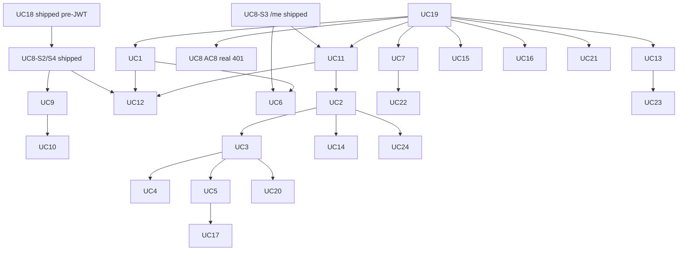

# CanMakan — Sprint 2 Use-Case Epics

| Field | Value |
| --- | --- |
| **Role** | Use-case narrative, acceptance criteria, and design context |
| **Prioritisation** | Core MVP (UC1–UC13) · Enhanced (UC14–UC19) · Nice-to-Have (UC20–UC24) |
| **Execution plan** | [`sprint2-jira-backlog.md`](sprint2-jira-backlog.md) |
| **Architecture packages** | Authentication & Security · Family · Dietary · Scanning & Verdicts · Analytics · Administration · Monitoring |
| **Tech stack** | Android Kotlin + ML Kit; React; Spring Boot + Security + JWT; AWS RDS MySQL; OFF; OpenAI; EC2; Resend |

UC IDs and packages match the [prioritisation table](sprint2-jira-backlog.md#0-prioritisation-strategy-features-and-technology-stack) and [architecture packages](sprint2-jira-backlog.md#0b-architecture-centric-feature-packages). Owners: [task assignment](sprint2-jira-backlog.md#0c-task-assignment).

### How to read each UC

1. Owner + package + architecture group + primary technologies  
2. Current code state  
3. User story  
4. Context (UI/UX, class & sequence diagrams, backend, client, testing)  
5. Acceptance criteria (checklist — one row per criterion)  
6. Jira child stories (AC # map — same UC epic; see [backlog §5](sprint2-jira-backlog.md#5-proposed-jira-child-stories))  
7. Dependencies and boundaries  

**Diagram expectation:** Design class and sequence diagrams for each UC; store under `docs/architecture/`.

**Acceptance criteria format:** Each criterion is a single checklist row. Mark Done in Jira/QA; do not expand scope beyond the UC notes and [alignment rules](sprint2-jira-backlog.md#0d-alignment-rules-schema-engineering). Stories inherit the [shared DoD](sprint2-jira-backlog.md#8-shared-definition-of-done-proposed). Thick ACs are split into multiple Jira sub-tasks under the same UC; the AC # map shows which checklist rows each story closes.

### Status legend

| Status | Meaning |
| --- | --- |
| Not started | No meaningful UI or API |
| Partial | Mock, stub, or incomplete API |
| Mostly complete | E2E path with known gaps |
| Complete | Meets MVP acceptance |

### Package overview

| Package | UC IDs |
| --- | --- |
| **Core MVP** | UC1–UC13 |
| **Enhanced** | UC14–UC19 |
| **Nice-to-Have** | UC20–UC24 |

### Task assignment (summary)

| Person | Assignments |
| --- | --- |
| **Kwok Heng** | UC1, UC4 |
| **Khai** | UC2, UC6; DevSecOps/CI/CD (owner) |
| **Huayuan** | UC3, UC14 |
| **Chai Lee** | UC5, UC17; Database Setup & Maintenance (owner) |
| **Amelia** | UC8–UC12; DevSecOps/CI/CD (support); Database (support) |
| **Maowei** | UC7, UC13, UC18, UC19 |
| *Unassigned* | UC15, UC16, UC20–UC24 |

Full table: [backlog §0c](sprint2-jira-backlog.md#0c-task-assignment).

---

# Core MVP

## UC1 — Manage App User Dietary Profile

**Owner:** Kwok Heng · **Package:** Core MVP · **Architecture:** Dietary Profile / Mobile Client  
**Tech:** Android Kotlin; Spring Boot REST; AWS RDS MySQL  
**Current code state:** Partial

- **Backend:** `DietaryProfileController` — live `GET /api/restrictions` and `GET|PUT /api/profiles/{profileId}/restrictions`; catalog + `profile_restrictions` seeded. No ownership/authz (any caller can read/write any `profileId`). No Spring Security yet.
- **Mobile:** `DietaryRestrictionSheet` + ViewModel wired from the drawer; loads/saves against the live API for the active profile. Severity is fixed to `STRICT_AVOID` in the VM (no PREFERENCE / INTOLERANCE picker). Loading/error paths exist.
- **Missing:** unknown-code → consistent HTTP 400 mapping; authenticated-only access once UC19-S3 lands. SELF bootstrap after registration is via **UC8** create-circle (register leaves `family_id` NULL until then).

### User story

As an app user, I want to change my personal restrictions, allergens, and preferences, and create a dietary profile after registration, so that scans reflect what I can and cannot have.

### Alignment

Profile create after registration must respect `dietary_profiles.family_id NOT NULL` — prefer **UC8** bootstrap SELF profile unless owners approve a schema change.

### Context

**Design:** Mobile restriction editor (catalog + severity); create/onboarding flow tied to registration + family bootstrap.  
**Diagrams:** DietaryProfileController, service, entities; sequences for load catalog → PUT restrictions; create path.  
**Backend:** `GET /api/restrictions`; `GET|PUT /api/profiles/{id}/restrictions`; ownership authz.  
**Mobile:** DietaryRestrictionSheet; wire create path without family-less orphans.  
**Testing:** PUT valid/unknown; authz denials; save round-trip.  
**Out of scope:** Free-text allergens beyond catalog; admin multi-member UI (UC12); orphan profiles without family.

### Acceptance criteria

| Done | # | Criterion |
| --- | --- | --- |
| [ ] | 1 | Authenticated user can load the restriction catalog via `GET /api/restrictions`. |
| [ ] | 2 | Authenticated user can load existing restrictions for an authorized profile via `GET /api/profiles/{profileId}/restrictions`. |
| [ ] | 3 | User can add one or more catalog restrictions to their authorized profile. |
| [ ] | 4 | User can change severity for an existing profile restriction. |
| [ ] | 5 | User can remove a restriction from their authorized profile. |
| [ ] | 6 | `PUT /api/profiles/{profileId}/restrictions` persists changes and a subsequent GET returns the saved set. |
| [ ] | 7 | The next successful scan/assess for that profile uses the updated restrictions (not a stale set). |
| [ ] | 8 | After registration (or first authenticated session), the user obtains a usable SELF dietary profile via the approved path (UC8 bootstrap, or an explicit schema-approved alternative). |
| [ ] | 9 | Creating a profile does not invent an orphan row when `family_id` is NOT NULL (no silent family-less insert). |
| [ ] | 10 | Unknown restriction codes are rejected with HTTP 400. |
| [ ] | 11 | Unauthorized profile access (other adult’s linked profile under default D3) returns HTTP 403. |
| [ ] | 12 | Unknown profile id returns HTTP 404 (or equivalent documented not-found). |
| [ ] | 13 | Mobile shows a loading state while catalog or profile restrictions load. |
| [ ] | 14 | Mobile shows an empty state when the catalog or saved restriction set is empty. |
| [ ] | 15 | Mobile shows an error state on network or save failure without crashing. |
| [ ] | 16 | Restriction requests require authentication once UC19-S3 is in place (no public write/read of dietary data). |

### Jira child stories

| Story | Closes AC # | Notes |
| --- | --- | --- |
| **UC1-S1** | 1–2, 10–12, 16 | Authz + catalog/load |
| **UC1-S2** | supports 3–6 | Codes / PREFERENCE (D8/M6) |
| **UC1-S3** | 3–7 | Mobile editor + save + next-scan |
| **UC1-S4** | 8–9 | Create-after-registration / UC8 bootstrap |
| **UC1-S5** | 13–15 | Loading / empty / error |

Full table: [backlog §5 UC1](sprint2-jira-backlog.md#uc1--dietary-profile).

### Dependencies

UC19, UC8 · Related: UC11, UC12

---

## UC2 — Scan Product Barcode

**Owner:** Khai · **Package:** Core MVP · **Architecture:** Scanning & Verdicts / Mobile Client  
**Tech:** Android; ML Kit Barcode; Spring Boot; Open Food Facts  
**Current code state:** Partial

- **Mobile:** `ScannerScreen` + ML Kit `BarcodeAnalyzer` → `ScannerViewModel` calls validate then assess and navigates to the verdict screen. No web scan UI (by design).
- **Backend:** `ScanController` — live `POST /api/scan/validate` and `POST /api/scan/assess`; `AssessmentOrchestrator` loads OFF product data, runs `DietaryRuleEngine`, optionally LLM evidence, and records a scan. Assess requires authentication (JWT).
- **Identity:** Assess uses `@AuthenticationPrincipal` for `scans.user_id`. Remaining gaps: no family/ownership check on `profileId`; inactive-profile reject not wired. Persist can fail silently if `scans.user_id` FK is invalid while the verdict response still returns.

### User story

As an app user, I want to scan a product's barcode so that CanMakan can fetch the product and call the safety verdict agent against my active dietary profile.

### Context

**Design:** Full-bleed scanner; validate → assess states; no web scan.  
**Diagrams:** Scanner → validate → assess → UC3.  
**Backend:** `POST /api/scan/validate`, `/assess`; JWT; authorize profileId.  
**Out of scope:** OCR label scan (UC24); web scan UI; inventing Safe for unknown products.

### Acceptance criteria

| Done | # | Criterion |
| --- | --- | --- |
| [ ] | 1 | Mobile camera captures a packaged-food barcode via ML Kit Barcode Scanning. |
| [ ] | 2 | Client calls `POST /api/scan/validate` with the decoded barcode. |
| [ ] | 3 | On successful validate, backend returns product identity details needed to proceed to assess. |
| [ ] | 4 | Client calls `POST /api/scan/assess` with the active authorized `profileId`. |
| [x] | 5 | Assess requires authentication; `scans.user_id` is taken from the JWT (spoofable `X-User-Id` is not trusted as identity). |
| [ ] | 6 | Assess rejects a `profileId` outside the caller’s family with HTTP 403. |
| [ ] | 7 | Assess rejects an inactive profile (`dietary_profiles.is_active=0`) with HTTP 409 (or documented equivalent). |
| [ ] | 8 | Unknown / not-found products show a clear failure state on mobile. |
| [ ] | 9 | Unknown / not-found products are never displayed or persisted as Safe. |
| [ ] | 10 | Non-food or unsupported barcode outcomes show a clear failure or guidance state (no false Safe). |
| [ ] | 11 | Network / OFF upstream failure shows an error state without crashing the scanner. |
| [ ] | 12 | Successful assess navigates to (or surfaces) the UC3 verdict view for that scan. |
| [ ] | 13 | Web clients do not implement barcode scan for this UC. |

### Jira child stories

| Story | Closes AC # | Notes |
| --- | --- | --- |
| **UC2-S1** | 5–7 | Assess authz + JWT userId |
| **UC2-S2** | 1–3 | Camera + validate |
| **UC2-S3** | 4, 12 | Assess → UC3 |
| **UC2-S4** | 8–11 | Failure states (never false Safe) |
| **UC2-S5** | 13 | No web scan |

Full table: [backlog §5 scan path](sprint2-jira-backlog.md#uc2--uc3--uc4--uc5--scan-path).

### Dependencies

UC19-S3, UC11 · Related: UC1 (restriction quality), UC3, UC4, UC5

---

## UC3 — View Safety Verdicts

**Owner:** Huayuan · **Package:** Core MVP · **Architecture:** Scanning & Verdicts / Mobile Client  
**Tech:** Android; Spring Boot; Dietary Rule Engine; AI-assisted analysis; RDS  
**Current code state:** Partial (verdict path mostly usable; alternatives empty)

- **Engine:** `DietaryRuleEngine` + checkers (allergen, restriction, nutrition, etc.); `@Primary` MCP ingredient resolver with stub fallback. Assess returns `SAFE` / `WARNING` / `UNSAFE`, findings, explanation, tier, `scanId`. LLM is evidence-only (does not own the verdict).
- **Mobile:** `ProductDetailScreen` — colour-coded Safe / Warning / Avoid (`UNSAFE` → Avoid), Flags & Details tab from findings. Mapping via `ScannerViewModel.toVerdictDetail` and history → `VerdictDetail`.
- **Gaps:** Alternatives tab still empty (UC5). Brand often missing on live assess responses. Incomplete-data / may-contain → Warning depends on product + MCP data quality.

### User story

As an app user, I want a detailed Safe / Warning / Unsafe verdict for a scanned product, explained simply, so that I can decide quickly and trust the result.

### Context

**Design:** Colour-coded verdict; ingredient findings; “may contain” as Warning; no complex charts.  
**Engine owns verdict;** LLM is evidence only. Wire `UNSAFE` (UI may say Avoid).  
**Out of scope:** Alternatives generation (UC5); recommendation history (UC17); trend charts (UC14); client-side verdict override.

### Acceptance criteria

| Done | # | Criterion |
| --- | --- | --- |
| [ ] | 1 | After a successful assess, mobile displays a colour-coded verdict for the active profile. |
| [ ] | 2 | Wire verdict values use backend `SAFE` \| `WARNING` \| `UNSAFE` (UI may label UNSAFE as Avoid). |
| [ ] | 3 | Verdict includes a plain-language reason that names the relevant ingredient and rule where applicable. |
| [ ] | 4 | Ingredient-level findings are shown in a simple colour-coded list/view (no complex charts). |
| [ ] | 5 | Complex ingredients and E-numbers are explained in simple language when the assess payload provides them. |
| [ ] | 6 | Cross-contamination / “may contain” signals are raised as Warning, not Safe. |
| [ ] | 7 | Incomplete product data never results in a fabricated Safe verdict. |
| [ ] | 8 | DietaryRuleEngine (or equivalent server authority) owns the final verdict; the client does not override it. |
| [ ] | 9 | Optional AI/LLM output is treated as evidence only and cannot force Safe against engine rules. |
| [ ] | 10 | Loading and error states are handled if assess detail is still fetching or fails after navigation. |
| [ ] | 11 | Product name/barcode (when available) are shown with the verdict for user confirmation. |

### Jira child stories

| Story | Closes AC # | Notes |
| --- | --- | --- |
| **UC3-S1** | 1–5, 11 | Colour-coded UI + findings |
| **UC3-S2** | 6–9 | Engine-owned + incomplete/may-contain |
| **UC3-S3** | 2 | Wire `UNSAFE` / Avoid |
| **UC3-S4** | 10 | Loading/error after navigation |

Full table: [backlog §5 scan path](sprint2-jira-backlog.md#uc2--uc3--uc4--uc5--scan-path).

### Dependencies

UC2 · Related: UC5, UC4

---

## UC4 — View Scan History

**Owner:** Kwok Heng · **Package:** Core MVP · **Architecture:** Shared Client  
**Tech:** Android + React + Spring Boot + RDS  
**Current code state:** Partial  
**Coordination:** Family list API (UC4-S2) owned by Kwok Heng; Family Portal page shell/nav coordinates with Amelia.

- **Mobile (personal):** `HistoryScreen` + `ServerScanHistoryRepository` against live `GET /api/profiles/{profileId}/history` (`ScanHistoryController`). Newest-first list with product join; tap opens product/verdict detail. No authz on the history GET.
- **Web (family):** `FamilyScanHistoryPage` + `familyService.getScanHistory()` — mock when `VITE_USE_MOCK_API` (default). Filters/demo dates are prototype-only; no live family-scoped scans API yet.
- **Out of this UC:** charts/trends (UC14); CSV export (UC22).

### User stories

1. As an app user, I want personal scan history on mobile so I can revisit past verdicts.  
2. As a Family Admin, I want a filterable household scan table on web so I can review assessments.

### Alignment

List/detail only. **Trend charts are UC14**, not UC4.

### Context

**APIs:** `GET /api/profiles/{id}/history`; `GET /api/families/me/scans` (admin).  
**Clients:** HistoryScreen; FamilyScanHistoryPage (no chart).  
**Out of scope:** Daily/weekly time-series charts (UC14); anonymised platform trends (UC7).

### Acceptance criteria

| Done | # | Criterion |
| --- | --- | --- |
| [ ] | 1 | Each successful assess persists product, verdict, timestamp, and profile used for the scan. |
| [ ] | 2 | Mobile lists the authenticated user’s personal scan history for an authorized profile via `GET /api/profiles/{profileId}/history`. |
| [ ] | 3 | Selecting a mobile history row reopens the stored assessment / verdict detail. |
| [ ] | 4 | Mobile history requires authentication and denies unauthorized `profileId` with 403. |
| [ ] | 5 | Family Admin can load household scans via `GET /api/families/me/scans`. |
| [ ] | 6 | Family history rows show at least product, profile, verdict, and time. |
| [ ] | 7 | Family history supports filters that narrow the list (e.g. profile, verdict, date range as implemented). |
| [ ] | 8 | Selecting a family history row opens assessment detail for that scan. |
| [ ] | 9 | Family history page remains a list/detail view and does **not** render a daily/weekly trend chart. |
| [ ] | 10 | Non–Family Admin callers receive 403 on the family-wide scans API (per permission matrix). |
| [ ] | 11 | Family history returns only scans for the authenticated admin’s family (no cross-family leakage). |
| [ ] | 12 | Empty history shows an empty state on mobile and web (no fabricated demo rows when mock is off). |
| [ ] | 13 | Loading and error states are handled on both clients. |
| [ ] | 14 | Web wire verdict values align with backend `SAFE` \| `WARNING` \| `UNSAFE` (UI label mapping allowed). |

### Jira child stories

| Story | Closes AC # | Notes |
| --- | --- | --- |
| **UC4-S1** | 1–4, 12–13 | Personal history (mobile) |
| **UC4-S2** | 5–6, 10–11 | Family list API |
| **UC4-S3** | 7–9, 12–13 | Family history web page |
| **UC4-S4** | 14 | Verdict wire alignment |

Full table: [backlog §5 scan path](sprint2-jira-backlog.md#uc2--uc3--uc4--uc5--scan-path).

### Dependencies

UC2, UC3; UC8 for family list

---

## UC5 — View Alternative Product Recommendation

**Owner:** Chai Lee · **Package:** Core MVP · **Architecture:** Scanning & Verdicts / Mobile Client  
**Tech:** Android; Spring Boot; Open Food Facts; recommendation logic  
**Current code state:** Not started / empty tab

### User story

As an app user, I want suitable alternatives when a product is Warning/Avoid, based on my active dietary profile.

### Alignment

Generating alternatives = UC5. **Listing past recommendations = UC17** (Enhanced).

### Context

**Out of scope:** Recommendation history list UI (UC17); ML ranking beyond agreed MVP algorithm; web alternatives UI unless later assigned.

### Acceptance criteria

| Done | # | Criterion |
| --- | --- | --- |
| [ ] | 1 | `GET /api/profiles/{profileId}/recommendations` (or equivalent) returns alternatives for an authorized profile. |
| [ ] | 2 | Alternatives are shown on mobile for Warning and Unsafe (Avoid) verdicts. |
| [ ] | 3 | Alternatives tab/section is hidden (or clearly inactive) for Safe verdicts. |
| [ ] | 4 | Returned alternatives are suitable for the active dietary profile under the agreed MVP algorithm (e.g. prior Safe history / category overlap). |
| [ ] | 5 | Current barcode/product is excluded from the recommendation list. |
| [ ] | 6 | When no alternatives exist, API returns an empty list and UI shows an appropriate empty state. |
| [ ] | 7 | Unauthorized profile access returns 403. |
| [ ] | 8 | Loading and error states are handled on the Alternatives UI. |
| [ ] | 9 | This UC does not implement a separate recommendation-history screen (UC17). |

### Jira child stories

| Story | Closes AC # | Notes |
| --- | --- | --- |
| **UC5-S1** | 1, 4–5, 7 | Recommendations API |
| **UC5-S2** | 2–3, 6, 8 | Alternatives tab UX |
| **UC5-S3** | 9 | UC17 boundary |

Full table: [backlog §5 scan path](sprint2-jira-backlog.md#uc2--uc3--uc4--uc5--scan-path).

### Dependencies

UC2, UC3 · Feeds: UC17

---

## UC6 — View Family Allergy Summary Grid

**Owner:** Khai · **Package:** Core MVP · **Architecture:** Family Management / **Mobile Client** (primary; optional React web parity)  
**Tech:** Android (primary); React (optional parity); Spring Boot; RDS  
**Current code state:** Partial (web mock only; mobile primary missing)

- **Web:** `FamilyRestrictionSummaryPage` at `/family/restrictions` builds a C / ✓ / — style matrix from `familyService.getRestrictionSummary()` → mock members when mock API is on. Edit CTA navigates toward member management (UC12 intent).
- **Backend:** no `/families/me/restriction-summary` (or equivalent) endpoint. Only related live call today is `GET /api/families/{familyId}/profiles`.
- **Mobile:** no allergy-summary / matrix screen yet (primary client for this UC). `dietary_profiles.is_active` not in schema yet (UC12 migration).

### User story

As a family account holder, I want a grid of family members and their allergies/restrictions so I can shop safely for the household.

### Context

**API:** `GET /api/families/me/restriction-summary`  
**Edit** navigates to UC12 — this UC is overview.  
**Out of scope:** Editing restrictions on the grid (UC12); system-admin anonymised trends (UC7).

### Acceptance criteria

| Done | # | Criterion |
| --- | --- | --- |
| [ ] | 1 | Authenticated family member can call `GET /api/families/me/restriction-summary`. |
| [ ] | 2 | Response includes profiles in the caller’s family with their restrictions (code, display name, severity as designed). |
| [ ] | 3 | **Primary client (mobile)** presents a matrix/grid of members (or profiles) against restrictions. |
| [ ] | 4 | Overlapping restrictions across members are visually highlighted as designed. |
| [ ] | 5 | Only the authenticated user’s family data is returned (no cross-family leakage; `/me` scoping). |
| [ ] | 6 | Inactive profiles are omitted or clearly marked per product choice documented with UC12. |
| [ ] | 7 | Empty family / no restrictions shows an empty state with guidance (e.g. link toward UC12 members). |
| [ ] | 8 | Edit actions navigate to UC12 (or UC1 for self) and do not mutate restrictions inside this UC. |
| [ ] | 9 | Loading and error states are handled. |
| [ ] | 10 | Production path works with mock API disabled. |
| [ ] | 11 | Non-members cannot access another family’s summary. |
| [ ] | 12 | Optional web parity (if shipped) uses the same summary API and does not become a second source of truth. |

### Jira child stories

| Story | Closes AC # | Notes |
| --- | --- | --- |
| **UC6-S1** | 1–2, 5–6, 11 | Restriction-summary API |
| **UC6-S2** | 3–4, 7–10 | Mobile primary grid |
| **UC6-S3** | 12 | Optional web parity |

Full table: [backlog §5](sprint2-jira-backlog.md#uc6--uc7--uc13).

### Dependencies

UC19, UC8, UC1 · Related: UC12

---

## UC7 — Generate Consumer Trends

**Owner:** Maowei · **Package:** Core MVP · **Architecture:** Analytics / Web Client (Admin)  
**Tech:** React Admin; Spring Boot aggregation; anonymisation; RDS  
**Current code state:** Partial (admin UI mock; DB rollup unused)

- **Web:** `ConsumerTrendsPage` (+ dashboard entry) via `adminService.getConsumerTrends()` → `mockAdminRepository` / mock data. Period controls do not hit a real query API.
- **Schema:** `daily_consumer_trends` exists in `00_schema.sql` and may be seeded, but there is no Java controller/service reading or writing it from `scans`.
- **Missing:** anonymised aggregation job/API, SYSTEM_ADMIN authz, live filters.

### User story

As a System Admin, I want anonymised consumer-trend insights from scan data.

### Alignment

UC7 = generate/view trends. **CSV export = UC22**. **Family charts = UC14**.

### Acceptance criteria

| Done | # | Criterion |
| --- | --- | --- |
| [ ] | 1 | System Admin can call `GET /api/admin/consumer-trends` (or equivalent) with agreed date/filter params. |
| [ ] | 2 | Backend aggregates scan data into category-level (or agreed) consumer trends. |
| [ ] | 3 | System Admin dashboard displays the aggregated trends. |
| [ ] | 4 | Response contains no user id, email, profile name, or family id (anonymised only). |
| [ ] | 5 | Non–System Admin callers receive HTTP 403. |
| [ ] | 6 | Empty range shows an empty state (no fabricated numbers when mock is off). |
| [ ] | 7 | Loading and error states are handled on the admin page. |
| [ ] | 8 | This UC does not implement CSV download (UC22) or family verdict charts (UC14). |

### Jira child stories

| Story | Closes AC # | Notes |
| --- | --- | --- |
| **UC7-S1** | 1–2, 4–5 | Anonymised trends API |
| **UC7-S2** | 3, 6–8 | Admin dashboard UI |

Full table: [backlog §5](sprint2-jira-backlog.md#uc6--uc7--uc13).

### Dependencies

UC19 · Related: UC22

---

## Family client ownership (product split)

| Action | Mobile | Web | Notes |
| --- | --- | --- | --- |
| Create Family Circle (UC8) | Yes | Yes | Very simple |
| Invite Member — link/code + share (UC9) | Yes | Yes | Mobile is better for sharing |
| Accept / Decline Invitation (UC10) | Yes | Optional | Mainly mobile |
| Switch Profile (UC11) | Yes | — | Daily use |
| Manage Family Circle (UC12) | Optional / limited | Primary | Roster, edit, remove, toggle active |

---

## UC8 — Create Family Circle

**Owner:** Amelia · **Package:** Core MVP · **Architecture:** Shared (Mobile + Web Family)  
**Tech:** Android; React; Spring Boot; RDS  
**Current code state:** Partial — **UC8-S1–S4 shipped** for API + web + mobile create-when-empty; **UC19 JWT identity** on family routes

- **Schema:** `UNIQUE(family_members.user_id)` via `uq_family_members_user_id` in `00_schema.sql` (D2 / one circle per user). Seeds remain one membership per user.
- **Backend:** `POST /api/families` and `GET /api/families/me` via `FamilyService` / `FamilyController`. Create is transactional: `families` (`created_by_user_id`) + `PRIMARY_ADMIN` membership + SELF `dietary_profiles` (`linked_user_id`, `family_id`, `is_primary`). Package layout: `family/dto/`, `model/`, `repository/`, `exception/`. Contract: `docs/api/families.md`.
- **Identity:** Controllers take `@AuthenticationPrincipal AuthUserDetails` (Bearer JWT). Unauthenticated family calls return 401.
- **Role model:** DB `family_members.member_role = PRIMARY_ADMIN`; web portal maps JWT `USER` → `ROLE_FAMILY_ADMIN` for the family gate. Full RBAC alignment remains shared with UC13.
- **Web:** Register (`/family-register`) / login → `/family` → `FamilyMeGate` loads `/families/me`; **404** → `CreateFamilyCirclePage` (name + loading/validation/error). `apiClient` sends `Authorization: Bearer`. Feature packaged under `features/family/{api,components,pages,lib}`.
- **Mobile:** Resolves `/families/me` with Bearer from `AuthSessionStore`. When 404 and a session exists, drawer CTA → `CreateFamilyCircleScreen` (`POST /api/families`); create is hidden once the user already has a family. Invite (UC9) and limited manage (UC12) follow the ownership matrix above.
- **Tests:** Backend create success, blank name 400, second create 409, missing/invalid JWT 401 (`FamilyControllerTest` / `FamilyServiceTest`). Mobile repository covers `/me` 200/404 and create 201/409/400.
- **Diagrams:** Class/sequence under `docs/architecture/` for create-circle still **open** (planned `domain-family.mmd`).
- **Demo tip:** Seeded users 4–13 already have families — register a new account to hit empty-state create.
- **Gaps:** Invites/manage (UC9/UC12); server-persisted active profile (UC11).

### User story

As a registered app user, I want to create a family circle and become its Family Admin (PRIMARY_ADMIN).

### Context

**APIs:** `POST /api/families`; `GET /api/families/me`  
Bootstraps SELF dietary profile for UC1.  
**Out of scope:** Invites (UC9); accept (UC10); manage roster mutations (UC12).

### Acceptance criteria

| Done | # | Criterion |
| --- | --- | --- |
| [x] | 1 | Authenticated APP_USER without a family can submit a family name via `POST /api/families`. |
| [x] | 2 | On success, a `families` row is persisted. |
| [x] | 3 | Creator is inserted as `family_members.member_role = PRIMARY_ADMIN`. |
| [x] | 4 | A linked SELF dietary profile is created for the creator (`linked_user_id` = caller, `family_id` set). |
| [x] | 5 | `GET /api/families/me` returns the new family as the user’s current family context. |
| [x] | 6 | If one-family-per-user rule applies (D2), a second create returns HTTP 409. |
| [x] | 7 | Blank or invalid family name returns HTTP 400. |
| [x] | 8 | Unauthenticated create returns HTTP 401. *(UC19 JWT / Security filter)* |
| [x] | 9 | Web empty-state CTA allows create when `/families/me` is empty/404. *(mobile drawer CTA + create screen also shipped when session exists and `/me` is 404)* |
| [x] | 10 | Clients that previously hardcoded `familyId=1` can resolve family via `/families/me` for this flow. *(web + mobile resolve `/me`; full active-profile persistence remains UC11)* |
| [x] | 11 | Loading, validation, and error states are handled on the create UI. *(web + mobile)* |

### Jira child stories

| Story | Closes AC # | Notes |
| --- | --- | --- |
| **UC8-S1** | 6 | **Done** — UNIQUE membership |
| **UC8-S2** | 1–5, 7–8 | **Done** except AC8 (401 → UC19) |
| **UC8-S3** | 5, 10 | **Done** — API + web + mobile `/me` resolve |
| **UC8-S4** | 9, 11 | **Done** — web + mobile create UX (mobile only when no family) |

Full table: [backlog §5 family lifecycle](sprint2-jira-backlog.md#uc8--uc9--uc10--family-lifecycle).

### Dependencies

UC19 (real auth) · UC18 (register new users to demo empty-state) · Unblocks: UC9–UC12, UC6, UC11

---

## UC9 — Invite Family Member to Circle

**Owner:** Amelia · **Package:** Core MVP · **Architecture:** Shared (Mobile + Web Family) — mobile preferred for share  
**Tech:** Android; React; Spring Boot; RDS  
**Current code state:** Partial (web mock immediate link; no invite APIs; mobile invite/share not built)

- **Product:** Invite via **shareable link/code** on **both** clients; mobile uses native share. Dependant-create API in this epic; **dependant UI is web-primary** (full roster manage is UC12).
- **Web:** FamilyMembersPage with LinkExistingUserModal and CreateFamilyProfileModal. Mock path searches users and **links immediately** as a member (no PENDING invitation). Must become PENDING invite + copy link/code.
- **Mobile:** No invite+share flow yet; add-profile stubs are not the UC9 share path.
- **Client contracts:** amilyService expects user-search / invitations / profiles endpoints when mock is off — backend implementations are missing.
- **Schema:** amily_invitations table exists; no seed/API/entity usage found for PENDING → accept (UC10). Production must not keep silent mock membership.

### User story

As a Family Admin, I want to invite someone with a shareable link/code (and optionally look up an existing user by email), **or** create an admin-managed dependant dietary profile, so the household can scan for each person.

### Acceptance criteria

| Done | # | Criterion |
| --- | --- | --- |
| [ ] | 1 | PRIMARY_ADMIN can search an existing user by email (GET /api/families/me/user-search). |
| [ ] | 2 | PRIMARY_ADMIN can create a PENDING invitation (POST /api/families/me/invitations). |
| [ ] | 3 | Invitation is associated with the admin’s family circle. |
| [ ] | 4 | Invitee is **not** added to Family_members until UC10 accept. |
| [ ] | 5 | Already-linked user returns HTTP 409 on invite. |
| [ ] | 6 | Non-admin (MEMBER) cannot invite (HTTP 403). |
| [ ] | 7 | Unknown/unregistered email returns a documented not-found or equivalent error. |
| [ ] | 8 | Production path does not use silent mock immediate membership link. |
| [ ] | 9 | PRIMARY_ADMIN can create a dependant profile via POST /api/families/me/profiles with name and relationship. |
| [ ] | 10 | Dependant profile is persisted with linked_user_id NULL. |
| [ ] | 11 | Creating a dependant does **not** insert a Family_members row without a user_id. |
| [ ] | 12 | Dependant appears in family profile/member views used by UC11/UC12/UC6. |
| [ ] | 13 | Admin can set initial dietary rules for the dependant using UC1 restriction contracts / authz. |
| [ ] | 14 | Loading, validation, and error states are handled for invite and dependant-create UIs. |
| [ ] | 15 | Create-invitation response includes a **shareable invite code and/or deep-link** usable by invitees for UC10. |
| [ ] | 16 | Mobile PRIMARY_ADMIN can invite and **share** the code/link (native share); web PRIMARY_ADMIN can invite and copy the code/link. |

### Jira child stories

| Story | Closes AC # | Notes |
| --- | --- | --- |
| **UC9-S1** | supports 2–4, 15 | Invitation migration (M5) + share token/code |
| **UC9-S2** | 1–7, 15 | Invite API + shareable payload |
| **UC9-S3** | 9–13 | Dependant create (web-primary UI) |
| **UC9-S4** | 8, 14–16 | Mobile invite+share + web invite; mock-off |

Full table: [backlog §5 family lifecycle](sprint2-jira-backlog.md#uc8--uc9--uc10--family-lifecycle).

### Dependencies

UC19, UC8, UC1 · Related: UC10

---

## UC10 — Accept Family Invitation

**Owner:** Amelia · **Package:** Core MVP · **Architecture:** Mobile Client (primary) & Email; web optional  
**Tech:** Android; Spring Boot; RDS; **Resend** *(optional React web parity)*  
**Current code state:** Not started

### User story

As an invited app user, I want to accept or decline a family invitation on mobile so I choose whether to join that household.

### Context

**Out of scope:** Creating invitations (UC9). Web accept/decline inbox is **optional** — mobile is the primary client.

### Acceptance criteria

| Done | # | Criterion |
| --- | --- | --- |
| [ ] | 1 | Authenticated invitee can list pending invitations for their account/email (GET /api/invitations/me). |
| [ ] | 2 | Each pending invitation displays family information needed to decide. |
| [ ] | 3 | Accepting a valid PENDING invitation adds the user as MEMBER and links/creates their dietary profile in that family. |
| [ ] | 4 | Accept marks the invitation ACCEPTED. |
| [ ] | 5 | Declining marks the invitation DECLINED and leaves the user outside the family. |
| [ ] | 6 | Expired invitations cannot be accepted (HTTP 410 or equivalent). |
| [ ] | 7 | Expired/used/already-final invitations cannot be accepted again (idempotent or error as documented). |
| [ ] | 8 | Email mismatch between token and authenticated user returns HTTP 403. |
| [ ] | 9 | If one-family rule applies, accept while already in another family returns HTTP 409. |
| [ ] | 10 | Primary client is mobile; accept/decline UX works on mobile. Web parity is optional. |
| [ ] | 11 | Invitation email delivery via Resend works as designed for the invite flow (when email is enabled). |
| [ ] | 12 | Loading, empty, and error states are handled on the invitations UI. |

### Jira child stories

| Story | Closes AC # | Notes |
| --- | --- | --- |
| **UC10-S1** | 1–2, 10, 12 | List pending (mobile primary; web optional) |
| **UC10-S2** | 3–4, 7–9 | Accept → MEMBER + profile |
| **UC10-S3** | 5–8 | Decline + expired/invalid guards |
| **UC10-S4** | 11 | Resend email |

Full table: [backlog §5 family lifecycle](sprint2-jira-backlog.md#uc8--uc9--uc10--family-lifecycle).

### Dependencies

UC19, UC9

---

## UC11 — Switch Family Profile

**Owner:** Amelia · **Package:** Core MVP · **Architecture:** Mobile Client  
**Tech:** Android; Spring Boot; RDS  
**Current code state:** Partial (local switch; hardcoded family 1)

- **Mobile (required):** ActiveProfileManager + drawer (ProfileDrawerContent) lets the user pick a profile for scan/history/restrictions in-session. Default profile id falls back to 1L. Selection is not server-persisted (ctive_profile_id migration not applied). Daily-use surface for this UC.
- **Profiles load:** GET /api/families/{familyId}/profiles via FamilyController; nav graph previously hardcoded amilyId = 1L — remove remaining hardcodes as UC11 lands.
- **Web:** Not required for MVP switch (ownership: mobile only). Any existing web selector must not become a divergent source of truth if kept for demos.

### User story

As an app user in a family circle, I want to select which eligible family profile subsequent scans use.

### Acceptance criteria

| Done | # | Criterion |
| --- | --- | --- |
| [ ] | 1 | Authenticated member can list eligible in-family profiles for switching. |
| [ ] | 2 | GET /api/families/me/active-profile returns the current active profile (or documented default). |
| [ ] | 3 | PUT /api/families/me/active-profile sets the active profile for the caller. |
| [ ] | 4 | Selection persists across app restart (server-backed, not memory-only). |
| [ ] | 5 | Subsequent UC2 assess uses the selected profileId. |
| [ ] | 6 | Profiles outside the user’s family cannot be selected (HTTP 403). |
| [ ] | 7 | Inactive profiles (is_active=0) cannot be selected once UC12 activation exists. |
| [ ] | 8 | Client path no longer hardcodes amilyId=1L or DEFAULT_PROFILE_ID=1L for switch/scan context. |
| [ ] | 9 | Loading and error states are handled on the **mobile** switcher UI. |
| [ ] | 10 | Web profile switcher is **out of MVP scope**; if a demo selector remains, it must not override server active-profile for scanning. |

### Jira child stories

| Story | Closes AC # | Notes |
| --- | --- | --- |
| **UC11-S1** | supports 2–4 | ctive_profile_id migration |
| **UC11-S2** | 1–3, 6–7 | GET/PUT active-profile + authz |
| **UC11-S3** | 4–5, 8 | Persist + drive assess + remove hardcodes |
| **UC11-S4** | 9–10 | Mobile switcher UX (web not required) |

Full table: [backlog §5](sprint2-jira-backlog.md#uc11--uc12--switch--manage).

### Dependencies

UC19; UC8-S3 (/families/me) or seeded membership for early delivery · Critical for UC2

---

## UC12 — Manage Family Circle

**Owner:** Amelia · **Package:** Core MVP · **Architecture:** Web Client (Family) primary; mobile optional/limited  
**Tech:** React; Spring Boot; RDS *(optional Android limited surface)*  
**Current code state:** Partial (mock roster/edit; no manage APIs)

- **Web (primary):** FamilyMembersPage, EditFamilyProfileModal, ProfileForm — list/edit against mock repository when VITE_USE_MOCK_API is on. Real admin work (roster, edit, remove, toggle active) lands here.
- **Mobile (optional/limited):** stubs exist (CreateNewProfileScreen / AddProfileToFamilyScreen); full manage parity is not required for MVP.
- **Missing:** live members/profiles CRUD, remove-member, soft-remove vs scan FK, dietary_profiles.is_active column + activate/deactivate, PRIMARY_ADMIN authz. Do not overload users.is_active for profile scanning.

### User stories

1. View all members (name, relationship, role, profile status).  
2. Update an existing member’s dietary profile.  
3. Remove a member (non-admin; confirm; last PRIMARY_ADMIN protected).  
4. Activate/deactivate a dietary profile for scanning (`dietary_profiles.is_active`, not `users.is_active`).

### Acceptance criteria

| Done | # | Criterion |
| --- | --- | --- |
| [ ] | 1 | Migration adds `dietary_profiles.is_active` (default active); does **not** overload `users.is_active`. |
| [ ] | 2 | PRIMARY_ADMIN can list members via `GET /api/families/me/members`. |
| [ ] | 3 | PRIMARY_ADMIN can list profiles via `GET /api/families/me/profiles`. |
| [ ] | 4 | Roster shows name, relationship, role, and profile active status as designed. |
| [ ] | 5 | List is family-scoped only (no other family’s members). |
| [ ] | 6 | Dependant profiles without login appear in the profile/member management views. |
| [ ] | 7 | PRIMARY_ADMIN can update allowed profile metadata via `PUT /api/families/me/profiles/{profileId}`. |
| [ ] | 8 | PRIMARY_ADMIN can update dependant (and self, as allowed) restrictions via UC1 PUT rules; unauthorized adult edits follow D3 (default deny). |
| [ ] | 9 | Profile/restriction updates persist and are visible on reload / subsequent scans for that profile. |
| [ ] | 10 | PRIMARY_ADMIN can remove a non-admin member after confirmation (`DELETE /api/families/me/members/{userId}`). |
| [ ] | 11 | Removed member no longer appears in the family list and loses access to that family circle. |
| [ ] | 12 | Non-admin users cannot remove members (HTTP 403). |
| [ ] | 13 | Sole/last PRIMARY_ADMIN cannot be removed without an allowed transfer process (HTTP 409). |
| [ ] | 14 | Soft-remove preserves scan history when `scans.profile_id` FK would block hard delete. |
| [ ] | 15 | PRIMARY_ADMIN can activate/deactivate a profile via `PATCH .../profiles/{profileId}` with `{active}`. |
| [ ] | 16 | Inactive profiles are visibly identified in the admin UI. |
| [ ] | 17 | Inactive profiles cannot be selected in UC11 and cannot be assessed (409). |
| [ ] | 18 | Reactivating a profile makes it selectable again. |
| [ ] | 19 | Loading, confirm, validation, and error states are handled for list/edit/remove/toggle. |
| [ ] | 20 | Production path works with mock API disabled. |

### Jira child stories

| Story | Closes AC # | Notes |
| --- | --- | --- |
| **UC12-S1** | 1 | `is_active` migration |
| **UC12-S2** | 2–6 | View roster |
| **UC12-S3** | 7, 9, 19 | Update metadata |
| **UC12-S4** | 8–9 | Update restrictions (UC1/D3) |
| **UC12-S5** | 10–14 | Remove member |
| **UC12-S6** | 15–18 | Activate/deactivate |
| **UC12-S7** | 19–20 | Mock-off + polish |

Full table: [backlog §5](sprint2-jira-backlog.md#uc11--uc12--switch--manage).

### Dependencies

UC19, UC8, UC1, UC11

---

## UC13 — Manage User Accounts and Access Rights

**Owner:** Maowei · **Package:** Core MVP · **Architecture:** Web Client (Admin)  
**Tech:** React Admin; Spring Boot; Spring Security; RBAC; RDS  
**Current code state:** Partial (admin UI mock only)

- **Web:** `UserAccessPage` + dashboard entry; `adminService` → `/api/admin/users` served by `mockAdminRepository` (including mock audit messages). Role/status toggles do not hit a real backend.
- **Schema/entity:** `users`, `roles`, `admin_audit_logs`; `UserAccount` entity with `is_active`. No admin users controller/service for list/PATCH/audit writes.
- **Missing:** SYSTEM_ADMIN RBAC, real PATCH access + audit persistence, last-admin / self-lockout guards, Spring Security protection.

### User story

As a System Admin, I want to manage user accounts, platform roles, and account status.

### Acceptance criteria

| Done | # | Criterion |
| --- | --- | --- |
| [ ] | 1 | System Admin can list user accounts via `GET /api/admin/users`. |
| [ ] | 2 | System Admin can change supported platform role and/or account status via `PATCH /api/admin/users/{userId}/access`. |
| [ ] | 3 | Access changes persist in the database. |
| [ ] | 4 | Access changes write an audit record (`admin_audit_logs` or equivalent). |
| [ ] | 5 | Platform roles are limited to agreed platform roles (e.g. APP_USER, SYSTEM_ADMIN) — not Family Admin. |
| [ ] | 6 | Suspend/deactivate account sets `users.is_active=0` and blocks login (UC19). |
| [ ] | 7 | Account suspend does **not** toggle `dietary_profiles.is_active` (UC12 concern). |
| [ ] | 8 | Server RBAC enforces System Admin only; non-admin callers receive 403 (React guards alone are insufficient). |
| [ ] | 9 | Protect last SYSTEM_ADMIN from self-demotion/suspend where applicable (HTTP 409). |
| [ ] | 10 | Admin can view audit entries via `GET /api/admin/audit` (or equivalent). |
| [ ] | 11 | Loading and error states are handled on the admin UI. |
| [ ] | 12 | Production path works with mock API disabled. |

### Jira child stories

| Story | Closes AC # | Notes |
| --- | --- | --- |
| **UC13-S1** | 1, 11–12 | List users + admin page |
| **UC13-S2** | 2–4, 10 | PATCH access + audit |
| **UC13-S3** | 5–9 | Roles / suspend / last-admin |
| **UC13-T1** | — | Role-model docs |

Full table: [backlog §5](sprint2-jira-backlog.md#uc6--uc7--uc13).

### Dependencies

UC19

---

# Enhanced

## UC14 — View Scan Verdict Trend

**Owner:** Huayuan · **Package:** Enhanced · **Architecture:** Web Client (Family)  
**Tech:** React chart library; Analytics API; RDS  
**Current code state:** Not started

### User story

As a Family Admin, I want charts of family Safe / Warning / Unsafe verdicts over time.

### Acceptance criteria

| Done | # | Criterion |
| --- | --- | --- |
| [ ] | 1 | PRIMARY_ADMIN can call `GET /api/families/me/scan-verdict-trends` with from/to and grain DAY\|WEEK. |
| [ ] | 2 | Response returns time buckets with Safe / Warning / Unsafe counts for the admin’s family only. |
| [ ] | 3 | Family Portal chart page renders the series with an agreed legend (Unsafe may display as Avoid). |
| [ ] | 4 | Empty periods / no scans show an appropriate empty state (no fabricated series when mock is off). |
| [ ] | 5 | Chart is **not** implemented inside the UC4 family history list page. |
| [ ] | 6 | Data is distinct from UC7 anonymised platform trends (family-identifiable household patterns only; no other families). |
| [ ] | 7 | Non-admin members receive 403 if matrix stays admin-only. |
| [ ] | 8 | Loading and error states are handled. |

### Jira child stories

| Story | Closes AC # | Notes |
| --- | --- | --- |
| **UC14-S1** | 1–2, 6–7 | Family verdict-trends API |
| **UC14-S2** | 3–5, 8 | Chart page (not UC4 list) |

Full table: [backlog §5 Enhanced](sprint2-jira-backlog.md#enhanced--nice-to-have).

### Dependencies

UC19, UC8, UC2–UC4

---

## UC15 — View Application Usage Statistics

**Owner:** *Unassigned* · **Package:** Enhanced · **Architecture:** Web Client (Admin)  
**Tech:** React Analytics Dashboard; Spring Boot Analytics API; RDS  
**Current code state:** Not started

### User story

As a System Admin, I want overall engagement and usage metrics (e.g. active users, session length, inactive users).

### Acceptance criteria

| Done | # | Criterion |
| --- | --- | --- |
| [ ] | 1 | System Admin can open a usage statistics dashboard. |
| [ ] | 2 | Dashboard displays agreed measures (at least active users, session length, inactive users — or documented substitutes). |
| [ ] | 3 | Measures are sourced from backend data (not hardcoded client demos when mock is off). |
| [ ] | 4 | Non–System Admin access is denied (403). |
| [ ] | 5 | Loading, empty, and error states are handled. |
| [ ] | 6 | This UC does not replace UC7 category consumer trends or UC14 family charts. |

### Jira child stories

| Story | Closes AC # | Notes |
| --- | --- | --- |
| **UC15-S1** | 1–6 | Usage stats API + dashboard |

Full table: [backlog §5 Enhanced](sprint2-jira-backlog.md#enhanced--nice-to-have).

---

## UC16 — View System Health Logs

**Owner:** *Unassigned* · **Package:** Enhanced · **Architecture:** Web Client (Admin)  
**Tech:** React Admin; Spring Boot Actuator; application logging; AWS EC2 monitoring  
**Current code state:** Not started

### User story

As a System Admin, I want application and infrastructure health events/logs.

### Acceptance criteria

| Done | # | Criterion |
| --- | --- | --- |
| [ ] | 1 | System Admin can view health events (crashes, errors, outages as available from agreed sources). |
| [ ] | 2 | Events can be filtered or searched. |
| [ ] | 3 | Access is restricted to System Admins (403 otherwise). |
| [ ] | 4 | Loading, empty, and error states are handled. |
| [ ] | 5 | This UC does not replace UC21 AI reasoning performance logs. |

### Jira child stories

| Story | Closes AC # | Notes |
| --- | --- | --- |
| **UC16-S1** | 1–5 | Health events list/filter |

Full table: [backlog §5 Enhanced](sprint2-jira-backlog.md#enhanced--nice-to-have).

---

## UC17 — View Recommendation History

**Owner:** Chai Lee · **Package:** Enhanced · **Architecture:** Mobile Client  
**Tech:** Android; Spring Boot; RDS  
**Current code state:** Not started

### User story

As an app user, I want to list past product recommendations so I can revisit suggestions I was shown.

### Alignment

UC5 generates alternatives at verdict time. **UC17** persists/lists that history.

### Acceptance criteria

| Done | # | Criterion |
| --- | --- | --- |
| [ ] | 1 | Authenticated user can list past recommendations for an authorized profile. |
| [ ] | 2 | Each history item includes enough context to identify the source product/time and suggested alternatives (as designed). |
| [ ] | 3 | Empty history shows an empty state. |
| [ ] | 4 | Unauthorized profile access returns 403. |
| [ ] | 5 | Loading and error states are handled. |
| [ ] | 6 | This UC does not generate new alternatives at verdict time (UC5 owns that). |

### Jira child stories

| Story | Closes AC # | Notes |
| --- | --- | --- |
| **UC17-S1** | 1–6 | Recommendation history API + list |

Full table: [backlog §5 Enhanced](sprint2-jira-backlog.md#enhanced--nice-to-have).

### Dependencies

UC5

---

## UC18 — User Registration

**Owner:** Maowei · **Package:** Enhanced · **Architecture:** Authentication & Security  
**Tech:** Mobile + Web + Spring Boot Auth API; Security; JWT; RDS  
**Current code state:** Partial — register API + web register/login glue shipped; JWT still UC19

- **Backend:** `POST /api/auth/register` creates `users` + SELF `dietary_profiles` with `family_id` NULL (circle created later via UC8). Pre-JWT `POST /api/auth/login` for web session. Password BCrypt; email requires dotted domain; registration password strength (upper/lower/digit/special) + 72-byte BCrypt limit on DTOs.
- **Web:** `/family-register` + credential login; session → `/family` → UC8 `FamilyMeGate` when no circle.
- **Mobile:** Registration UI/ViewModel present; align remaining gaps with API as needed.
- **Gaps:** JWT session (UC19); does not itself create a family circle (by design — UC8).

### User story

As a new user, I want to register for a CanMakan account so I can access personalised features.

### Acceptance criteria

| Done | # | Criterion |
| --- | --- | --- |
| [x] | 1 | User can submit required account details via `POST /api/auth/register` (or equivalent). |
| [x] | 2 | Duplicate email/account is rejected with a clear error. |
| [x] | 3 | Credentials are stored securely (password hashed; no plaintext secrets in DB/logs). |
| [x] | 4 | Successful registration creates an active account (`users.is_active=1` unless designed otherwise). |
| [x] | 5 | Flow proceeds to login or onboarding as designed. *(web: register → session → `/family` / UC8)* |
| [x] | 6 | Validation errors return HTTP 400 with actionable messages. |
| [x] | 7 | Loading and error states are handled on mobile and web register UIs. *(web done; mobile present — polish as needed)* |
| [x] | 8 | This UC does not create a family circle (UC8) or orphan dietary profile against schema rules. |

### Jira child stories

| Story | Closes AC # | Notes |
| --- | --- | --- |
| **UC18-S1** | 1–4, 6 | **Done** — register API + validation |
| **UC18-S2** | 5, 7–8 | **Done** (web); mobile UI present |

Full table: [backlog §5 auth](sprint2-jira-backlog.md#uc19--uc18-authentication--security).

### Dependencies

UC19 (JWT / real auth) · Unblocks demo of UC8 empty-state create

---

## UC19 — User Login / Logout

**Owner:** Maowei · **Package:** Enhanced (**Core critical path**) · **Architecture:** Authentication & Security  
**Tech:** Mobile + Web + Spring Boot Auth; Security; JWT; RDS  
**Current code state:** Not started (scaffold only)

### User stories

1. As a user, I want to log in so I can access my profile and scan history.  
2. As a user, I want to log out so data stays private on shared devices.

### Acceptance criteria

| Done | # | Criterion |
| --- | --- | --- |
| [ ] | 1 | Valid email/password login returns access (and refresh if designed) tokens via `POST /api/auth/login`. |
| [ ] | 2 | Invalid credentials return HTTP 401. |
| [ ] | 3 | Suspended account (`users.is_active=0`) cannot obtain tokens (HTTP 403). |
| [ ] | 4 | Protected business APIs require a valid JWT after UC19-S3 (unauthenticated → 401). |
| [ ] | 5 | JWT carries agreed platform authorities (UC19-S2 role mapping). |
| [ ] | 6 | Family Admin capability is **not** granted solely by a platform FAMILY_ADMIN JWT claim (membership remains source of truth). |
| [ ] | 7 | Refresh token flow works as designed (`POST /api/auth/refresh`) or is explicitly deferred with documented scope. |
| [ ] | 8 | Logout invalidates/terminates the session or refresh token as designed (`POST /api/auth/logout`). |
| [ ] | 9 | Logout clears locally stored credentials/tokens on mobile and web. |
| [ ] | 10 | After logout, protected features require re-authentication. |
| [ ] | 11 | Mobile and web both support login and logout for their portals. |
| [ ] | 12 | Loading and error states are handled on auth UIs. |

### Jira child stories

| Story | Closes AC # | Notes |
| --- | --- | --- |
| **UC19-S1** | 1–3, 7 | Login/refresh JWT |
| **UC19-S2** | 5–6 | Platform roles + mapping |
| **UC19-S3** | 4 | Protect business endpoints |
| **UC19-S4** | 8–10 | Logout invalidate + clear local |
| **UC19-S5** | 11–12 | Mobile + web auth UX |

Full table: [backlog §5 auth](sprint2-jira-backlog.md#uc19--uc18-authentication--security).

### Dependencies

None · **Blocks** production use of Core MVP APIs

---

# Nice-to-Have

## UC20 — Report Incorrect Product Information

**Owner:** *Unassigned* · **Package:** Nice-to-Have · **Architecture:** Shared Client  
**Tech:** Android; React Admin; Reporting API; RDS  
**Current code state:** README / not started

### User story

As an app user, I want to flag incorrect product or ingredient data for review.

### Acceptance criteria

| Done | # | Criterion |
| --- | --- | --- |
| [ ] | 1 | Authenticated user can flag a product/ingredient error from the mobile result/verdict screen. |
| [ ] | 2 | Report is persisted via the reporting API for System Admin review. |
| [ ] | 3 | System Admin can view submitted reports in the admin portal (as designed). |
| [ ] | 4 | Unauthorized users cannot submit or browse others’ reports beyond designed authz. |
| [ ] | 5 | Loading, confirmation, and error states are handled. |
| [ ] | 6 | This UC does not auto-correct Open Food Facts or override engine verdicts. |

### Jira child stories

| Story | Closes AC # | Notes |
| --- | --- | --- |
| **UC20-S1** | 1–2, 5–6 | Mobile flag |
| **UC20-S2** | 3–4 | Admin review queue |

Full table: [backlog §5](sprint2-jira-backlog.md#enhanced--nice-to-have).

---

## UC21 — View AI Reasoning Performance and Accuracy Logs

**Owner:** *Unassigned* · **Package:** Nice-to-Have · **Architecture:** Web Client (Admin)  
**Tech:** React Admin; Spring Boot logging/analytics; AI trace storage; RDS  
**Current code state:** Partial (write path exists; no admin UI)

- **Backend:** `AiExecutionLog` / repository + `AiExecutionLogService` — best-effort writes from `AssessmentOrchestrator` after assess when `canmakan.ai.audit.enabled=true` (default **false** in `application.properties`). Seeds exist in `06_scans_and_ai_logs.sql`.
- **UI:** no AI logs dashboard. Future-features page may list “AI Reasoning Review” as disabled/future only.
- **Missing:** admin list/filter API, SYSTEM_ADMIN authz, accuracy/latency/token views, enabling audit in non-dev environments as designed.

### User story

As a System Admin, I want AI analysis/execution logs with accuracy indicators, latency, and model/token usage.

### Acceptance criteria

| Done | # | Criterion |
| --- | --- | --- |
| [ ] | 1 | System Admin dashboard lists AI execution/analysis logs from agreed storage (e.g. `ai_execution_logs`). |
| [ ] | 2 | Logs show agreed metrics such as outcome, latency, model usage, and accuracy/correctness indicators when available. |
| [ ] | 3 | Logs can be filtered (e.g. by date/outcome). |
| [ ] | 4 | Access is restricted to System Admins (403 otherwise). |
| [ ] | 5 | Loading, empty, and error states are handled. |
| [ ] | 6 | This UC does not retrain models or change UC3 verdict ownership. |

### Jira child stories

| Story | Closes AC # | Notes |
| --- | --- | --- |
| **UC21-S1** | 1–6 | AI logs dashboard + filters |

Full table: [backlog §5](sprint2-jira-backlog.md#enhanced--nice-to-have).

---

## UC22 — Export Consumer Trends

**Owner:** *Unassigned* · **Package:** Nice-to-Have · **Architecture:** Web Client (Admin)  
**Tech:** React Admin; CSV export; RDS  
**Current code state:** Not started

### User story

As a System Admin, I want to export aggregated anonymised trend data (e.g. CSV).

### Acceptance criteria

| Done | # | Criterion |
| --- | --- | --- |
| [ ] | 1 | System Admin can export the currently selected aggregated consumer-trend dataset as CSV. |
| [ ] | 2 | Export respects the selected filters/date range. |
| [ ] | 3 | Exported file contains no personally identifiable user or family information. |
| [ ] | 4 | Non–System Admin cannot export (403). |
| [ ] | 5 | Error/empty export cases are handled. |
| [ ] | 6 | This UC depends on UC7 aggregates and does not invent a separate identifiable family export. |

### Jira child stories

| Story | Closes AC # | Notes |
| --- | --- | --- |
| **UC22-S1** | 1–6 | CSV export (no PII) |

Full table: [backlog §5](sprint2-jira-backlog.md#enhanced--nice-to-have).

### Dependencies

UC7

---

## UC23 — Manage Subscription / Premium Plans

**Owner:** *Unassigned* · **Package:** Nice-to-Have · **Architecture:** Web Client (Admin)  
**Tech:** React Admin; Spring Boot; RDS  
**Current code state:** Not started

### User story

As a System Admin, I want to configure subscription tiers and feature availability.

### Acceptance criteria

| Done | # | Criterion |
| --- | --- | --- |
| [ ] | 1 | System Admin can create a supported subscription tier. |
| [ ] | 2 | System Admin can edit an existing tier. |
| [ ] | 3 | System Admin can configure feature availability per tier. |
| [ ] | 4 | Changes persist after save. |
| [ ] | 5 | Only authorised System Admins can modify plans (403 otherwise). |
| [ ] | 6 | Loading, validation, and error states are handled. |
| [ ] | 7 | Payment-provider billing integration is out of scope unless explicitly expanded later. |

### Jira child stories

| Story | Closes AC # | Notes |
| --- | --- | --- |
| **UC23-S1** | 1–7 | Tier CRUD + feature flags |

Full table: [backlog §5](sprint2-jira-backlog.md#enhanced--nice-to-have).

---

## UC24 — Scan Ingredient List with OCR

**Owner:** *Unassigned* · **Package:** Nice-to-Have · **Architecture:** Mobile Client  
**Tech:** Android; ML Kit Text Recognition; Spring Boot  
**Current code state:** Not started

### User story

As an app user, I want to capture ingredient text via OCR on an unbarcoded product, review/extract it, and analyse it with the same verdict pipeline.

### Acceptance criteria

| Done | # | Criterion |
| --- | --- | --- |
| [ ] | 1 | User can capture an ingredient-label image on mobile. |
| [ ] | 2 | ML Kit Text Recognition extracts ingredient text from the image. |
| [ ] | 3 | User can review and correct the extracted text before assess. |
| [ ] | 4 | Extracted/corrected ingredients are assessed using the same dietary-profile and verdict rules as UC2/UC3. |
| [ ] | 5 | Assess uses the active authorized profile (same authz as barcode assess). |
| [ ] | 6 | OCR failure produces a clear error state. |
| [ ] | 7 | OCR failure never produces a false Safe verdict. |
| [ ] | 8 | Loading and error states are handled across capture → extract → assess. |
| [ ] | 9 | This UC does not replace the Core barcode scan path (UC2). |

### Jira child stories

| Story | Closes AC # | Notes |
| --- | --- | --- |
| **UC24-S1** | 1–2, 6–8 | Capture + OCR extract |
| **UC24-S2** | 3–5, 7, 9 | Review → same assess pipeline |

Full table: [backlog §5](sprint2-jira-backlog.md#enhanced--nice-to-have).

---

## Delivery guidance

| Layer | UCs |
| --- | --- |
| **Core MVP** | UC1–UC13 |
| **Enhanced** | UC14–UC19 (**UC19 is Core critical path**) |
| **Nice-to-Have** | UC20–UC24 |

### Suggested build order

Canonical with [backlog §5b](sprint2-jira-backlog.md#5b-recommended-delivery-sequence):

1. UC19-S1/S3/S5 (critical path — real JWT / 401)  
2. **Shipped (pre-JWT):** UC18-S1/S2 (web); UC8-S1–S4 (API + web/mobile create-when-empty); remaining UC8 = AC8→UC19; AC10 polish → UC11  
3. UC11-S1…S3 (drop `familyId=1`) → UC2-S1…S4 → UC3-S1…S2 → UC4-S1  
4. UC12-S1…S6 → UC9-S3; stretch UC1-S1/S3, UC6-S1/S2, UC9-S1/S2  
5. UC9–UC10 invite loop → UC6-S3 if needed  
6. UC4-S2/S3 → UC5-S1/S2 → UC7-S1/S2 → UC13-S1…S3  
7. Enhanced: UC14-S1/S2, UC15–UC17; polish UC18–UC19  
8. Nice-to-Have: UC20-S1/S2 … UC24-S1/S2  

Seeded families still useful for scan work until UC11 resolves membership without hardcodes.

---

*End of use-case epics*
